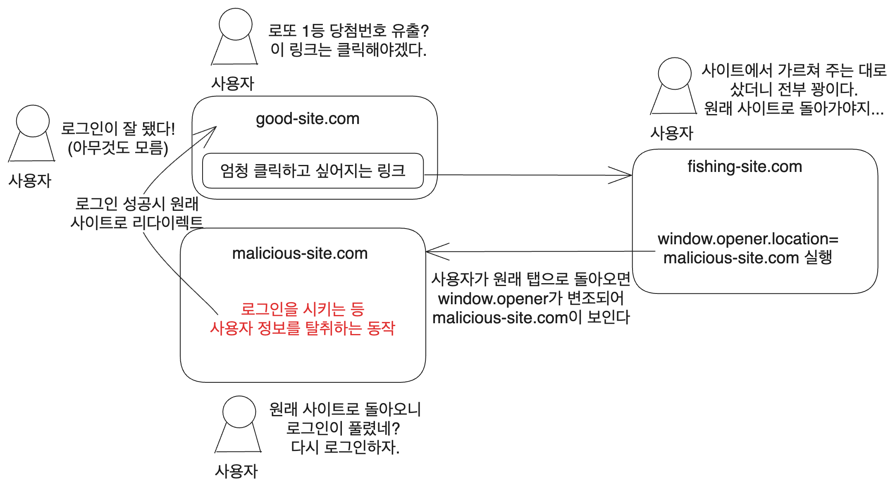

# 1. 시작

HTML 태그들을 조사하다가 [a 태그 문서](https://developer.mozilla.org/ko/docs/Web/HTML/Element/a)에서 흥미로운 부분이 있었다. a 태그를 잘못 사용하면 보안과 개인정보 문제가 발생할 수 있다고 한다.

`target="_blank"` 속성을 `rel="noreferrer"`와 `rel="noopener"` 없이 사용하면 웹사이트가 `window.opener` API 악용 공격에 취약해진다는 것이다. 그러나 이게 무슨 말인지 이것만 봐서는 모르겠다. 이제부터 알아보자.

# 2. 개요

a태그에서 `target="_blank"` 속성을 넣으면 링크가 새로운 브라우저 맥락에서 열린다.

```html
<a href="https://www.google.com" target="_blank">구글</a>
```

그런데 이렇게 하면 다음과 같은 문제가 있다.

1. 다른 페이지가 해당 페이지와 동일한 프로세스에서 실행될 수 있다. 기본적으로는 브라우저가 페이지별로 다른 프로세스를 사용한다. 다른 페이지에서 많은 JavaScript를 실행하는 경우 페이지의 성능이 저하될 수 있다.
2. 다른 페이지가 window.opener 속성을 사용하여 window 객체에 액세스할 수 있다. 그러면 다른 페이지에서 해당 페이지를 악성 URL로 리디렉션할 수 있다.

이 문제를 피하기 위해서는 `target="_blank"` 속성을 사용할 때는 `rel="noreferrer"`혹은 `rel="noopener"` 속성을 함께 사용해야 한다고 한다.

```html
<a href="https://www.google.com" target="_blank" rel="noreferrer">구글</a>
```

그런데 이 문제들은 대체 왜 일어나는 걸까? 하나는 성능 면의 문제고, 하나는 보안 문제다. 하나씩 알아보자.

* 최신 브라우저들에서는 이런 문제가 기본적으로 발생하지 않도록 되어 있다고 한다

# 3. 성능 문제

a 태그가 `target="_blank"` 속성으로 쓰였고 위의 문제 해결법을 사용하지 않은 상태라고 하자.

a 태그를 통해서 새롭게 열린 페이지는 보조 브라우징 맥락이다. 따라서 자신을 생성한 원본 브라우징 맥락을 오프너 브라우징 맥락으로 참조하고 있다.

따라서 새롭게 열린 페이지가 원본 페이지의 오프너 브라우징 맥락과 동일한 프로세스 상에서 실행될 수 있다. 만약 새롭게 열린 페이지에서 많은 JS를 실행하는 경우 원본 페이지의 성능이 저하될 수 있다.

# 4. 보안 문제

위와 똑같은 가정을 하면 새롭게 열린 페이지에서 JS를 통해 원본 페이지 접근이 가능해진다. 이는 `window.opener` API를 통해 가능한데 이를 이용하는 보안 취약점이 있다.

이를 이용한 공격을 tab nabbing이라고 한다.

먼저 사용자를 유도할 사이트를 만든다. 예시에서는 적당히 `https://www.fishing-site.com`라고 하였다.

```html
<a href="https://www.fishing-site.com" target="_blank" >클릭을 유도하는 문구</a>
```

그리고 해당 사이트에서는 다음과 같은 JS를 실행한다.

```js
window.opener.location = 'https://www.malicious-site.com';
```

사용자가 원래 사이트에서 `https://www.fishing-site.com`에 갔다가 원래 탭으로 돌아오면 `window.opener.location`이 변경되었으므로 `https://www.malicious-site.com`에 있다.

이제 사용자는 `https://www.malicious-site.com`에 있다고 생각하고 로그인을 하거나 뭔가를 하게 될 것이다. 그러면 사용자의 정보가 노출될 수 있다.

이렇게 노출된 사용자의 정보가 탈취되고 나면(가령 사용자가 로그인을 했다던가) 원래 사이트로 리디렉션된다. 사용자는 아무것도 모르고 로그인이 풀린 줄 알고 `https://www.malicious-site.com`에서 로그인을 했고, 원래 사이트로 돌아왔으니까 아무것도 모르고 있다.



일정 시간이 지나면 로그인을 다시 하도록 하는 사이트도 꽤 있기 때문에 사용자는 의심하기 어렵다. 그리고 사용자가 악의적인 사이트에서 로그인 시 이미 로그인되어 있는 원래 사이트로 리다이렉션하기 때문에 사용자는 로그인 성공으로만 인식한다.

도메인 이름이 달라졌거나 조직 정보가 표시되지 않는 것 등을 이용해서 알아차릴 수도 있지만 악의적인 사이트에서도 원래 사이트와 비슷한 이름을 사용하기 때문에 쉽지 않다(예를 들어 `youtube.com`에 있는 댓글에서 파생된 링크라면 `voutube.com`을 쓰는 식이다)

# 5. 보안 문제 해결방법

`rel="noopener"` 혹은 `rel="noreferrer"` 속성을 사용하면 된다.

## 5.1. rel="noopener"

```html
<a href="https://www.google.com" target="_blank" rel="noopener">구글</a>
```

이를 적용하면 a, area, form요소에서 새롭게 생성된 브라우징 맥락에서 해당 맥락을 생성한 문서에 대한 접근을 하는 것을 막을 수 있다. 즉 새로 열린 브라우징 맥락의 `window.opener`가 null로 설정된다.

단 `Referer` HTTP 헤더는 그대로 유지된다.

그리고 a 태그에서 `target="_blank"`속성을 설정하면 현재 대부분의 최신 브라우저에선 `rel="noopener"`를 지정하는 것이 기본 동작이다.

만약 굳이 새 탭에서 `window.opener`를 써야 한다면 `rel="opener"`를 지정하면 된다.

## 5.2. rel="noreferrer"

해당 속성을 지정하면 `rel="noopener"`의 동작이 일어날 뿐 아니라 추가적으로 `Referer` HTTP 헤더도 제거된다.

링크를 타고 들어왔을 때 HTTP 헤더에 포함되는 원래 사이트의 주소가 없어지는 것이다. 따라서 유입 분석에서도 해당 사이트가 어디서 유입되었는지 알 수 없기에 직접 유입으로 표시되게 된다.

하지만 일부 구형 브라우저에서는 `rel="noreferrer"`만 지원하는 경우가 있기 때문에 `rel="noopener noreferrer"`처럼 함께 사용하는 것이 좋다.

# 6. window.open

새 창을 여는 함수인 `window.open`을 사용할 때도 같은 취약점이 있다. 따라서 이 함수를 사용할 때에도 opener를 리셋해 주자.

```js
var ret = window.open(url, "_blank", specs, replace);
ret.opener=null;
```

# 참고

리퍼러 헤더 : 개인정보와 보안 고려사항 https://developer.mozilla.org/en-US/docs/Web/Security/Referer_header:_privacy_and_security_concerns

교차 출처 대상에 대한 링크는 안전하지 않습니다 https://developer.chrome.com/ko/docs/lighthouse/best-practices/external-anchors-use-rel-noopener/

하이퍼링크를 신뢰할 수 없다면? https://yozm.wishket.com/magazine/detail/1586/

https://blog.jxck.io/entries/2016-06-12/noopener.html

rel=noopener https://developer.mozilla.org/en-US/docs/Web/HTML/Attributes/rel/noopener

https://www.jitbit.com/alexblog/256-targetblank---the-most-underestimated-vulnerability-ever/

https://security.stackexchange.com/questions/216135/xss-with-a-tag-with-target-blank

https://offbyone.tistory.com/312