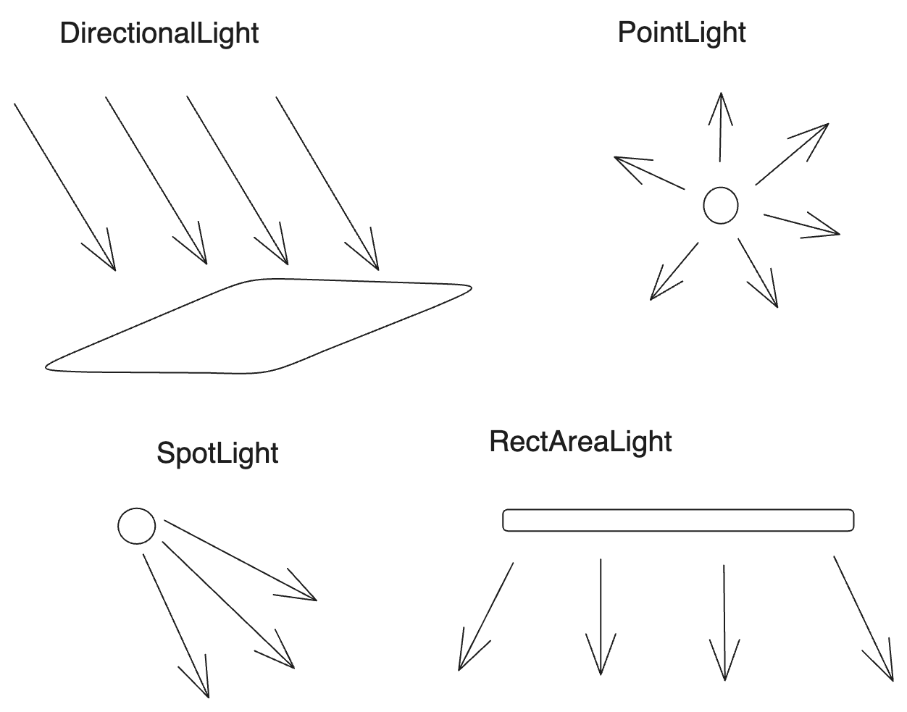

# 1. 시작

기본적인 설치법은 [공식 문서의 설치 가이드](https://threejs.org/docs/index.html#manual/en/introduction/Installation)를 참고. 나는 이곳에서 Vite를 사용했다.

기본 원리는 그래픽스에서 배운 것과 같다. Scene에 있는 물체를 Camera에서 보고, 카메라에 맺힌 영상을 Renderer가 화면에 렌더링한다. 만약에 이 글을 읽는 사람이 있고 내부 원리가 궁금하다면 그래픽스 과목을 들어보길 바란다. [서강대학교 임인성 교수님 연구실에서 좀 오래되긴 했어도 한글로 된 그래픽스 자료를 무료로 볼 수 있다.](http://grmanet.sogang.ac.kr/publications.html#book)

three.js에서는 이를 각각 Scene, Camera, Renderer로 구현한다. 공식 페이지에서는 화면에 회전하는 초록색 정육면체를 띄우는 예제를 보여준다.

```javascript
// 출처 : https://threejs.org/docs/index.html#manual/en/introduction/Creating-a-scene
import * as THREE from 'three';
// 물체가 들어갈 scene
const scene = new THREE.Scene();
// 물체를 비출 카메라. 인수는 시야각, aspect ratio, near, far이다.
const camera = new THREE.PerspectiveCamera( 75, window.innerWidth / window.innerHeight, 0.1, 1000 );
// 물체를 렌더링할 렌더러
const renderer = new THREE.WebGLRenderer();
renderer.setSize( window.innerWidth, window.innerHeight );
// DOM tree에 렌더러를 추가해서 화면에 띄운다.
document.body.appendChild( renderer.domElement );
// 박스 만들기 + 초록색으로
const geometry = new THREE.BoxGeometry( 1, 1, 1 );
const material = new THREE.MeshBasicMaterial( { color: 0x00ff00 } );
const cube = new THREE.Mesh( geometry, material );
// scene에 박스 추가
scene.add( cube );

camera.position.z = 5;
// 렌더링 함수
function animate() {
	requestAnimationFrame( animate );

	cube.rotation.x += 0.01;
	cube.rotation.y += 0.01;

	renderer.render( scene, camera );
}

animate();
```

Renderer는 Scene, Camera를 넘겨받아서 카메라가 비추고 있는 범위를 2차원으로 축소해서 제공한다. 자세한 내용은 그래픽스 과목에서 다룬다.


만약 빛을 넣고 싶다면 AmbientLight나 DirectionalLight 등의 광원을 추가하고 Material을 MeshPhongMaterial로 바꾸면 된다. Phong은 광원을 근사적으로 모델링하는 모델 이름인데 제작자 이름을 따서 만들어졌다.

```javascript
// 빛 만들기 코드의 일부
const geometry = new THREE.BoxGeometry( 1, 1, 1 );

const material = new THREE.MeshPhongMaterial( { color: 0x00ff00 } );
const cube = new THREE.Mesh( geometry, material );
scene.add( cube );
/* DirectionalLight 선언 */
const color=0xFFFFFF;
const intensity=1;
const light = new THREE.DirectionalLight(color, intensity);
light.position.set(-1, 2, 4);
scene.add(light);

camera.position.z = 5;
```

# 2. threejs 기본 구조

## 2.1. BoxGeometry

너비, 높이, 깊이를 인자로 받아서 육면체를 만든다. 그리고 4,5,6번째 인수로 각 면을 이루는 세그먼트 개수에 대한 설정을 할 수 있다.

```js
const geometry = new THREE.BoxGeometry(width, height, depth);
const geometry = new THREE.BoxGeometry(width, height, depth, widthSegments, heightSegments, depthSegments);
```

## 2.2. CircleGeometry

반지름과 세그먼트 개수를 받아서 원을 만든다. 세그먼트는 원을 몇 개의 호로 나눌지를 결정한다. 예를 들어서 8개의 세그먼트로 원을 구현한다면 원보다는 팔각형에 가까운 모양이 렌더링된다.

3,4번째 인수로는 호를 그릴 수 있는 기능을 제공하는데 호의 시작 각도와 호의 중심각을 지정할 수 있다. 라디안 단위.

```js
const geometry = new THREE.CircleGeometry(radius, segments);
const geometry = new THREE.CircleGeometry(radius, segments, thetaStart, thetaLength);
```

## 2.3. ConeGeometry

원뿔 그리기. 반지름, 높이, 세그먼트 개수, 원뿔의 꼭대기를 닫을지 여부, 원뿔호의 시작각도, 원뿔호의 중심각도를 인수로 받는다.

```js
const geometry = new THREE.ConeGeometry( radius, height, radialSegments );
const geometry = new THREE.ConeGeometry(radius, height, radialSegments, heightSegments, openEnded, thetaStart, thetaLength );
```

## 2.4. CylinderGeometry

윗/밑면 반지름, 높이, 세그먼트 개수, 끝을 닫을지 여부, 원기둥 호의 시작각도, 호의 중심각. 

```js
const geometry = new THREE.CylinderGeometry( radiusTop, radiusBottom, height, radialSegments );
const geometry = new THREE.CylinderGeometry( radiusTop, radiusBottom, height, radialSegments, heightSegments, openEnded, thetaStart, thetaLength );
```

## 2.5. DodecahedronGeometry

십이면체를 그린다. 반지름과 디테일한 정도가 전부다.

```js
// 반지름만 전달도 가능
const geometry = new THREE.DodecahedronGeometry( radius );
const geometry = new THREE.DodecahedronGeometry( radius, detail );
```

## 2.6. ExtrudeGeometry

경로를 따라 생성된 입체를 렌더링한다. 입체는 threejs의 Shape 객체를 통해 만들어질 수 있다.

```js
const geometry = new THREE.ExtrudeGeometry(shape, extrudeSettings);
```

## 2.7. IcosahedronGeometry

이십면체를 그린다.

```js
const geometry = new THREE.IcosahedronGeometry( radius );
const geometry = new THREE.IcosahedronGeometry( radius, detail );
```

## 2.8. SphereGeometry

구를 그린다. 구면 좌표계를 통한 그림도 지원한다.

```js
const geometry = new THREE.SphereGeometry( radius, widthSegments, heightSegments );
const geometry = new THREE.SphereGeometry(radius, widthSegments, heightSegments, phiStart, phiLength, thetaStart, thetaLength );
```

## 2.8. 기타 Geometry

- LatheGeometry : 선을 회전시켜 만든 모양을 렌더링한다.
- OctahedronGeometry : 팔면체를 그린다.
- ParametricGeometry : 매개 변수를 통해서 만든 입체를 렌더링하는 듯 하다.
- PlaneGeometry : 평면을 그린다.
- PolyhedronGeometry : 다면체를 그린다.
- RingGeometry : 중앙이 비어 있는 CD같은 모양의 디스크를 그린다.
- ShapeGeometry : 2D 윤곽선을 그린다.
- TetrahedronGeometry : 사면체를 그린다.
- TextGeometry : 텍스트를 그린다. 폰트를 따로 로딩해 줘야 한다.
- TorusGeometry : 도넛 모양을 그린다.
- TorusKnotGeometry : 원환 매듭 모양을 그린다.
- TubeGeometry : 경로를 따라서 원통을 그린다.
- EdgesGeometry : 다른 geometry를 받아서 각 면 사이 각이 thresholdAngle 이상일 때만 모서리를 그린다. 
- WireframeGeometry

# 3. Scene graph

씬 그래프는 요소의 계층 구조를 나타낸다. 각 요소의 지역 공간과 그 소속을 다루는 것이다. 예를 들어서 지구는 태양의 지역 공간에 속해서 태양을 공전한다. 그리고 달은 지구의 지역 공간에서 공전한다. 

태양의 입장에서 보면 달은 괴상한 모양을 그리겠지만 달은 그냥 지구의 지역 공간만 신경쓰면 된다. threejs에서 이런 움직임을 모방하려 한다면 달을 지구의 자식으로 만들어서 지구의 지역 공간에서 공전하게 만들면 될 뿐이다.

기본 세팅과 같은 부분을 빼고 물체 좌표계간의 계층 구조를 만드는 코드는 다음과 같다.

```js
const solarSystem = new THREE.Object3D();
scene.add(solarSystem);
objects.push(solarSystem);

const sunMaterial = new THREE.MeshPhongMaterial({emissive: 0xFFFF00});
const sunMesh = new THREE.Mesh(sphereGeometry, sunMaterial);
sunMesh.scale.set(5,5,5);

solarSystem.add(sunMesh);
objects.push(sunMesh);

const earthOrbit=new THREE.Object3D();
earthOrbit.position.x=10;
solarSystem.add(earthOrbit);
objects.push(earthOrbit);

const earthMaterial=new THREE.MeshPhongMaterial({color: 0x2233FF, emissive: 0x112244});
const earthMesh=new THREE.Mesh(sphereGeometry, earthMaterial);
earthOrbit.add(earthMesh);
objects.push(earthMesh);

const moonOrbit=new THREE.Object3D();
moonOrbit.position.x=2;
earthOrbit.add(moonOrbit);

const moonMaterial=new THREE.MeshPhongMaterial({color: 0x888888, emissive: 0x222222});
const moonMesh=new THREE.Mesh(sphereGeometry, moonMaterial);
moonMesh.scale.set(.5,.5,.5);
moonOrbit.add(moonMesh);
objects.push(moonMesh);
```

# 4. Material

Material은 물체가 scene에 어떻게 나타날지를 결정한다. 이 속성은 material 생성자를 호출 시 값을 넘겨서 정할 수도 있고 생성한 다음 바꿀 수도 있다.

MeshBasicMaterial : 광원 영향을 받지 않음
MeshLambertMaterial : 광원 영향을 받는데, 정점에서만 광원을 계산함
MeshPhongMaterial : 픽셀 하나하나에서 광원을 계산한다. 이것도 근사 모델이긴 하지만 더 정확한 광원 모델링을 위해 사용한다.

옵션에서는 shininess, emissive등을 설정 가능하다.

만화 같은 스타일의 물체를 생성하는 MeshToonMaterial, 물리 기반 렌더링을 위한 MeshStandardMaterial, 더 고급의 물리 렌더링 특성을 제공하는 MeshPhysicalMaterial 등이 있다.

특수한 경우 사용하는 재질로는 그림자를 가져오는 ShadowMaterial, 픽셀의 깊이를 렌더링하는 MeshDepthMaterial, 법선을 렌더링하는 MeshNormalMaterial 등이 있다. 재질을 커스텀할 수 있게 해주는 ShaderMaterial도 존재한다. 이들은 당장 자세히 알 필요는 없을 것 같다.

## 4.1. 유명한 옵션

flatShading : 물체를 각지게 표현할지 여부, 기본값은 false
side : 어떤 면을 렌더링할지 여부, 기본값은 THREE.FrontSide이고 THREE.BackSide / THREE.DoubleSide도 있다.

재질을 만드는 건 연산이 많이 필요하기에 보통 한 번 만든 재질을 바꾸지는 않지만 만약 그래야 할 일이 있다면 `material.needsUpdate = true`로 설정해야 한다.

# 5. 텍스처

텍스처는 `TextureLoader`를 생성한 다음 load 메서드에 이미지를 넘겨서 호출한 후 반환된 값을 Material의 map 속성에 지정하는 방식으로 사용할 수 있다.

```js
const cubes=[];
const loader=new THREE.TextureLoader();

const material = new THREE.MeshBasicMaterial({
  map:loader.load("./witch-new.png"),
});
const cube=new THREE.Mesh(geometry,material);
scene.add(cube);
cubes.push(cube);
```

이 `loader.load`는 비동기로 작동한다. 2번째 인수로는 텍스처를 전부 불러온 후에 호출될 콜백을 지정할 수 있다. 다음과 같이 하면 텍스처를 전부 불러온 다음 화면을 렌더링한다.

```js
const loader=new THREE.TextureLoader();
loader.load("./witch-new.png",function(texture){
  const material = new THREE.MeshBasicMaterial({
    map:texture,
  });
  const cube=new THREE.Mesh(geometry,material);
  scene.add(cube);
  cubes.push(cube);
});
```

다수의 텍스처를 불러올 땐 `LoadingManager` 사용. `TextureLoader`를 생성할 때 `LoadingManager`를 인수로 넘겨준다. 그리고 `load` 메서드를 호출할 때 2번째 인수로 텍스처를 전부 불러온 후에 호출될 콜백을 지정할 수 있다.

LoadingManager의 onProgress에 콜백 함수 지정시 현재 진행 상태도 추적할 수 있다.

단 텍스처는 메모리를 매우 많이 사용하므로 주의해서 사용하자. 보통 텍스처는 `width * height * 4 * 1.33`바이트의 메모리를 사용한다. 따라서 필요한 퀄리티를 유지하는 선에서 해상도를 낮추는 게 좋다.

그런데 텍스처의 크기가 딱 원본과 맞는 경우는 잘 없다. 이 경우 GPU는 mipmap이라는, 텍스처를 반 크기로 축소해 가면서 생성한 map들을 만들어 놓고 geometry와 가장 가까운 크기의 것을 골라서 렌더링한다.

사용되는 필터는 텍스처가 원본보다 클 경우 `texture.magFilter`를 사용하며 `THREE.nearestFilter`와 `THREE.LinearFilter`가 있다. 

텍스처가 원본보다 작을 경우 `texture.minFilter`를 사용하며 `THREE.NearestFilter`, `THREE.LinearFilter`, `THREE.NearestMipmapNearestFilter`, `THREE.NearestMipmapLinearFilter`, `THREE.LinearMipmapNearestFilter`, `THREE.LinearMipmapLinearFilter`가 있다.

필요할 때마다 추가하자.

# 6. 조명

조명은 대표적으로 `AmbientLight`, `DirectionalLight`, `HemisphereLight` 가 있다.

## 6.1. AmbientLight

Ambient Light는 말 그대로 방향 같은 게 없이 scene에 전체적으로 적용되는 빛이다. 물체에 Light color를 곱해 주는 것 뿐이고 방향이나 어떤 물체에 더 비춰 준다는 개념이 없다.

```js
const light = new THREE.AmbientLight(color, intensity);
```

## 6.2. HemisphereLight

반구 형태의 광원이다. 천장과 바닥의 색을 인자로 받아서 천장을 바라보는 색은 천장 색, 바닥을 바라보는 색은 바닥 색으로 혼합한다.

```js
const light = new THREE.HemisphereLight(천장색, 바닥색, intensity);
```

## 6.3. DirectionalLight

직사광이다. 생성자는 빛 색상과 강도를 인자로 받으며 position과 target을 설정해야 한다.

```js
const light = new THREE.DirectionalLight(color, intensity);
light.position.set(x, y, z);
light.target.position.set(x, y, z);
scene.add(light);
```

그런데 조명이 충분히 강하지 않으면 조명이 눈에 잘 안 들어올 수도 있다. 이런 경우를 대비해서 `helper`를 사용할 수 있다. `helper`는 조명의 위치를 표시해 준다. `DirectionalLightHelper`를 사용하자.

```js
// 여기서 light는 DirectionalLight 객체
const helper = new THREE.DirectionalLightHelper(light);
scene.add(helper);
```

이 직사광은 한 점에서 뻗어나오는 게 아니다. 어떤 방향으로 빛이 비추는 것이다. 한 점에서 뻗어나오는 광원은 다음에 볼 PointLight이다.

## 6.4. PointLight

점 광원을 생성한다. 생성자는 빛 색상과 강도를 인자로 받으며 position을 설정해야 한다.

```js
const light = new THREE.PointLight(color, intensity);
light.position.set(x, y, z);
```

## 6.5. SpotLight

광원에서 원뿔 모양의 빛을 비추는 스포트라이트를 생성한다. 생성자는 빛 색상과 강도를 인자로 받으며 position, target, 각도, 빛의 범위를 설정해야 한다.

```js
const light = new THREE.SpotLight(color, intensity);
// 빛 경로 시각화 헬퍼
const helper = new THREE.SpotLightHelper(light);
light.position.set(x, y, z);
light.target.position.set(x, y, z);
// 45도의 내각을 갖는 원뿔 모양 빛을 비춘다.
light.angle = Math.PI / 4;
// 0이면 모든 부분에서 크기 동일. 1이면 외부로 갈수록 빛 희미해짐
light.penumbra = 0.05;
```

## 6.6. RectAreaLight

사각 형태의 조명이며 `MeshStandardMaterial`과 `MeshPhysicalMaterial`에서만 사용할 수 있다. 생성자는 빛 색상과 강도를 인자로 받으며 width, height도 설정해야 한다.

```js
const light = new THREE.RectAreaLight(color, intensity, width, height);
```

`renderer.physicallyCorrectLights` 속성을 true로 설정해서 켜게 되면 조명을 물리적으로 보정할 수 있다. 일단 넘어가자.



# 7. 카메라

이런 식으로 `PerspectiveCamera`를 생성할 수 있다.

```js
const camera = new THREE.PerspectiveCamera( fov, aspect, near, far );
```

near, far를 설정하는 건 매우 중요하다. 만약 near를 매우 작게 그리고 far를 매우 크게 설정한다면 모든 물체가 다 보일 것이다. 하지만 이는 카메라의 정밀도에 영향을 미친다.

정밀도는 near, far 사이에 어느 정도씩 퍼져 있는데 카메라에 가까울수록 정밀도가 높고 멀수록 낮아진다. 이럴 경우 z-fighting이라고 하는 현상이 발생해서 물체가 깨져 보이게 된다. `WebGLRenderer` 생성시 옵션으로 `logarithmicDepthBuffer`를 true로 설정하면 이 현상을 완화할 수 있다. 하지만 이는 일부 기기에서만 지원된다...

따라서 near, far를 주의깊게 설정해야 한다.

## 7.1. OrthographicCamera

이는 정사영 카메라다. 원근 카메라의 잘린 사각뿔 모양 대신 직육면체 모양의 카메라다. 생성자는 left, right, top, bottom, near, far를 인자로 받는다.

```js
const camera = new THREE.OrthographicCamera( left, right, top, bottom, near, far );
```

이 카메라는 받은 6개의 인자를 토대로 육면체를 만들고, 이 육면체 내의 물체들을 정사영해서 보여준다. 따라서 개체 크기가 카메라와의 거리에 관계없이 일정하게 유지된다.

# 8. 그림자

threeJS는 그림자 맵을 사용해서 그림자를 만든다. 이는 그림자를 만드는 모든 물체를 빛의 시점에서 렌더링함을 말한다. 따라서 그림자를 만드는 모든 물체들의 그림자 각각을 빛 각각이 한번씩 렌더링한다.

만약 20개의 물체와 5개의 조명이 있고 20개 물체 모두가 그림자를 만든다면 한 장면을 위해서 화면은 6번 렌더링된다(물체를 만드는 1번, 그림자를 만드는 5번).

따라서 그림자를 지게 하는 조명을 여러 개 만들기보다는 보통 다른 방법을 사용한다. 하나의 조명만 그림자를 지게 하거나 가짜 그림자를 만드는 등이다. 하지만 이는 나중에 알아보고, 그림자는 어떻게 사용하는가? renderer의 `shadowMap` 옵션을 켜고 조명도 그림자를 드리우도록 옵션을 켠다.

```js
const scene = new THREE.Scene();
const renderer = new THREE.WebGLRenderer();
renderer.setSize( window.innerWidth, window.innerHeight );
/* 렌더러가 그림자도 그리도록 함 */
renderer.shadowMap.enabled=true;
document.body.appendChild( renderer.domElement );

/* 카메라 세팅 */
const fov=45;
const aspect=2;
const near=0.1;
const far=100;
const camera = new THREE.PerspectiveCamera( fov, aspect, near, far );
camera.position.set(0,10,20);

const controls=new OrbitControls(camera,renderer.domElement);
controls.target.set(0,5,0);
controls.update();

scene.background=new THREE.Color('black');

/* 바닥 그리기 */
const planeSize=40;
const texture=new THREE.TextureLoader().load('./witch-new.png');
texture.wrapS=THREE.RepeatWrapping;
texture.wrapT=THREE.RepeatWrapping;
texture.magFilter=THREE.NearestFilter;
const repeats=planeSize/2;
texture.repeat.set(repeats,repeats);

const planeGeo=new THREE.PlaneGeometry(planeSize,planeSize);
const planeMat=new THREE.MeshPhongMaterial({
  map:texture,
  side:THREE.DoubleSide,
});

const mesh=new THREE.Mesh(planeGeo,planeMat);
/* 바닥은 그림자를 그리지는 않고 그림자의 영향만 받도록 한다. */
mesh.receiveShadow=true;
mesh.rotation.x=Math.PI*-.5;
scene.add(mesh);
/* 정육면체 그리기 */
const cubeSize=4;
const cubeGeo=new THREE.BoxGeometry(cubeSize,cubeSize,cubeSize);
const cubeMat=new THREE.MeshPhongMaterial({color:'#8AC'});
const mesh2=new THREE.Mesh(cubeGeo,cubeMat);
/* 정육면체가 그림자를 만들도록 한다 */
mesh2.castShadow=true;
/* 정육면체에 그림자가 드리우도록 한다 */
mesh2.receiveShadow=true;
mesh2.position.set(cubeSize+1,cubeSize/2,0);
scene.add(mesh2);

/* 빛 만들기 */
const lightColor=0xFFFFFF;
const lightIntensity=1;
const light=new THREE.DirectionalLight(lightColor,lightIntensity);
/* 빛이 그림자를 만들도록 한다 */
light.castShadow=true;
light.position.set(0,10,0);
light.target.position.set(-4,0,-4);
scene.add(light);
scene.add(light.target);
```

이렇게 하면 그림자 일부가 잘려 보이는데 이는 그림자용 카메라 범위 안에 있는 그림자만 렌더링하게 되기 때문이다. 이 그림자용 카메라는 위의 경우 `DirectionalLight`의 위치에 존재하며 해당 조명의 목표를 바라본다. 그리고 일정 공간 안의 그림자만 렌더링한다. 이 공간에 들어오지 않는 그림자가 잘려 나가는 것이다.

# 기타

안개를 그리기 https://threejs.org/manual/#ko/fog\
커스텀 Geometry 만들기 https://threejs.org/manual/#ko/custom-buffergeometry

# 참고

https://threejs.org/manual/#en/fundamentals

https://threejs.org/manual/#ko/fundamentals