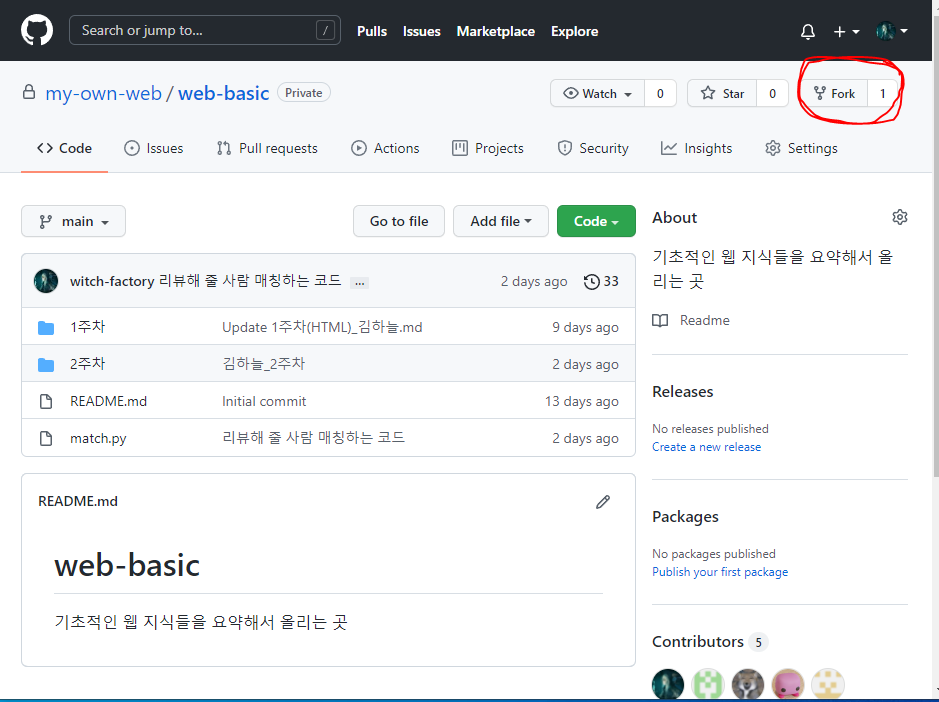
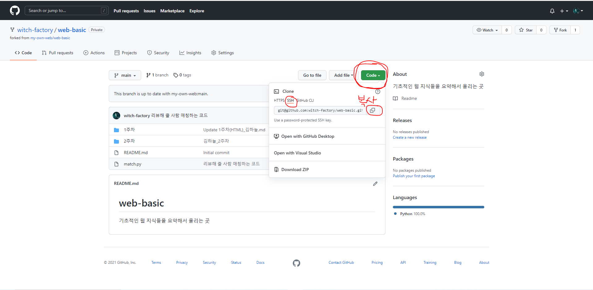

# 1. 스터디에서 git의 사용

웹의 첫걸음을 떼기 위해 프론트(React), 백(Express) 작업 그리고 배포까지의 과정을 엉성하게나마 한번 끝까지 해 보기 위한 스터디를 만들었다. 이런 스터디는 각자에게 공부를 강제하는 구속구 역할만 잘 해줘도 중박은 친다고 생각한다. 그런데 어쨌거나 다른 사람들과 함께 모여서 스터디를 하는 것이므로, 혼자 하는 것보다 좋은 점이 있다면, 더 배우는 점이 있다면 좋을 것이다. 나는 스터디장으로서 그것을 위한 여러 가지 장치를 만들어 보았다. 그 중 하나가 남의 코드를 읽고 남이 코드를 짜면서 한 생각을 배울 기회를 제공하는 것이다.

그런데 다른 사람과 코드를 어떻게 공유할 것인가? 카톡으로 파일 보내기를 할 수도 있다. 그러나 우리는 개발의 길을 걷는다면 꼭 다뤄봐야 할 툴이며 숙련되면 카톡 보내기보다 더 간편해질(나는 그러리라고 믿고 있다) git을 쓰도록 할 것이다. git에 대한 자료는 인터넷에 아주 많고 나를 포함한 모두가 계속 구글링을 하면서 더 배워야겠지만, 여기서는 일단 스터디에 필요한 부분만 간단하게 다룰 것이다.

# 2. git의 기본

git은 코드를 관리할 수 있는 도구이다. 우리가 어떤 부분을 수정했는지도 추적할 수 있고, 코드에 대한 백업도 제공하고 있다. 그 외에도 협업을 위한 기능 등 수많은 편의기능들을 제공한다. 

먼저 이 사이트에 나와 있는 과정을 따라하면서 git 설치를 진행해 보자. 기본적인 기능들에 대한 설명도 있다.

https://goddaehee.tistory.com/216?category=381481

https://goddaehee.tistory.com/217?category=381481

git을 설치했다면, 이제 스터디에서 진행할 코드 공유 방법을 설명한다. 이 글을 많이 참고했다.

https://gmlwjd9405.github.io/2017/10/28/how-to-collaborate-on-GitHub-2.html

먼저 my-own-web 조직에 있는 web-basic 레포지토리를 각자의 원격 저장소에 fork한다. 



이제 각자의 git 계정의 원격 저장소마다 우리의 스터디 레포지토리의 복제품이 하나씩 들어가 있을 것이다. 그러면 이제 그것을 각자의 로컬 저장소(컴퓨터의 저장공간)에 가져오자.

먼저 레포지토리를 담을 적당한 폴더를 원하는 위치에 만든다. 가령 `web-study` 같은 이름의 폴더를 만드는 것이다. 그리고 그 폴더 내부에서 git bash를 열고 다음과 같은 명령을 한다.

```
git init
```

그리고 자신의 계정 저장소에 fork된 레포지토리를 로컬 저장소에 불러올 것이다. 가령 나는 `witch-factory/web-basic` 이라는 저장소가 있다. 이를 불러오겠다. 각자의 github 계정의 web-basic 저장소에 들어가게 되면 초록색으로 code 라고 쓰인 버튼이 있을 것이다. 그걸 눌러서 ssh 항목을 선택하고 아래 나오는 주소를 복사한다.



그리고 이를 아까 만든 폴더의 원격 저장소에 추가하자. 우리가 `git init`을 했던 저장소에 다시 들어가 터미널을 열고 다음 명령을 실행한다.

```
git remote add origin 아까 복사한 주소
```

나 같은 경우에는 다음과 같은 명령이었다.

```
git remote add origin git@github.com:witch-factory/web-basic.git
```

그리고 나서 원격 저장소의 내용을 로컬 저장소로 끌어오자(pull)

```
git pull origin main
```


<span style="color:red">이때 주의해야 할 점은 우리가 organization에서 만든 web-basic 레포지토리가 아니라 각자의 저장소에 fork한 레포지토리에서 이 작업을 진행해야 한다는 것이다.</span>.

`git clone`으로도 이 작업을 똑같이 할 수 있지만, 연결된 원격 저장소에 origin이라는 이름을 주는 것을 명시적으로 보여줄 수 있다고 생각해서 이렇게 했다. 만약 원격 저장소가 로컬에 잘 저장되어 있는지 궁금하다면 `git remote -v` 커맨드로 현재 로컬 저장소에 연결된 원격 저장소들을 볼 수 있다.

그리고 우리가 이렇게 git으로 연결한 저장소에서 어떤 작업을 진행했다고 하자. 나는 create-react-app을 이용해서 내 이름의 react 작업 폴더를 만들었다.

```
npx create-react-app sunghyun
```

그러면 로컬 저장소에 sunghyun이라는 폴더가 생성된다. 나는 react 작업을 하기 위해서 이렇게 한 것 뿐이고, 중요한 것은 저장소에 어떤 변경 사항이 생겼다는 것이다. 내가 텍스트 파일을 하나 만들었더라도 마찬가지고 기존의 무언가를 삭제했더라도 마찬가지다.

`git status` 명령으로 저장소의 변경 사항을 확인할 수 있다. 나는 `sunghyun` 폴더가 새로 생겼으며 git에 의해 추적되지 않고 있는 상태라고 뜬다.

이를 git에 의해 추적되도록 해주자.

```
git add .
```

위 명령으로 git에 의해 추적되지 않는 파일을 모두 추적되도록 할 수 있다. 그리고 변경 사항을 커밋한다.

```
git commit -m "커밋 메시지"
```

그리고 이 변경 사항을 실제 원격 저장소에 반영한다. 커밋 상태까지는 이 변경 사항이 어디에 반영될지 아직 정해지지 않은 상태이기 때문이다.

```
git push origin main
```

만약 뭔가 오류가 뜬다면 `git branch` 명령어로 현재 저장소가 어떤 브랜치에 의해서 추적되고 있는지를 알 수 있다. 그때 브랜치가 `master` 같은 이름으로 떠 있을 수 있는데, 그럴 때는 

```
git branch -m main
```

이라는 커맨드로, 현재의 변경 사항이 main 브랜치에 따라가도록 할 수 있다. 그렇게 한 이후 `git add .` 부터 다시 진행하면 된다.

https://velog.io/@kimiszero/github-src-refspec-master-does-not-match-any-%ED%95%B4%EA%B2%B0%EB%B0%A9%EB%B2%95

이런 브랜치를 좀 더 잘 다루고 싶다면, `git checkout`, `git merge` 등의 명령들을 사용하여 작업별로 브랜치를 나눠서 작업하는 방법도 있다.

https://backlog.com/git-tutorial/kr/stepup/stepup2_4.html

다만 지금 당장은 필요 없다고 생각된다. 어차피 PR만 날리면 되므로.

이렇게 자신만의 원격 저장소에 자신의 로컬 저장소 내용을 푸시하고 나서 github.com에 들어가 자신의 원격 저장소에 들어간다. 그러면 `This branch is 1 commit ahead of my-own-web:main.` 과 같은, 무언가 중앙 저장소(우리의 my-own-web 레포지토리)에 비해 나의 원격 저장소에 변경사항이 있다는 것을 알려주는 메시지가 뜬다. 

그럼 그 옆에 contribute라는 항목이 있다. 내가 내 원격 저장소에서 변경한 사안을 중앙 저장소에 기여하겠냐는 뜻이다. 그 옆에 Fetch upstream 항목은 중앙 저장소에서 변경된 내용을 내가 내 원격 저장소로 가져오겠냐는 뜻인데 아직 우리가 할 필요는 없다.

어쨌든 contribute 항목을 눌러 `open pull request` 를 선택한다.


그리고 pull request를 할 때 중앙 저장소의 사람들에게 보여줄 메시지를 작성한 후 create pull request를 누른다. 

우리가 한 작업은 다음과 같다.

1. 중앙 저장소를 나의 계정 고유의 레포지토리에 본을 뜬다.

2. 나의 계정에 본따진 레포지토리를 내 로컬 저장소에 가져온다.

3. 로컬 저장소에서 작업을 한다.

4. 로컬 저장소에서 작업한 내용을 내 계정의 레포지토리에 반영한다.

5. 내 계정의 레포지토리에 반영된 변경 사항을 중앙 저장소에 반영되기를 요청한다.

   

그러면 이제 다른 사람들이 그 pull request를 보고 내가 변경한 사항이 무엇인지 등을 확인하고 코멘트를 달아줄 수 있다. 오른쪽에는 작게 reviewers 항목이 있는데 거기서 다른 사람들에게 리뷰를 요청할 수도 있다.


이때 각자의 아이디를 누르면 그 사람에게 내 pull request에 대한 리뷰를 요청하는 메일이 간다.

그리고 내가 변경한 사항이 만약 중앙 저장소와 충돌되는 부분이 없다면 그대로 중앙 저장소에 내 변경 사항을 반영시킬 수 있다. 초록색의 `merge pull request` 버튼이 그것이다. 우리는 각자의 폴더를 만들어서 작업할 것이기 때문에 작업 내용이 겹칠 일은 웬만해선 없을 것이다. <span style="color:red">하지만 아직 merge를 하지는 말자...혹시 돌발 상황이 발생할 수도 있으므로 merge는 다 모였을 때 한번에 할 것이다.</span>

그리고 스터디에서 각자가 지정된 사람의 작업 내용에 대해 리뷰를 하기로 했는데, 그 리뷰도 위에서 한 것과 같이 PR에 comment를 남기는 방식으로 진행하게 될 것이다.

