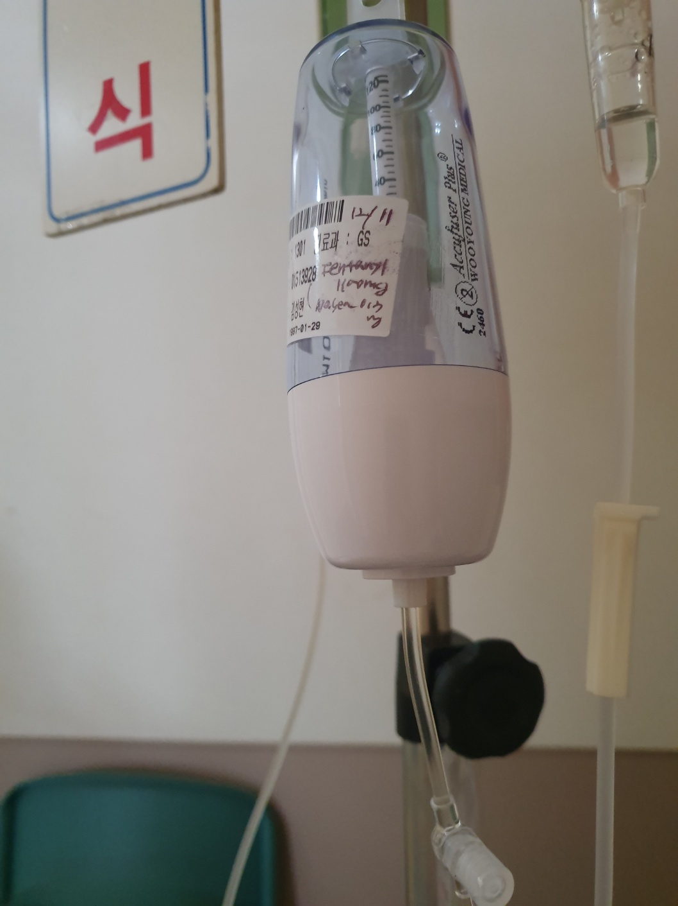
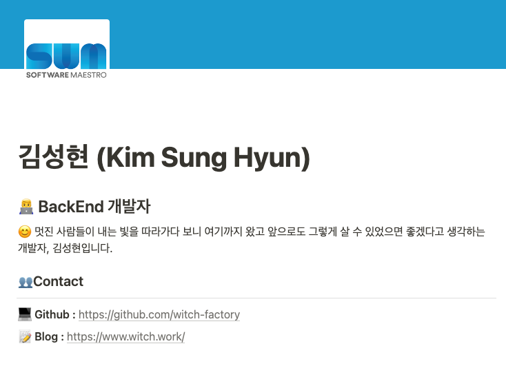
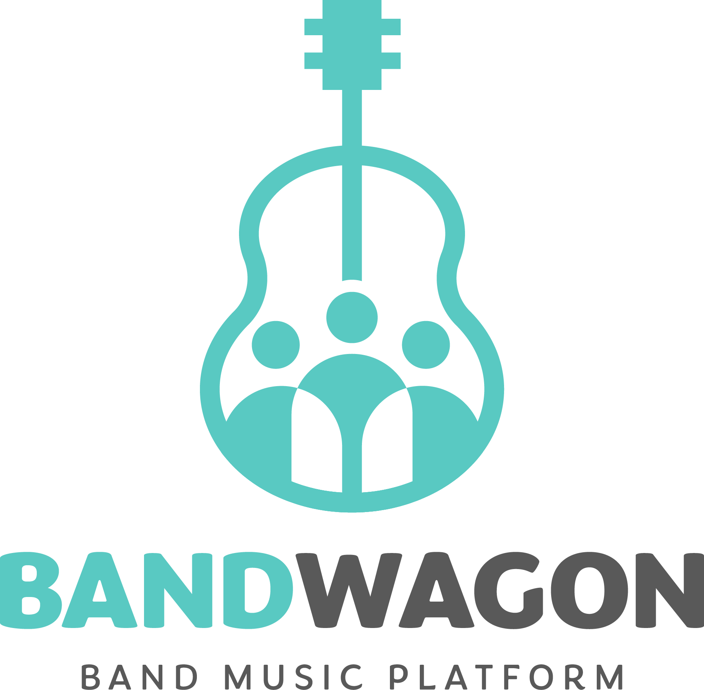
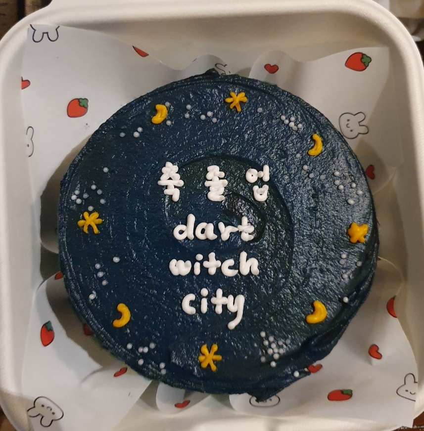

# 시작

1학년 때 나는 내가 내 본전공인 기계공학과의 교수가 되는 상상을 하곤 했다.

높은 학점으로 학교를 졸업하고 석사 학위를 받는다. 정든 친구들과 부모님을 잠시 뒤로하고 먼 미국으로 날아가서 박사과정을 밟는다. 험난한 과정을 어떻게든 이겨내고 열심히 논문을 쓰고 박사후 과정을 할 수도 있겠다. 그렇게 오랜 과정을 거쳐서 드디어 교수가 된다.

처음 강의를 하는 날 나는 강의실 문을 열고 들어와서 말한다. "15년 전 여기 이 자리에 저도 앉아 있었습니다." 그리고 강단으로 한 걸음 올라서면서 말한다. "제가 이 계단 하나를 올라오기까지 15년이 걸렸습니다."

오글거리는 상상이다. 하지만 만약 저렇게 할 수 있다면 멋있을 거라고 지금도 생각한다. 1학년 때는, 저 멋있는 상상을 실현하는 것에 평생을 바치는 게 내 삶에 있어 좋은 답이자 꿈이라고 생각했다.

그리고 그때 교수가 되는 데 걸리리라 생각했던 15년의 반 가까이가 지나서 지금이 되었다. 난 내가 1학년 때 상상은 커녕 그런 게 존재하는지 알지도 못했던 프론트엔드 개발자라는 직업을 갖고 있다.

솔직히 뭔가 위대한 뜻을 품고 살아서 이렇게 된 건 아니다. 그저 멋진 사람들이 내는 빛을 따라가다 보니 여기까지 왔을 뿐이다. 그리고 그들과 함께하며 여기까지 오고 보니 앞으로도 그렇게 살고 싶었다. 나 스스로도 이런 말에 맞는 사람으로 살려고 했다. 그렇게 보낸 시간이 마치 내가 내린 삶의 답처럼 보였다.

# 기계공학의 시간

내 본전공은 기계공학이다. 내 수능 성적으로 선택할 수 있는 가장 좋은 과였다. 또한 그때의 많은 고3들이 그랬듯 나도 내가 그렇게 점수 맞춰 간 과를 좋아하게 될 거라고 생각했다.

위에 말했듯 나는 내가 기계공학과 교수가 될 거라고 쉽게 생각했다. 앞으로 더욱 승승장구하며 성공의 사다리를 오를 거라고 당연히 생각한 것이다. 마치 내가 꽤 좋은 수능 점수를 얻고 괜찮은 대학에 왔듯이 말이다. 내 삶이 일차함수 그래프처럼 단조로운 상승 곡선을 그리리라고 믿었다.

하지만 어디서나 그렇듯 잘하는 것도 좋아하는 것도 쉽지 않았다. 입학한 지 1년도 되지 않은 새내기가 알 수 있는 건 얼마 없었지만, 내가 상상하던 걸 실제로 이루는 건 정말 어려운 일이라는 것 하나는 쉽게 깨달을 수 있었다. 내가 그 어려운 일을 이루기 위한 뚜렷한 동기부여가 없는 사람이라는 것도 역시 알기 쉬웠다.

그래서 아무것도 하지 않았다. 무엇을 해야 할지도 몰랐다. 수업에는 그럭저럭 출석했지만 수업을 듣지는 않았다. 시험기간에는 대세를 따라 도서관에 가기도 했지만 몇 시간씩 멍하니 있다가 오기 일쑤였다.

아무 곳에도 흥미도 정도 붙이지 못하고 아는 사람이라고는 거의 없이, 내려가는 학점을 안고 2년이란 시간을 지루하게 흘려보냈다. 그렇게 2학년을 마치고 부모님에게 떠밀려 군대에 갔다.

# 군대의 시간과 프로그래밍의 시작

군대는 아무 생각 없이 지내기 참 좋은 곳이었다. 좋아하지 않는 학과도 남은 학기를 어떻게 보낼지 하는 걱정도 진로 고민도 모두 내려놓고 단순하게 살았다.훈련을 받고 근무를 서고 군복을 빨고 휴가를 나오며 1년이 넘게 지났다.

그러던 어느 날 누군가가 업무용 컴퓨터에 간단한 매크로를 만들어 놓았다. 이 매크로는 반복적으로 복사-붙여넣기를 하고 하나하나 변환하던 작업을 단축키 한 번에 처리해 주었다.

알아보니 그걸 만든 사람은 서울대 컴퓨터공학과 출신의 한 후임이었다. 그를 찾아가 어떻게 그런 매크로를 만드냐고 물었고 그는 파이썬이라는 대답을 해주었다. 당시 별로 할 일도 없었던 나는 그가 말한 파이썬을 배우기 시작했다.

사지방에서 점프 투 파이썬을 떼고, 그 후임과 함께 매크로를 만지작거렸다. 그리고 전역 한 달 전부터 검색하다가 우연히 찾은 [백준 온라인 저지(이하 백준)](https://www.acmicpc.net/)라는 사이트에서 알고리즘 문제를 풀기 시작했다. 알고리즘 문제라고 했지만 사실 알고리즘이 필요 없는 단순한 문제들을 주로 풀었다. 전역할 때쯤은 200문제 정도가 풀려 있었던 걸로 기억한다.

# 알고리즘의 시간

전역하고 나니 같이 프로그래밍을 공부할 사람이 없었다. 그래서 2019년, 학교에 있던 알고리즘 학회 [Sogang ICPC Team](https://icpc.team/)과 카카오톡 오픈채팅방인 ['백준푸는방'](https://bbconf.kr/about/)을 찾아 들어가게 되었다. 사실 커뮤니티의 이름은 그렇게 중요하지 않다. 중요한 건 그곳에서 나를 기다리고 있던 사람들이었다.

그곳에 들어가자 몇몇 사람들이 마치 무언가에 홀리기라도 한 것처럼 백준을 풀고 있었다. 그들은 매일같이 DP니 네트워크 플로우니 무슨무슨 트리니 하는 이야기를 했다.

그들은 수업을 듣는 대신 백준을 풀었고 길을 가면서도 문제 생각을 했고 매일같이 자신이 푼 문제를 올리고 서로서로 풀이를 공유했다. 내가 질문을 하면 다들 신이 나서 친절하게 알려주었다.

얼마 지나지 않아 그들을 직접 만날 기회도 있었다. 그들은 만나서도 백준 푸는 방법을 담은 ppt로 발표를 했고 백준을 풀었다. 그리고 그들 중 몇몇은 자신은 1조원이 있어도 백준을 풀 것 같다고 말했다.

나는 그렇게 무언가에 흥미를 가지고 스스로 찾아 공부하는 사람들을 만난 게 처음이었다. 그건 내게 아주 큰 충격이었다. 나는 대학에 와서 지금까지 학과 공부는 커녕 흥미 있는 것 단 하나도 없었는데, 그게 뭐건 간에 이렇게 열심히 공부하는 사람들이 있다니! 나는 그들이 굉장히 멋있다고 생각했다. 지금도 그게 멋있다고 생각하는 건 마찬가지다.

그런 사람들과 교류하다가 나는 2020년에 복학을 했다. 흥미도 아는 사람도 거의 없는 기계공학과가 나를 반겼다. 그런 학교에서 가끔 컴퓨터공학과 사람들과 밥을 먹고 백준을 풀면서, 이럴 거면 컴퓨터공학과에 가고 싶다는 생각을 했다.

하지만 그때까지도 나는 쉽게 진로를 틀 수 없었다. 기계공학과는 쉽게 버리기에는 여전히 많은 수요가 있는 전공이었다. 또 학점은 낮았지만 이미 쏟은 시간도 있었다. 그래서 나는 일단 자료구조와 같은 컴퓨터공학과의 기초 과목만 몇 개 들어보기로 했다.

# 병원의 시간

2020년 2학기에는 기계공학 과목 5개와 함께 자료구조를 수강했다. 그런데 중간고사가 끝날 즈음부터 갑자기 배가 너무 아팠다. 긴 진료 과정과 여러 검사를 거쳐 나온 진단은 크론병이라는 희귀 난치병이었다. 상태가 많이 좋지 않았기 때문에 즉시 입원을 하고 시간이 좀 지나 수술을 받았다. 휴학도 불가피했다. 고통스런 시간이었다.

나는 20대에 '합법적으로' 펜타닐을 맞아 본 얼마 안 되는 사람 중 하나다. 그 당시에도 펜타닐은 신종 마약이라고 논란이 되고 있는 약물이었기 때문에 신기해서 그때 찍어 놓았던 사진이다. 아프기는 했지만 이렇게 수술을 받고 병원을 드나드는 것 자체가 20대에 드문 경험이다 보니 왠지 사진을 찍어야겠다는 생각이 드는 이런 순간들이 있었다.

나만 그랬는지도 모르지만 병원에 있는 건 단순히 몸이 아픈 것 이상으로 엄청난 심리적 고통을 줬다. 안 그래도 휴학하고 논 시간 등으로 인해 뒤처졌는데 더욱 더 뒤처지지 않았을까 하는 걱정, 앞으로 건강을 지킬 수 있을까 하는 걱정 등등이 밀려왔다.

특히, 내가 지금까지처럼 제법 건강과 활기를 지키면서 살 수 있는 시간이 얼마 남지 않았을지도 모른다는 느낌이 가장 강렬하게 들었다. 내가 아파서 호출벨을 누르면 달려와서 "얼만큼 아프세요? 1에서 10까지 중에서 말씀해 주세요"하는 질문을 던지는 신규 간호사들도 나보다 어린데 나는 이렇게 아무 역할도 하지 못하고 누워만 있다는 무력감도 많이 들었다.

기계공학이 수요가 많든 괜찮은 전공이든 내가 나중에 교수가 되든 그게 정말 중요한가 하는 생각이 문득 들었다. 그간 내가 해왔고 해야 한다고 생각했던 것들의 대부분은 미래를 위해 현재를 희생하는 행동들이었다. 기계공학 전공 공부는 재미가 없지만 취업을 해야 하니까 하고, 또 취직에 필요한 관련 경험을 쌓기 위해 재미없는 학부연구생을 해야 하고, 그런 것들 말이다.

하지만 나는 내가 꿈꾸던 미래가 아니라 바로 지금, 이렇게 상상도 못했던 병에 걸려 아픈 배를 부여잡고 누워 있었다. 앞으로 5년 뒤나 10년 뒤에 무엇이 된들 그게 무슨 상관이고 의미란 말인가? 애초에 진짜 그런 미래가 펼쳐지는 게 확실하기나 하단 말인가? 내가 스물네 살에 병원 침대에 눕게 될 거라고 상상하지 못했듯 어떤 미래가 올지 같은 건 알 수 없다.

그렇다면 이왕 이렇게 된 거 지금 약간의 단서와 흥미라도 보이는 곳으로 가는 것도 좋지 않을까? 지금까지 쏟은 시간을 아쉬워하며 본전공을 붙잡고 있는 대신 내가 본 멋진 사람들이 가는 길을 따라가 보는 것도 괜찮지 않을까?

1조원이 있어도 백준을 풀겠다던 사람들. 자신이 무엇을 하고 싶고 무엇을 즐거워하는지 확실히 아는 것 같은 사람들. 자기가 하는 것을 사랑한다고 단 1초도 망설임 없이 말할 수 있는 사람들. 그들은 뭔가를 알지 않을까? 그들과 함께 가면 나도 뭔가 알게 되지 않을까? 먼 미래 같은 건 아무래도 좋고 지금 내게는 이 컴퓨터맨들이 너무 멋있어 보이니까 이들을 따라가 보아도 좋지 않을까?

# 다시 한 번 기계공학의 시간

퇴원 후 요양을 끝내고 2021년 1학기에 복학해서는 바로 컴퓨터공학 복수전공을 시작했다. 그때에는 이미 함께 알고리즘을 하는 지인들도 있었고 학회에서도 충분히 자리를 잡은 상태였다. 여러 사람들이 내 복수전공 첫걸음을 환영해 주었다.

그러나 군대를 다녀오면서 머리를 한번 비워낸 뒤 다시 한 기계공학은 크게 재미는 없었지만 할 만 했다. 예전에는 왜 이걸 그렇게 어려워했나 싶을 정도였다. 이대로 이 전공을 버리기는 아깝다는 생각이 들었다. 

그래서 기계공학과의 로보틱스 연구실에 들어갔다. 컴퓨터공학 복수전공도 좀 살릴 수 있을 것 같았고 이 분야는 조금은 재밌어 보여서 그랬다.

그 연구실에서 만난 사람들은 어떻게 보아도 멋있고 빛나는 사람들이었다. 나는 내가 새내기 때 혹은 군대에 가기 전에 그 연구실 사람들을 만났다면 어땠을까, 그러면 나는 그 멋진 사람들과 함께 기계공학과에서 행복할 수도 있지 않았을까 하는 상상을 지금도 가끔 하곤 한다.

교수님은 부임한 지 얼마 안 되어 열정이 넘쳤다. 로보틱스라는 유망한 분야의 연구실답게 같이 있는 대학원생들이나 학부생들도 똑똑하고 연구를 좋아하는 사람들이었다. 또한 나는 창립 멤버라 연구실 선반부터 조립하며 처음부터 함께 시작했다. 그래서 다른 연구실과 달리 텃세 같은 걸 걱정할 일도 없었다. 만약 내가 그 연구실에서 석사를 하겠다고 했다면 교수님과 그때의 동료들은 흔쾌히 받아줬으리라고 확신한다.

하지만 그런 완벽한 연구실의 유일한 단점이 있었다. 그 공부가 내게는 재미가 없었다는 사실이었다. 열정 넘치고 흥미도 가진 동료들을 억지로 따라가는 시간들이었다. 그래서 이 정도로 완벽한 연구실에서조차 내가 흥미를 가질 수 없다면 기계공학은 정말 내 길이 아닌가 보다 하는 생각을 했다.

교수님을 찾아가 이런 말씀을 드렸다. 교수님은 카이스트 출신이셨는데 거기서 흥미 없이 마치 정해진 길을 따라가듯이 대학원에 진학했다가 방황하는 사람을 너무 많이 보았다는 이야기를 들려주셨다. 그리고 내가 이 분야에 흥미가 없다는 사실을 빨리 찾은 걸 축하한다고 해주셨다.

그렇게 나는 기계공학에서 완전히 마음을 떠나보냈다. 이후에도 몇몇 전공과목을 들었고 성적도 나쁘지 않았다. 하지만 더 이상 필수 학점 채우기 이상의 의미를 내게 갖지는 못했다.

# 개발자의 길

완전히 컴퓨터공학으로 진로를 변경했다. 학회 사람들을 비롯해서 같은 길을 가는 친구들이 내 앞을 밝혀 주었다. 내 동기 부여도 확실했기 때문에 다같이 공부를 하며 좋은 학점도 받았다. 여기서는 뭔가 답을 얻을 수 있을지도 모르겠다는 생각을 했다.

하지만 이제는 정말 진로 생각을 해야 했다. 알고리즘을 꽤 해봤고 스터디 같은 활동도 많이 했지만([관련해서 2021년에 썼던 알고리즘 대회 회고](https://witch.work/posts/sinchon-camp-2021-summer)) 사실 그때도 내가 알고리즘 관련해서 대성할 싹이 아니라는 것 정도는 감을 잡고 있었다.

알고리즘을 하면서 알게 된 사람을 한 명 찾아가 솔직하게 물었다.  소위 말하는 '네카라쿠배'에 간 사람이었다.

'알고리즘이 재밌고 사람들이 좋아서 여기까지 왔다. 하지만 내가 알고리즘 판에서 대성할 사람은 아닌 거 같은데 먹고는 살아야겠고, 나도 높이 가보고 싶은 사람이니까 그 이름높은 네카라에 가고 싶기도 하다, 어떡하지?'

그러자 그가 소프트웨어 마에스트로(이하 소마)라는 활동을 추천해 주었다. 일단 여기 지원해 보고 만약 떨어지면 42서울과 싸피에 차례로 지원하라고. 그리고 백엔드가 제일 무난하니까 남은 시간 동안 백엔드를 공부하라고 했다.

그렇게 2022년 초, 나는 소마에 지원하기까지를 돌아보면서 자기소개를 작성하고 지원했다. 그때의 자기소개가 지금 블로그에서 나를 나타내는 소개글이 되었다. 알고리즘 하던 사람들 하나만 보다가 거기까지 도달했었으니 그때도 그렇게 틀린 말은 아니었다고 생각한다.

> 대단한 뜻을 품고 사는 사람은 아닙니다. 그저 멋진 사람들이 내는 빛을 따라가다 보니 여기까지 왔고, 앞으로도 그렇게 살 수 있었으면 좋겠다고 생각하는 사람입니다. 이곳에 찾아오신 당신과도 함께할 수 있어 영광입니다. `마녀`라는 닉네임을 주로 씁니다.
>
> 지금 내 블로그의 자기소개

알고리즘은 꾸준히 해왔기에 코딩테스트는 수월하게 통과할 수 있었고 면접도 어떻게든 통과했다. 있는 열정 없는 열정 다 끌어모아 이야기한 게 어필하지 않았을까 생각한다. 그렇게 소마 13기에 합격했고 2022년 동안 소마 활동을 하면서 나는 백엔드 개발자로서의 첫 발을 내딛었다...고 생각했다. 나는 지금 프론트엔드 개발자가 되어 있다.

# 실패?

소마에서는 사회인 밴드 운영을 도와주고 그들 간의 교류를 할 수 있는 플랫폼 사이트를 만들었다. 그 과정에서 어차피 백엔드나 프론트나 모르니까 아무거나 하다 보니 프론트를 맡게 되어버렸다. 그런데 이것이 꽤 재미있었다. 반면 거기서 만난 백엔드들이 하는 것을 보고 나도 비슷한 것을 조금 공부해 보고는 했는데 프론트 역할을 버리고 그쪽으로 갈 만큼 흥미롭지는 않았다. 그렇게 나는 프론트 개발자의 길을 가게 되었다.

소마는 사실 내게 있어 그렇게 성공적인 결과물이 남은 시기는 아니다. 팀원들하고는 일 외의 이야기는 잘 하지 못했고 지금도 그다지 연락하지 않는다. 크게 싸운 것조차 아니라는 것이 내게 더 큰 실패로 다가온다. 디자인 외주 비용까지 들여 가며 작은 사이트를 구성했지만 배포도 금방 내려가 버렸다.

다만 그 시간들은 내게 그런 실패들을 반복하지 않기 위한 생각을 하게 했다. 그 생각들이 자잘하게 내가 몰랐던 빈 부분들을 채워주었지 않았나 한다. 프로젝트 초반에 어떻게 했어야 했는지, 그리고 나는 어떤 사람을 찾고 함께했어야 했는지 또 그런 사람들을 가려내고 얻어내는 데 도움을 주는 나만의 기준들은 무엇인지 같은 것들.

또 내가 원하는 모습의 프로젝트 팀은 뭔지, 소마 프로젝트에 주어진 환경은 꽤 괜찮았는데 대체 무엇이 문제였기에 이렇게 되었는지 같은 것들을 생각했다. 거기에 대한 나름의 결론도 조금씩 내리면서 가치관을 한번 더 다질 수 있었다. 또 소마라는 느슨하지만 든든한 커뮤니티도 하나 얻어서 언제든 그곳에서 스터디건 뭐건 구할 수 있게 되었다.

# 실패의 영향

신기하게 소마 그 자체에서는 많이 남은 게 없었지만 파생 효과로 얻은 건 꽤 많았다. 먼저 지금까지 이어지고 있는 공부 방향을 잡을 수 있었다. 소마 활동 후반에 다른 취준생들과 함께 '네카라쿠배' 중 한 회사에 지원하여 면접을 볼 기회가 있었다. 나는 그때 프론트를 깊이 해보지 않았기 때문에 기껏해야 디자인이 나온 페이지를 겨우겨우 찍어내는 게 전부였다.

그런데 그 면접에서는 내가 신경도 쓰지 못했던 자바스크립트의 깊은 내용에 대한 질문들이 쉴새없이 들어왔다. 1시간 반 동안 털린 나는 당연히 떨어졌고 매우 큰 후회를 느꼈다. 그렇게 바뀐 공부 방향이 기본부터 다지는 것이었고 그 결과가 이 블로그의 여러 글들이다.

또 소마 활동에 대하여 다른 학교에서 발표할 기회를 얻을 수 있었다. 그곳에서 많은 좋은 사람들을 만날 수 있었다. 그때 만난 사람들과는 아직도 교류한다. 같이 스터디를 하기도 하고 자주 생각도 나누곤 한다. 소마 발표를 하다가 오히려 소마에서보다 훨씬 깊은 동료들을 얻을 수 있었다.

마지막으로 소마를 했던 6개월 동안 인간관계에서의 실패를 많이 겪었기에 어떻게 하면 그러지 않을 수 있을까 하는 생각을 많이 했다. 나름의 대안들을 세웠고 이후에 진행한 스터디나 프로젝트에서는 그 대안들을 적용해 보기도 했다. 그게 어느 정도 먹혀서, 이후에 했던 활동들에서는 활동의 목적 자체는 실패한 것들도 있었지만 언제나 사람들은 남았다.

지금 생각해 보면 오히려 소마에서 약간의 실패를 함으로써 얻을 수 있었던 게 더 많았던 것 같기도 하다.

# 2022년, 정리

2022년에는 여러 대외 활동을 했었다. 소마에서는 프로젝트뿐 아니라 많은 사람들과 인사를 나누고 밥을 먹고 스터디를 조직해 이끌었다. 내 첫걸음을 끌어 주었던 알고리즘 학회에서 임원으로 활동했고 신촌지역 대학교들의 알고리즘 동아리들이 모여 만든 연합에서 알고리즘을 가르쳤다. '백준푸는방'에서 정기적으로 여는 세미나에서도 간단한 발표를 했다.

기존의 나에 비해서는 정말 많은 사람을 만났다. 그러면서 개발자도 결국 사람이고 사람과 함께하는 직업이라는 생각을 하고 굳혀 나갔다. 나는 개발자로서의 실력과 커리어라는 게 정량화되어 있는 것처럼 생각했었다. 마치 내 실력이 100이고 네 실력이 70이면 너는 내 밑이야, 같은 생각을 조금 가지고 있었다. 그래서 나는 한 1000쯤 되는 개발자가 되어서 다 이기고 다녀야지! 하는 생각을 했다.

하지만 그게 전부는 아니었다. 물론 확실히 표현되는 실력이라는 것이 존재했다(그게 어떤 숫자로 딱 떨어질 수 있는 것은 아니었지만). 하지만 사람을 만나다 보니 한없이 부족한 사람이라도 함께하고 싶어 미칠 것 같은 사람도 있었고, 나에 비해 압도적인 실력을 가졌어도 약간은 꺼려지는 사람도 있었다.

그러고 보면 내게 너무 멋있어 보였던 컴퓨터공학과 사람들도 누가 봐도 엄청난 그런 사람들은 아니었다. 그들도 알고리즘을 좋아하는 대학생이거나 평범한 주니어 개발자일 뿐이었다. 나를 단숨에 매료시킨 건 그들의 대단한 실력이 아니라 자신이 하는 것을 사랑하고, 망설임 없이 자기 일을 사랑한다고 말하는 모습이었다.

나는 그런 빛나는 말들을 따라 여기까지 왔고 대단한 사람들이 아니라 함께하고 싶은 사람들과 함께해 왔으면서도 그걸 머리로는 잊고 있었다. 당장 하고 싶은 일과 보고 싶은 사람들을 찾아가자고 하면서 컴퓨터공학과에 왔으면서, 또 무슨 엘리트코스를 밟아서 엄청난 실력을 가진 사람이 되겠다고 생각하고 있었다. 또 너무 멀리만 보아 버렸다.

아무도 모르고 아무것도 모르던 기계공학과의 복학생이 컴퓨터공학과 학회 임원이 되었고 알고리즘 강사가 되었고 여러 스터디의 장이 되었다. 그리고 그 길을 함께했던 멋진 사람들이 내 옆에 있었다. 사실 강사니 임원이니 하는 지위 따위는 아무런 의미가 없었다. 내가 보았던 빛나는 그들이 이제는 먼 곳이 아니라 내 옆에 있다. 이제 내가 좇아가야 할 먼 목표 따위는 어디 있는지 모르겠고 그들도 그런 건 모르는 것 같지만 함께하고 있으니 된 거 아닌가.

# 졸업

2023년 2월 졸업을 했다. 많은 사람들이 와서 축하를 해주었다. 따로 만난 후배들은 케이크와 편지를 주었다. dart와 city는 내가 백준에서 쓰는 아이디고, 나는 보통 온라인에서 `마녀`라는 닉네임을 쓴다.

오래 다닌 학교를 떠난다는 게 아쉽기는 했다. 하지만 몇 년간 이미 함께한 사람들이 있었고, 그들은 내가 졸업한다고 끊기는 사람들이 아니었다. 그들은 요즘도 나와 가끔 백준 이야기를 한다. 그래서 졸업이 크게 나를 변하게 하지는 않았다. 나는 똑같이 문제를 풀었고 자바스크립트를 공부했고 일기를 쓰곤 하면서 취준을 했다. 지금은 요행히 취업해서 잘 다니고 있다.

# 지금

나는 기계공학과 교수가 될 거라 생각했다. 그보다 더 예전에는 경제학자가 될 거라 생각했고 그전에는 판사가 되리라 생각했다. 거기까지 가는 시간이 쉬우리라 생각한 적은 한 번도 없다. 하지만 그 어려움에 대한 상상이란 건 아주 막연했다. '어려움이 있겠지만 나는 그걸 힘겹게 극복하고는 목표를 이룰 것이다'정도로 말이다. 마치 나는 결국은 위기를 극복해내는 소설 주인공이고 닥쳐오는 시련들은 그저 소설의 장치인 것처럼 상상한 것이다. 내가 그 위기를 넘기지 못하거나 위기로 인해 변하거나 하는 건 완전히 내 상상 밖이었다.

그리고 얼마 지나지 않아 진짜 시간과 거기 담긴 시련이 내게 닥쳤다. 좋은 일도 있고 나쁜 일도 있었다. 남들보다 특별히 더 힘들었다고 생각하지는 않는다. 나는 몇몇 경우에 꽤 운이 좋았다. 그래서 그 시간 중에 박혀 있던 몇몇 위기들은 상대적으로 쉽게 넘길 수도 있었다.

하지만 좋고 나쁘고를 떠나서, 존재조차도 전혀 상상하지 못한 일을 맞이한다는 것은 나를 나조차도 알 수 없는 방향으로 끌고 갔다. 아니, 이런 병이 세상에 존재해서 나를 이렇게 힘들게 하다니! 아니, 이렇게 멋있어서 따라가지 않고는 못 배길 사람들이 있다니! 그것들을 어떻게든 넘기고 나면 나는 좋든 나쁘든 많이 다른 사람이 되어 있었다.

그 과정에서 나는 꽤 오랫동안, 내가 어디로 갈지에 대한 답이 있다고 생각했다. 누군가는 그걸 알 거라고 생각했고 무엇인가는 인생의 마스터키 같은 거라 그것만 하면 될 거라 생각하기도 했다. 당연히 그것들은 다 정답이 아니었고 정답 같은 건 아무도 몰랐다. 어쩌면 정답이란 건 없는지도 모른다는 생각을 한다. 하지만 내가 그렇게 답을 찾으면서 지나왔던 시간들이 이제는 내가 찾은 답처럼 보였다.

그리고 이제는 그 답들이 들어 있는 내 주변의 사람들과 함께, 우리의 답이 맞았다는 것을 스스로 세상에 증명하기를 꿈꾼다.