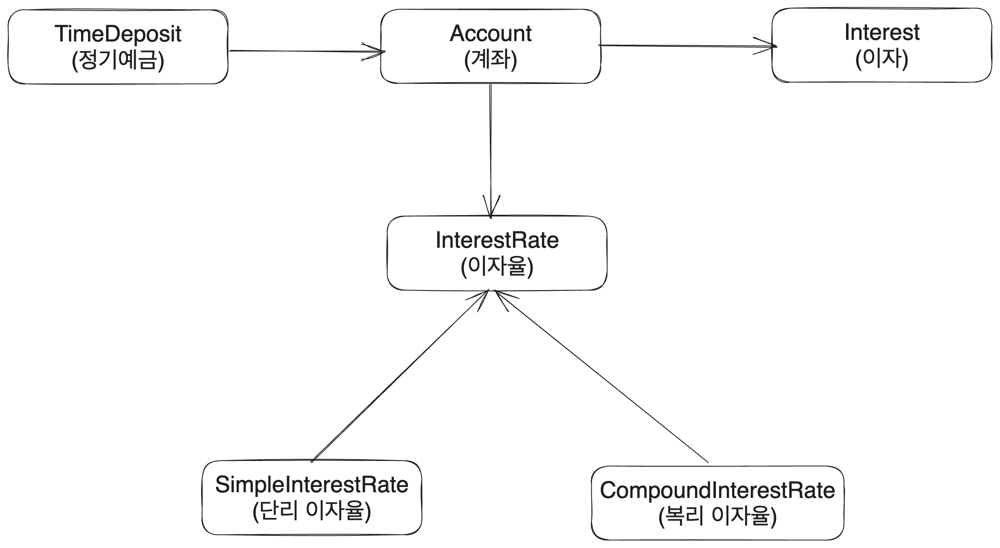
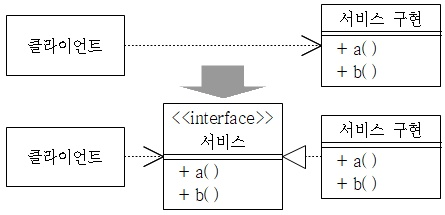

# 1. 의문의 시작

[객체지향의 사실과 오해](https://search.shopping.naver.com/book/catalog/32482589668?cat_id=50010920&frm=PBOKMOD&query=%EA%B0%9D%EC%B2%B4%EC%A7%80%ED%96%A5%EC%9D%98+%EC%82%AC%EC%8B%A4%EA%B3%BC+%EC%98%A4%ED%95%B4&NaPm=ct%3Dlkvvzqtc%7Cci%3D5211e57fe6c8ce2f9c1fe36b09a5c8dc67251120%7Ctr%3Dboknx%7Csn%3D95694%7Chk%3Dc5efb137f754a6758d8f82de28601994901bf66a)를 읽고 있다. 이 책의 후반부에 가면 실제로 프로그램 구조를 간단하게 짜 보는 예시가 있다. 예금에 관련된 구조를 짜는 다음과 같은 예시다. 메서드 같은 게 이 글에서 중요한 건 아니기 때문에 간단히 모방하였다.



이 예시에서는 이자율을 인터페이스로 만든 후 단리이자율, 복리이자율 클래스가 해당 인터페이스를 구현하도록 하는 식으로 구조를 구성하였다. 하지만 내가 이러한 개발 지식이 부족하여 이런 설계방식을 바로 이해하지 못했기에 고수들에게 물어보면서 배운 지식을 정리하였다. 예시 코드의 경우 의사 코드로 개념만 갖고가려 한다.

# 2. 의존성

A가 B에 의존한다는 것은 A가 B를 직접적으로 이용하며 A가 어떤 작업을 하기 위해서 B의 정보를 가지고 있어야 한다는 뜻이다. 예를 들어서 간단한 TodoList를 만든다고 하자. 다음과 같이 구성된 클래스를 생각할 수 있겠다.

```java
class TodoList {
  private Repository someDBRepository;

  TodoList() {
    this.someDBRepository = new someDB();
  }

  addTodo(todo) {
    this.someDBRepository.insertOne(todo);
  }

  removeTodo(todo) {
    this.someDBRepository.deleteOne(todo);
  }

  updateTodo(todo, newTodo) {
    this.someDBRepository.updateOne(todo, newTodo);
  }

  getTodo(id) {
    this.someDBRepository.findOne(id);
  }
}
```

이 클래스는 `someDBRepository`에 의존한다. 즉 `someDBRepository`를 사용하며 `someDBRepository`의 정보를 가지고 메서드를 직접 사용한다.

```
+-----------------+         +---------------------+
| TodoList        | ------> | someDBRepository    |
+-----------------+         +---------------------+
```

하지만 이렇게 설계할 시 확장이나 수정이 쉽지 않다. SOLID니 하는 원칙들이 수도 없지만 결국 우리는 변경사항에 유연하게 대처할 수 있도록 코드 구조를 짜야 하기 때문에 이는 문제다.

## 2.1. 의존성 역전

이를 해결하기 위해서는 의존성 역전을 적용해야 한다. 중간에 인터페이스를 하나 두는 것이다.



먼저 DB 클라이언트를 대표하는 인터페이스를 만든다. 그리고 이 인터페이스를 구현하는 클래스를 만든다. 그리고 이 클래스를 TodoList가 사용하도록 한다.

인터페이스는 다음과 같이 만든다. 기본적인 CRUD 메서드를 가지고 있다.

```java
public interface DBRepository {
  addElement();

  removeElement();

  updateElement();

  getElement();
}
```

이를 다음과 같이 구현한다.

```java
public class SomeDBRepository implements DBRepository {
  private Repository repository;

  public SomeDBRepository(repo) {
    this.repository = repo;
  }

  addElement(elem) {
    this.Connection.insertOne(elem);
  }

  removeElement(elem) {
    this.Connection.deleteOne(elem);
  }

  updateElement(elem, newElem) {
    this.Connection.updateOne(elem, newElem);
  }

  getElement(id) {
    this.Connection.findOne(id);
  }
}
```


# 참고

https://blog.itcode.dev/posts/2021/08/17/dependency-inversion-principle

https://github.com/binary-ho/TIL-public/blob/main/Architecture/%ED%85%8C%EC%8A%A4%ED%8A%B8%EC%99%80%20%EC%95%84%ED%82%A4%ED%85%8D%EC%B2%98.md

https://eunjin3786.tistory.com/198