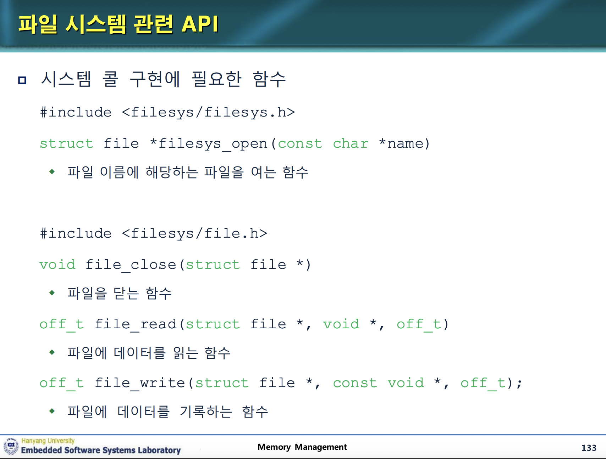
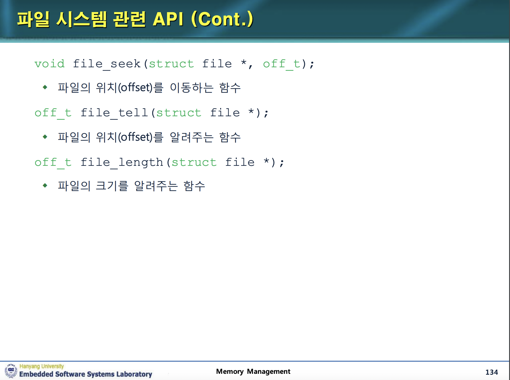
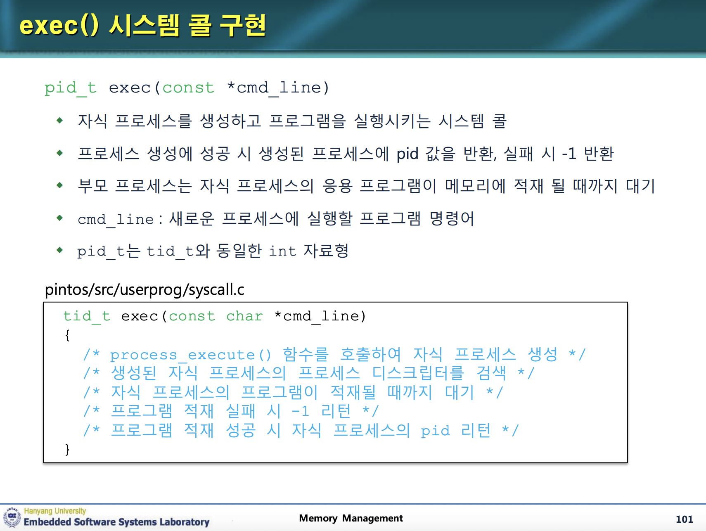

# 1. 프로젝트 개요

이번 프로젝트에서는 파일 시스템과 관련된 시스템 콜을 구현한다. create, remove, open, close, filesize, read, write, seek, tell을 구현하면 된다. 이 대부분은 이미 구현되어 있는 함수들을 이용할 수 있다.

하지만 이를 구현하기 위해서는 파일 디스크립터를 구현해야 한다.

# 2. 파일 디스크립터 구현

운영체제는 파일 디스크립터를 통해서 파일에 접근한다. 이때 파일이란 디스크에서의 입출력이나 모니터, 키보드 등 어떤 외부 디바이스일 수 있다. 그리고 파일 디스크립터란 이 파일들을 정수로 표현한 것이다. 파일 디스크립터는 0부터 시작해서 2까지는 표준 입출력을 위한 것이고, 3부터는 사용자가 open을 통해서 열 수 있는 파일들이다.

그리고 파일에 접근할 때는 파일 디스크립터 테이블을 이용한다. 예를 들어 3이라는 파일 디스크립터를 가진 파일이 있다면, 파일 디스크립터 테이블에는 3과 해당하는 파일에 대한 매칭이 저장되어 있다. 우리는 이 파일 디스크립터 테이블을 스레드 구조체에 추가해야 한다.

## 2.1 파일 디스크립터와 관련 기본 함수

핀토스 매뉴얼에 보면 파일 디스크립터는 최대 128까지만 있으면 된다고 하므로 크기 130의 배열을 만들어서 사용하면 된다. 먼저 편의를 위해 이를 매크로로 정의한다.

```c
#define FDTABLE_SIZE 130
```

그리고 파일 디스크립터 테이블을 스레드 구조체에 추가한다.

```c
// src/threads/thread.h 의 thread 구조체
#ifdef USERPROG
    /* Owned by userprog/process.c. */
    uint32_t *pagedir;                  /* Page directory. */
    // parent process descriptor
    struct thread* parent_thread;

    /* each structure
   that is a potential list element must embed a struct list_elem
   member. */
    /* child list element */
    struct list_elem child_thread_elem;
    /* child list */
    struct list child_threads;
    /* 프로세스의 프로그램 메모리 적재 여부 */
    bool load_flag;
    /* 프로세스 종료 유무 확인 */
    bool exit_flag;
    /* exit semaphore, 자식 프로세스 종료 대기를 위한 세마포어 */
    struct semaphore exit_sema;
    /* load semaphore, 자식 프로세스 생성 대기 */
    struct semaphore load_sema;
    /* exit 호출 시 종료 상태 */
    int exit_status;
    /* file descriptor table */
    struct file* fd_table[FDTABLE_SIZE];

#endif
```

이제 파일 디스크립터 테이블을 초기화하는 함수를 만들어야 한다. 이 함수는 스레드가 생성될 때 호출되어야 한다. 그래서 스레드 초기화 함수인 init_thread를 다음과 같이 수정한다.

```c
// src/threads/thread.c 의 init_thread 함수
static void
init_thread (struct thread *t, const char *name, int priority)
{
  enum intr_level old_level;

  ASSERT (t != NULL);
  ASSERT (PRI_MIN <= priority && priority <= PRI_MAX);
  ASSERT (name != NULL);

  memset (t, 0, sizeof *t);
  t->status = THREAD_BLOCKED;
  strlcpy (t->name, name, sizeof t->name);
  t->stack = (uint8_t *) t + PGSIZE;
  t->priority = priority;
  t->magic = THREAD_MAGIC;

  old_level = intr_disable ();
  list_push_back (&all_list, &t->allelem);
  intr_set_level (old_level);

  #ifdef USERPROG
  /* 자식 리스트 초기화 */
  list_init(&(t->child_threads));
  // push to the child list of the running thread
  list_push_back(&(running_thread()->child_threads), &(t->child_thread_elem));
  // 부모 프로세스 저장
  t->parent_thread=running_thread();
  sema_init(&(t->exit_sema), 0);
  sema_init(&(t->load_sema), 0);
  for(i=0;i<FDTABLE_SIZE;i++){
    t->fd_table[i]=NULL;
  }
  #endif
}
```

그리고 한양대학교 핀토스 ppt에서 시키는 함수들을 구현한다. 먼저 파일 디스크립터를 생성하는 함수를 구현한다. 이 함수는 파일 객체를 파일 디스크립터 테이블에 추가하고 파일 디스크립터를 리턴한다.

```c
// src/userprog/process.c 의 process_add_file 함수
int process_add_file(struct file* f){
  struct thread* t = thread_current();
  int i;
  for(i=3;i<FDTABLE_SIZE;i++){
    if(t->fd_table[i]==NULL){
      t->fd_table[i]=f;
      return i;
    }
  }
  return -1;
}
```

그리고 파일 디스크립터 값에 해당하는 파일 객체를 리턴하는 함수를 구현한다.

```c
// src/userprog/process.c 의 process_get_file 함수
// 파일 디스크립터에 대한 객체 주소 반환
struct file* process_get_file(int fd){
  struct thread* t = thread_current();
  if(fd<3 || fd>=FDTABLE_SIZE){
    return NULL;
  }
  return t->fd_table[fd];
}
```

그리고 파일 디스크립터에 해당하는 파일 객체를 닫는 함수를 구현한다.

```c
// src/userprog/process.c 의 process_close_file 함수
void process_close_file(int fd){
  struct thread* t = thread_current();
  if(fd<3 || fd>=FDTABLE_SIZE){
    return;
  }
  // NULL인 파일을 닫을 수는 없다.
  if(t->fd_table[fd]!=NULL){
    file_close(t->fd_table[fd]);
    t->fd_table[fd]=NULL;
  }
}
```

그리고 프로세스가 종료될 때는 프로세스에 열린 모든 파일을 닫도록 한다. 따라서 process_exit 함수를 다음과 같이 수정한다.

```c
/* Free the current process's resources. */
void
process_exit (void)
{
  struct thread *cur = thread_current ();
  uint32_t *pd;
  int i;

  /* new! */
  for(i=3;i<FDTABLE_SIZE;i++){
    process_close_file(i);
  }

  /* Destroy the current process's page directory and switch back
     to the kernel-only page directory. */
  pd = cur->pagedir;
  if (pd != NULL)
    {
      /* Correct ordering here is crucial.  We must set
         cur->pagedir to NULL before switching page directories,
         so that a timer interrupt can't switch back to the
         process page directory.  We must activate the base page
         directory before destroying the process's page
         directory, or our active page directory will be one
         that's been freed (and cleared). */
      cur->pagedir = NULL;
      pagedir_activate (NULL);
      pagedir_destroy (pd);
    }
}
```

## 2.2 파일 시스템 콜 구현

이제 파일 시스템 콜을 구현해 보자. 핀토스에서는 파일을 다루기 위한 함수들을 이미 몇 가지 제공하고 있다. 한양대 ppt에 자세히 설명되어 있는데 그것을 옮겨온다.




이제 이 함수들을 사용하여 파일 시스템 콜을 구현해 보자.

### 2.2.0 구현하기 전에

파일에 관한 시스템 콜을 구현하기 전에 고려해야 할 사항이 있다. 바로 파일에 대한 동시 접근을 막아야 한다는 점이다. 예를 들어서 A 파일을 내가 읽고 있는데 A 파일을 다른 프로세스에서 쓰기를 시도한다면 A 파일의 내용을 읽는 중에 내용이 바뀔 수 있다. 더 심한 것은 A 파일을 2개 이상의 프로세스가 동시에 쓰기를 시도할 경우 내용이 꼬일 수 있다.

따라서 파일에 대한 동시 접근을 막을 lock을 사용해야 한다. reader-writer problem처럼 읽는 건 동시에 여러 프로세스에서 할 수 있고 쓰기는 하나의 프로세스에서만 가능하게 하는 방법도 있겠지만 여기서는 가장 단순하게 읽기든 쓰기든 한 번에 하나의 프로세스만 파일에 접근할 수 있도록 구현한다.

핀토스에서는 이런 목적으로 `src/threads/synch.h`에 lock 구조체를 선언해 놓았다. 이를 사용하면 된다.

먼저 `src/userprog/syscall.h`에 전역 변수로 `struct lock filesys_lock;`을 추가한다.

그리고 `src/userprog/syscall.c`의 `syscall_init()`에서 `lock_init(&filesys_lock);`을 추가한다.

```c
void
syscall_init (void)
{
  lock_init(&filesys_lock);
  intr_register_int (0x30, 3, INTR_ON, syscall_handler, "syscall");
}
```

앞으로 시스템 콜을 구현할 때 이 락을 이용한다. open, read, write 시스템 콜에서 사용될 것이다.

### 2.2.1 파일 열기

open 시스템 콜은 파일을 열고 그 파일의 디스크립터를 반환한다. 파일을 열 때 락을 거는 열고 나서 락을 푸는 것, 파일이 NULL일 때의 처리를 해야 한다. 파일의 디스크립터를 부여할 때는 아까 구현한 `process_add_file()`을 사용한다.

```c
int open(const char* file){
  int fd;
  struct file* f;
  if(file==NULL){exit(-1);}
  lock_acquire(&filesys_lock);
  f=filesys_open(file);
  if(f==NULL){
    lock_release(&filesys_lock);
    return -1;
  }
  fd=process_add_file(f);
  lock_release(&filesys_lock);
  return fd;
}
```

### 2.2.2 파일 읽기

프로젝트 1에서는 read 시스템 콜을 stdin에 대해서만 구현하였다. 이번에는 파일에 대해서도 구현한다. 먼저 인자로 들어오는 fd가 음수일 때, stdout(==1)일 때 혹은 파일 디스크립터 테이블의 크기보다 클 때는 exit 시스템 콜을 호출해 준다. 그리고 락을 얻는다.

그 후 fd가 stdin이면 프로젝트 1에서 했던 키보드 입력을 읽는 동작을 한다. 아니라면 fd를 파일 디스크립터로 갖는 파일의 내용을 읽는다. 이러한 동작이 끝나고 나면 락을 풀어 줘야 한다.

```c
int read(int fd, void *buffer, unsigned int size){
  int result;
  uint8_t temp;
  if(fd<0 || fd==1 || fd>=FDTABLE_SIZE){exit(-1);}
  lock_acquire(&filesys_lock);
  if(fd==0){
    for(result=0;(result<size) && (temp=input_getc());result++){
      *(uint8_t*)(buffer+result)=temp;
    }
  }
  else{
    struct file* f=process_get_file(fd);
    if(f==NULL){
      lock_release(&filesys_lock);
      exit(-1);
    }
    result=file_read(f, buffer, size);
  }
  lock_release(&filesys_lock);
  return result;
}
```

### 2.2.3 파일 쓰기

write 시스템 콜은 파일에 쓰는 동작을 한다. 구현은 앞의 read 시스템 콜과 비슷하다. 인자로 들어오는 fd가 음수일 때, stdin(==0)일 때 혹은 파일 디스크립터 테이블의 크기보다 클 때는 exit 시스템 콜을 호출해 준다. 그리고 락을 얻는다.

그 후 fd가 stdout이면 프로젝트 1에서 했던 화면 출력을 하는 동작을 한다. 아니라면 fd를 파일 디스크립터로 갖는 파일에 쓴다. 이러한 동작이 끝나고 나면 락을 풀어 줘야 한다.

```c
int write(int fd, const void* buffer, unsigned int size){
  int file_write_result;
  struct file* f;
  if(fd<=0 || fd>=FDTABLE_SIZE){exit(-1);}
  lock_acquire(&filesys_lock);
  if(fd==1){
    putbuf(buffer, size);
    lock_release(&filesys_lock);
    return size;
  }
  else{
    f=process_get_file(fd);
    if(f==NULL){
      lock_release(&filesys_lock);
      exit(-1);
    }
    file_write_result=file_write(f, buffer, size);
    lock_release(&filesys_lock);
    return file_write_result;
  }
}
```

### 2.2.4 파일 생성

파일 생성은 다음과 같이 구현한다. filesys_create 함수를 그대로 사용하기만 하면 된다.

```c
bool create(const char *file, unsigned initial_size){
  // NULL 파일은 열 수 없다.
  if(file==NULL){
    exit(-1);
  }
  return filesys_create(file, initial_size);
}
```

### 2.2.5 파일 삭제

파일 삭제는 다음과 같이 구현한다. filesys_remove 함수를 그대로 사용하기만 하면 된다.

```c
bool remove(const char *file){
  // NULL 파일은 열 수 없다.
  if(file==NULL){
    exit(-1);
  }
  return filesys_remove(file);
}
```

### 2.2.6 파일 닫기

파일 닫기는 process_close_file 함수를 그대로 사용하기만 하면 된다.

```c
void close(int fd){
  process_close_file(fd);
}
```

### 2.2.7 파일 크기

파일 크기는 file_length 함수를 그대로 사용한다.

```c
int filesize(int fd){
  struct file* f=process_get_file(fd);
  if(f==NULL){exit(-1);}
  return file_length(f);
}
```

### 2.2.8 파일의 읽기/쓰기 위치 변경

파일의 편집 위치 변경은 file_seek 함수를 그대로 사용한다.

```c
void seek(int fd, unsigned int position){
  struct file* f=process_get_file(fd);
  if(f==NULL){exit(-1);}
  file_seek(f, position);
}
```

### 2.2.9 파일 위치 반환

파일 위치 반환은 file_tell 함수를 그대로 사용한다.

```c
unsigned int tell(int fd){
  struct file* f=process_get_file(fd);
  if(f==NULL){exit(-1);}
  return file_tell(f);
}
```

### 2.2.10 테스트

이제 이렇게 열심히 구현한 시스템 콜들을 시스템 콜 핸들러에 추가한다.

```c
static void
syscall_handler (struct intr_frame *f UNUSED)
{
  switch(*(int32_t*)(f->esp)){
    case SYS_HALT:                   /* Halt the operating system. */
    halt();
    break;
    case SYS_EXIT:                   /* Terminate this process. */
    check_address(f->esp+4);
    exit(*(int*)(f->esp+4));
    break;
    case SYS_EXEC:                   /* Start another process. */
    check_address(f->esp+4);
    f->eax=exec((char*)*(uint32_t*)(f->esp+4));
    break;
    case SYS_WAIT:                   /* Wait for a child process to die. */
    check_address(f->esp+4);
    f->eax = wait(*(uint32_t*)(f->esp+4));
    break;
    case SYS_CREATE:                 /* Create a file. */
    check_address(f->esp+4);
    check_address(f->esp+8);
    f->eax = create((char*)*(uint32_t*)(f->esp+4), *(uint32_t*)(f->esp+8));
    break;
    case SYS_REMOVE:                 /* Delete a file. */
    check_address(f->esp+4);
    f->eax = remove((char*)*(uint32_t*)(f->esp+4));
    break;
    case SYS_OPEN:                   /* Open a file. */
    check_address(f->esp+4);
    f->eax = open((char*)*(uint32_t*)(f->esp+4));
    break;
    case SYS_FILESIZE:               /* Obtain a file's size. */
    check_address(f->esp+4);
    f->eax = filesize(*(uint32_t*)(f->esp+4));
    break;
    case SYS_READ:                   /* Read from a file. */
    check_address(f->esp+4);
    check_address(f->esp+8);
    check_address(f->esp+12);
    f->eax = read((int)*(uint32_t*)(f->esp+4), (void*)*(uint32_t*)(f->esp+8),
					(unsigned)*(uint32_t*)(f->esp+12));
    break;
    case SYS_WRITE:                  /* Write to a file. */
    //printf("write system call!\n");
    check_address(f->esp+4);
    check_address(f->esp+8);
    check_address(f->esp+12);
    f->eax = write((int)*(uint32_t*)(f->esp+4), (const void*)*(uint32_t*)(f->esp+8),
					(unsigned)*(uint32_t*)(f->esp+12));
    break;
    case SYS_SEEK:                   /* Change position in a file. */
    check_address(f->esp+4);
    check_address(f->esp+8);
    seek((int)*(uint32_t*)(f->esp+4), (unsigned)*(uint32_t*)(f->esp+8));
    break;
    case SYS_TELL:                   /* Report current position in a file. */
    check_address(f->esp+4);
    f->eax = tell((int)*(uint32_t*)(f->esp+4));
    break;
    case SYS_CLOSE:                  /* Close a file. */
    check_address(f->esp+4);
    close(*(uint32_t*)(f->esp+4));
    break;
  }
  //printf ("system call! %d\n", *(int32_t*)(f->esp));
  //thread_exit ();
}
```

이제 대망의 make check을 해보면?? 안 된다..아예 프로세스가 끝나지 않는다.

왜 안되나 열심히 찾아보았더니 프로젝트 1에서 `thread_schedule_tail` 함수의 `palloc_free_page`를 주석처리하여 프로세스 디스크립터 삭제를 막는 부분이 있었는데 그 부분을 처리한 게 다시 원래대로 돌아가 있었다. 따라서 이 부분을 주석처리하고 다시 make check을 한다.

```c
// 수정된 thread_schedule_tail
void
thread_schedule_tail (struct thread *prev)
{
  struct thread *cur = running_thread ();

  ASSERT (intr_get_level () == INTR_OFF);

  /* Mark us as running. */
  cur->status = THREAD_RUNNING;

  /* Start new time slice. */
  thread_ticks = 0;

#ifdef USERPROG
  /* Activate the new address space. */
  process_activate ();
#endif

  /* If the thread we switched from is dying, destroy its struct
     thread.  This must happen late so that thread_exit() doesn't
     pull out the rug under itself.  (We don't free
     initial_thread because its memory was not obtained via
     palloc().) */
  if (prev != NULL && prev->status == THREAD_DYING && prev != initial_thread)
    {
      ASSERT (prev != cur);
      /* 이 부분을 주석처리해서 프로세스 디스크립터 삭제를 막는다. */
      //palloc_free_page (prev);
    }
}
```

이제는 7개 빼고 모두 통과하는 것을 확인할 수 있다.

```
run: wait for child 2 of 10 returned 0 (expected 1): FAILED
pass tests/userprog/args-none
pass tests/userprog/args-single
pass tests/userprog/args-multiple
pass tests/userprog/args-many
pass tests/userprog/args-dbl-space
pass tests/userprog/sc-bad-sp
pass tests/userprog/sc-bad-arg
pass tests/userprog/sc-boundary
pass tests/userprog/sc-boundary-2
pass tests/userprog/sc-boundary-3
pass tests/userprog/halt
pass tests/userprog/exit
pass tests/userprog/create-normal
pass tests/userprog/create-empty
pass tests/userprog/create-null
pass tests/userprog/create-bad-ptr
pass tests/userprog/create-long
pass tests/userprog/create-exists
pass tests/userprog/create-bound
pass tests/userprog/open-normal
pass tests/userprog/open-missing
pass tests/userprog/open-boundary
pass tests/userprog/open-empty
pass tests/userprog/open-null
pass tests/userprog/open-bad-ptr
pass tests/userprog/open-twice
pass tests/userprog/close-normal
pass tests/userprog/close-twice
pass tests/userprog/close-stdin
pass tests/userprog/close-stdout
pass tests/userprog/close-bad-fd
pass tests/userprog/read-normal
FAIL tests/userprog/read-bad-ptr
pass tests/userprog/read-boundary
pass tests/userprog/read-zero
pass tests/userprog/read-stdout
pass tests/userprog/read-bad-fd
pass tests/userprog/write-normal
pass tests/userprog/write-bad-ptr
pass tests/userprog/write-boundary
pass tests/userprog/write-zero
pass tests/userprog/write-stdin
pass tests/userprog/write-bad-fd
pass tests/userprog/exec-once
pass tests/userprog/exec-arg
pass tests/userprog/exec-bound
pass tests/userprog/exec-bound-2
pass tests/userprog/exec-bound-3
pass tests/userprog/exec-multiple
pass tests/userprog/exec-missing
pass tests/userprog/exec-bad-ptr
pass tests/userprog/wait-simple
pass tests/userprog/wait-twice
pass tests/userprog/wait-killed
pass tests/userprog/wait-bad-pid
pass tests/userprog/multi-recurse
pass tests/userprog/multi-child-fd
FAIL tests/userprog/rox-simple
FAIL tests/userprog/rox-child
FAIL tests/userprog/rox-multichild
pass tests/userprog/bad-read
pass tests/userprog/bad-write
pass tests/userprog/bad-read2
pass tests/userprog/bad-write2
pass tests/userprog/bad-jump
pass tests/userprog/bad-jump2
FAIL tests/userprog/no-vm/multi-oom
pass tests/filesys/base/lg-create
pass tests/filesys/base/lg-full
pass tests/filesys/base/lg-random
pass tests/filesys/base/lg-seq-block
pass tests/filesys/base/lg-seq-random
pass tests/filesys/base/sm-create
pass tests/filesys/base/sm-full
pass tests/filesys/base/sm-random
pass tests/filesys/base/sm-seq-block
pass tests/filesys/base/sm-seq-random
FAIL tests/filesys/base/syn-read
pass tests/filesys/base/syn-remove
FAIL tests/filesys/base/syn-write
7 of 80 tests failed.
```

실패한 테스트들을 하나하나 까볼 수도 있겠다. 하지만 그전에 할 수 있는 게 남았다. 한양대 ppt를 보면 `denying write to executable`이라는 챕터가 다음에 있다. 또한 학교 ppt에도 실행중인 파일에 데이터 쓰기를 막아야 한다는 내용이 있다. 이를 먼저 진행하자.

# 3. Denying Write to Executable

실행 중인 사용자 프로그램에 데이터를 쓰는 걸 방지해야 한다는 것은 당연하다. 프로그램이 실행 중일 땐 데이터 변경을 막아야 하며 프로그램이 종료된 상태일 때만 변경 가능하도록 해야 한다. 핀토스에 이미 구현되어 있는, 데이터 변경을 막는 함수들을 이용해서 이를 구현하자.

먼저 현재 프로세스에서 실행 중인 파일을 저장하는 `struct file *exec_file`을 스레드에 추가한다.

```c
// thread.h 의 thread 구조체 일부
#ifdef USERPROG
    /* Owned by userprog/process.c. */
    uint32_t *pagedir;                  /* Page directory. */
    // parent process descriptor
    struct thread* parent_thread;

    /* each structure
   that is a potential list element must embed a struct list_elem
   member. */
    /* child list element */
    struct list_elem child_thread_elem;
    /* child list */
    struct list child_threads;
    /* 프로세스의 프로그램 메모리 적재 여부 */
    bool load_flag;
    /* 프로세스 종료 유무 확인 */
    bool exit_flag;
    /* exit semaphore, 자식 프로세스 종료 대기를 위한 세마포어 */
    struct semaphore exit_sema;
    /* load semaphore, 자식 프로세스 생성 대기 */
    struct semaphore load_sema;
    /* exit 호출 시 종료 상태 */
    int exit_status;
    /* file descriptor table */
    struct file* fd_table[FDTABLE_SIZE];
    /* new! 현재 실행중인 파일 */
    struct file* exec_file;
#endif
```

이제 `file_deny_write()`와 `file_allow_write`를 어떻게 사용할지는 한양대학교 ppt에 아주 친절하게 나와 있다. 그대로 하면 된다.

먼저 load 함수에서 실행할 파일을 열 때 실행중인 파일을 설정하고 `file_deny_write()`를 호출한다.

```c
bool
load (const char *file_name, void (**eip) (void), void **esp)
{
  struct thread *t = thread_current ();
  struct Elf32_Ehdr ehdr;
  struct file *file = NULL;
  off_t file_ofs;
  bool success = false;
  int i;
  char command[200];
  char* command_ptr;
  char* command_file_name;

  /* Allocate and activate page directory. */
  t->pagedir = pagedir_create ();
  if (t->pagedir == NULL)
    goto done;
  process_activate ();

  // parse file name
  strlcpy(command, file_name, 129);
  command_file_name=strtok_r(command, " ", &command_ptr);
  /* Open executable file. */
  file = filesys_open (command_file_name);
  if (file == NULL)
    {
      printf ("load: %s: open failed\n", command_file_name);
      goto done;
    }

    /* 데이터 변경 예방 */
    t->exec_file=file;
    file_deny_write(file);

  /* Read and verify executable header. */
  if (file_read (file, &ehdr, sizeof ehdr) != sizeof ehdr
      || memcmp (ehdr.e_ident, "\177ELF\1\1\1", 7)
      || ehdr.e_type != 2
      || ehdr.e_machine != 3
      || ehdr.e_version != 1
      || ehdr.e_phentsize != sizeof (struct Elf32_Phdr)
      || ehdr.e_phnum > 1024)
    {
      printf ("load: %s: error loading executable\n", file_name);
      goto done;
    }

  /* Read program headers. */
  file_ofs = ehdr.e_phoff;
  for (i = 0; i < ehdr.e_phnum; i++)
    {
      struct Elf32_Phdr phdr;

      if (file_ofs < 0 || file_ofs > file_length (file))
        goto done;
      file_seek (file, file_ofs);

      if (file_read (file, &phdr, sizeof phdr) != sizeof phdr)
        goto done;
      file_ofs += sizeof phdr;
      switch (phdr.p_type)
        {
        case PT_NULL:
        case PT_NOTE:
        case PT_PHDR:
        case PT_STACK:
        default:
          /* Ignore this segment. */
          break;
        case PT_DYNAMIC:
        case PT_INTERP:
        case PT_SHLIB:
          goto done;
        case PT_LOAD:
          if (validate_segment (&phdr, file))
            {
              bool writable = (phdr.p_flags & PF_W) != 0;
              uint32_t file_page = phdr.p_offset & ~PGMASK;
              uint32_t mem_page = phdr.p_vaddr & ~PGMASK;
              uint32_t page_offset = phdr.p_vaddr & PGMASK;
              uint32_t read_bytes, zero_bytes;
              if (phdr.p_filesz > 0)
                {
                  /* Normal segment.
                     Read initial part from disk and zero the rest. */
                  read_bytes = page_offset + phdr.p_filesz;
                  zero_bytes = (ROUND_UP (page_offset + phdr.p_memsz, PGSIZE)
                                - read_bytes);
                }
              else
                {
                  /* Entirely zero.
                     Don't read anything from disk. */
                  read_bytes = 0;
                  zero_bytes = ROUND_UP (page_offset + phdr.p_memsz, PGSIZE);
                }
              if (!load_segment (file, file_page, (void *) mem_page,
                                 read_bytes, zero_bytes, writable))
                goto done;
            }
          else
            goto done;
          break;
        }
    }

  /* Set up stack. */
  if (!setup_stack (esp))
    goto done;

  //printf("stack pointer before construct stack %p\n", *esp);
  // construct stack
  construct_stack(file_name, esp);
  //printf("stack pointer %p\n", *esp);
  /* Start address. */
  *eip = (void (*) (void)) ehdr.e_entry;

  success = true;

 done:
  /* We arrive here whether the load is successful or not. */
  file_close (file);
  return success;
}
```

그 다음 `process_exit()`에서 `file_allow_write()`를 호출해야 하는데, 이는 file_close 함수에서 호출된다. 이는 process_exit 함수에서 실행 중인 모든 파일에 대해 file_close를 호출하는 코드가 이미 있으니 괜찮다고 생각했다. 그래서 load만 저렇게 바꾸고 실행하면? 똑같이 80개 중 7개가 실패한다. 뭐가 문제일까?

## 3.1 디버깅

load 함수를 잘 보자. 맨 아래의 done: 은 파일 열기가 성공하든 실패하든 도달하는 지점이다. 그런데 여기서 file_close를 호출해 버리고 있다. 이러면 file_close에서 해당 파일에 file_allow_write를 하게 되므로 기껏 파일에 대해 file_deny_write를 한 의미가 없어진다. 따라서 load 함수에서는 file_close를 호출하지 않도록 바꿔야 한다. 따라서 done: 아래의 file_close를 주석처리한다.

```c
 done:
  /* We arrive here whether the load is successful or not. */
  //file_close (file);
  return success;
```

그리고 어쩐지 process_exit 함수에서 실행중인 모든 파일을 닫고 file_allow_write를 해주는 과정이 필요할 것 같아서 process_exit 함수도 다음과 같이 수정한다.

```c
/* Free the current process's resources. */
void
process_exit (void)
{
  struct thread *cur = thread_current ();
  uint32_t *pd;
  int i;

  // 실행중인 파일 닫기 (file_allow_write도 이루어짐)
  file_close(cur->exec_file);
  for(i=3;i<FDTABLE_SIZE;i++){
    process_close_file(i);
  }
  /* Destroy the current process's page directory and switch back
     to the kernel-only page directory. */
  pd = cur->pagedir;
  if (pd != NULL)
    {
      /* Correct ordering here is crucial.  We must set
         cur->pagedir to NULL before switching page directories,
         so that a timer interrupt can't switch back to the
         process page directory.  We must activate the base page
         directory before destroying the process's page
         directory, or our active page directory will be one
         that's been freed (and cleared). */
      cur->pagedir = NULL;
      pagedir_activate (NULL);
      pagedir_destroy (pd);
    }
  //printf("process exit\n");

}
```

이렇게 하고 make check을 해본다. 와! 실패가 80개중 4개로 줄었다!

# 4. 남은 테스트 디버깅

## 4.1 read-bad-ptr

현재 80개의 테스트 중 read-bad-ptr, multi-oom, syn-read, syn-write 4개가 실패한다. 가장 만만한 건 read-bad-ptr이므로 이것부터 해결해 보자. 왜 실패하는지는 `src/userprog/build/tests/userprog/read-bad-ptr.result` 파일을 보면 알 수 있다. 커널 패닉이 뜬다. 뭔가 안 좋은 포인터를 읽고 있는 것 같다.

read 시스템 콜이 받는 buffer 인수에 check_address를 진행해 주면 해결된다. read 시스템 콜을 다음과 같이 수정한다.

```c
int read(int fd, void *buffer, unsigned int size){
  int result;
  uint8_t temp;
  if(fd<0 || fd==1 || fd>=FDTABLE_SIZE){exit(-1);}
  /* new! */
  check_address(buffer);
  lock_acquire(&filesys_lock);
  if(fd==0){
    for(result=0;(result<size) && (temp=input_getc());result++){
      *(uint8_t*)(buffer+result)=temp;
    }
  }
  else{
    struct file* f=process_get_file(fd);
    if(f==NULL){
      lock_release(&filesys_lock);
      exit(-1);
    }
    result=file_read(f, buffer, size);
  }
  lock_release(&filesys_lock);
  return result;
}
```

비슷한 주소 체크를 write 시스템 콜의 buffer 인수에도 해주었다.

```c
int write(int fd, const void* buffer, unsigned int size){
  int file_write_result;
  struct file* f;
  if(fd<=0 || fd>=FDTABLE_SIZE){exit(-1);}
  check_address(buffer);
  lock_acquire(&filesys_lock);
  if(fd==1){
    putbuf(buffer, size);
    lock_release(&filesys_lock);
    return size;
  }
  else{
    f=process_get_file(fd);
    if(f==NULL){
      lock_release(&filesys_lock);
      exit(-1);
    }
    file_write_result=file_write(f, buffer, size);
    lock_release(&filesys_lock);
    return file_write_result;
  }
}
```

해결 완료. make check에서 syn-read, syn-write, multi-oom 3개 실패 상태가 되었다.

## 4.2 syn-read, syn-write

이번에는 syn-read 테스트가 실패한다. `src/userprog/build/tests/filesys/base/syn-read.result` 파일을 보면 뭔가 많이 로드하고 있는데 많이 실패하는 것 같다.

지금까지 내가 뭘 안했는지 찾아보자. 한양대학교 ppt 97쪽에 보면 '부모 프로세스는 생성된 자식 프로세스의 프로그램이 메모리에 적재 될 때까지 대기'해야 한다고 나와 있다.

생각해 보면 당연하다. 자식 프로세스가 아직 적재되고 있는데 부모 프로세스가 종료되어 버리면 안 된다. 이 문제 때문에 syn-read, syn-write 테스트 에서 load가 실패하는 게 아닌가 싶다. 이를 세마포어를 이용해 구현하자.

예전에 프로젝트 1을 할 때 로드에 관한 세마포어를 스레드 구조체에 추가했었다. load_sema라는 이름으로. 따라서 이를 이용한다. 어떻게 해야 하는지는 한양대 ppt에 상세하게 나와 있다.

먼저 exec 시스템 콜을 고치자.



```c
pid_t exec(const char *cmd_line){
  tid_t tid;
  // 자식 프로세스 생성
  tid=process_execute(cmd_line);
  /* 자식 프로세스가 문제없이 생성되었으면 그 자식 프로세스가 메모리에 적재될 때까지 대기한다 */
  if(tid!=-1){
    sema_down(&(get_child_process(tid)->load_sema));
  }
  return tid;
}
```

그리고 메모리가 다 적재되면 load_sema를 up 시키는 부분을 추가한다. 이는 start_process 함수에 있다. 그 외에 한양대 ppt에서 요구하고 있는 load_flag의 값도 변경해준다. 이를 수행한 start_process 함수는 다음과 같다.

```c
static void
start_process (void *file_name_)
{
  char *file_name = file_name_;
  struct intr_frame if_;
  bool success;

  /* Initialize interrupt frame and load executable. */
  memset (&if_, 0, sizeof if_);
  if_.gs = if_.fs = if_.es = if_.ds = if_.ss = SEL_UDSEG;
  if_.cs = SEL_UCSEG;
  if_.eflags = FLAG_IF | FLAG_MBS;
  // 프로그램 메모리 적재 성공 여부
  success = load (file_name, &if_.eip, &if_.esp);
  /* 메모리 적재 완료 시 부모 프로세스 다시 진행 (세마포어 이용) */
  sema_up(&(thread_current()->load_sema));
  /* If load failed, quit. */
  palloc_free_page (file_name);
  if (!success) {
    /* 메모리 적재 실패 시 프로세스 디스크립터에 메모리 적재 실패 */
    thread_current()->load_flag=false;
    thread_exit ();
  }
  /* 메모리 적재 성공 시 프로세스 디스크립터에 메모리 적재 성공 */
  thread_current()->load_flag=true;

  /* Start the user process by simulating a return from an
     interrupt, implemented by intr_exit (in
     threads/intr-stubs.S).  Because intr_exit takes all of its
     arguments on the stack in the form of a `struct intr_frame',
     we just point the stack pointer (%esp) to our stack frame
     and jump to it. */
  asm volatile ("movl %0, %%esp; jmp intr_exit" : : "g" (&if_) : "memory");
  NOT_REACHED ();
}
```

이 작업을 수행해 주면 syn-write, syn-read가 모두 정상 동작한다. 이제 multi-oom 하나 남았다.

## 4.3 multi-oom

이제 테스트 단 하나 남았다. 먼저 multi-oom 테스트의 결과를 보자.

```
FAIL
run: crashed child should return -1.: FAILED
```

음..무슨 말인지 모르겠다. 뭔가 자식 프로세스가 충돌할 때 -1을 리턴해야 하는데 그게 안되는 것 같다. 참고에 있는 네이버 블로그에서 한 짓들을 먼저 해보자.

강제 종료된 child list가 있는지 검사하여 process_wait으로 실패한 프로세스를 회수한다. 이는 앞에서 처리한 load_flag를 이용한다. load가 되지 못하고 종료되어 버린 프로세스를 기다려 주는 것이다.

이때 주의할 점은 init_thread에서 스레드의 요소들을 초기화할 때 load_flag가 true로 초기화되어 있는지 확인해야 한다는 것이다. 이 기본값을 설정 안 해 놓아서 몇 시간 동안 디버깅을 했다.

process_execute를 다음과 같이 수정한다.

```c
tid_t
process_execute (const char *file_name)
{
  char *fn_copy;
  tid_t tid;

  char file_name_copy[1000];
  char* parsed_file_name;
  char* save_ptr;
  struct list_elem* elem;
  struct thread* t;

  /* Make a copy of FILE_NAME.
     Otherwise there's a race between the caller and load(). */
  fn_copy = palloc_get_page (0);
  if (fn_copy == NULL)
    return TID_ERROR;
  strlcpy (fn_copy, file_name, PGSIZE);

  // 첫 단어만 파싱
  strlcpy(file_name_copy, file_name, strlen(file_name)+1);
  parsed_file_name=strtok_r(file_name_copy, " ", &save_ptr);

  if(filesys_open(parsed_file_name)==NULL){return -1;}
  /* Create a new thread to execute FILE_NAME. */
  tid = thread_create (parsed_file_name, PRI_DEFAULT, start_process, fn_copy);
  if (tid == TID_ERROR)
    palloc_free_page (fn_copy);

  for(elem=list_begin(&thread_current()->child_threads);elem!=list_end(&thread_current()->child_threads);elem=list_next(elem)){
    t = list_entry(elem, struct thread, child_thread_elem);
    if(t->load_flag==false){
      return process_wait(tid);
    }
  }
  return tid;
}
```

또한 start_process에서 load에 실패했을 때 thread_exit() 대신 exit(-1)을 해줘야 한다. exit() 시스템 콜을 사용해서 프로세스를 종료함으로써 exit status를 저장해 놓아야 부모 프로세스가 자식 프로세스의 exit status를 확인할 수 있기 때문이다.(thread_exit()만 하면 종료 상태가 저장되지 않는다.)

```c
// start_process 함수 일부 내용
// 프로그램 메모리 적재 성공 여부
  success = load (file_name, &if_.eip, &if_.esp);
  /* 메모리 적재 완료 시 부모 프로세스 다시 진행 (세마포어 이용) */
  sema_up(&(thread_current()->load_sema));
  /* If load failed, quit. */
  palloc_free_page (file_name);
  if (!success) {
    /* 메모리 적재 실패 시 프로세스 디스크립터에 메모리 적재 실패 */
    thread_current()->load_flag=false;
    exit(-1);
  }
  /* 메모리 적재 성공 시 프로세스 디스크립터에 메모리 적재 성공 */
  thread_current()->load_flag=true;
```

이렇게 하면 오류 메시지가 바뀐다.

```
FAIL
run: wait returned -1.: FAILED
```

wait이 -1을 리턴했다고 한다. 자식 프로세스가 제대로 종료되지 않는다는 것이다. 그럼 multi-oom의 목적을 생각해 보자. 메모리 누수를 체크하는 것이다. 메모리 누수가 어디에서 나는 거지? free를 어디서 했던가?

잘 생각해 보니 누수가 날 곳이 있다. 아까 thread_schedule_tail 함수에서 프로세스 디스크립터를 palloc_free_page로 삭제하는 것을 막지 않았던가? 이 부분에서 누수가 일어나는 것 같다. 따라서 free를 하면서도 자식 프로세스의 디스크립터를 삭제하지 않도록 수정해 줘야 한다. 이 또한 세마포어로 할 수 있다.

이 작업은 다음과 같다. 먼저 스레드 구조체에 remove_sema를 추가한다.

```c
/* 삭제될 때 부모의 자식 리스트에서 삭제하기 위해 메모리를 남겨두는 세마포어 */
struct semaphore remove_sema;
```

그리고 init_thread 함수에서 remove_sema를 0으로 초기화시켜 준다. thread_exit 함수에서 remove_sema를 down 시키고 process_wait 함수에서 자식 리스트에서 해당 프로세스가 삭제되면 다시 remove_sema를 up시킨다. 이렇게 고친 함수들은 다음과 같다.

```c
void
thread_exit (void)
{
  ASSERT (!intr_context ());

#ifdef USERPROG
  process_exit ();
#endif

  /* Remove thread from all threads list, set our status to dying,
     and schedule another process.  That process will destroy us
     when it calls thread_schedule_tail(). */
  intr_disable ();
  list_remove (&thread_current()->allelem);
  sema_up(&(thread_current()->exit_sema));
  // new!
  sema_down(&(thread_current()->remove_sema));
  thread_current ()->status = THREAD_DYING;
  schedule ();
  NOT_REACHED ();
}
```

```c
int
process_wait (tid_t child_tid UNUSED)
{
  struct thread* child_thread;
  struct list_elem* elem;
  int exit_status;

  child_thread=get_child_process(child_tid);
  // child thread not found
  if(child_thread==NULL){
    return -1;
  }
  // 자식 프로세스 종료까지 대기
  sema_down(&(child_thread->exit_sema));
  exit_status=child_thread->exit_status;
  list_remove(&(child_thread->child_thread_elem));
  // new!
  sema_up(&(child_thread->remove_sema));
  return exit_status;
}
```

그리고 thread_schedule_tail의 palloc_free_page도 원래대로 복구한다.

```c
void
thread_schedule_tail (struct thread *prev)
{
  struct thread *cur = running_thread ();

  ASSERT (intr_get_level () == INTR_OFF);

  /* Mark us as running. */
  cur->status = THREAD_RUNNING;

  /* Start new time slice. */
  thread_ticks = 0;

#ifdef USERPROG
  /* Activate the new address space. */
  process_activate ();
#endif

  /* If the thread we switched from is dying, destroy its struct
     thread.  This must happen late so that thread_exit() doesn't
     pull out the rug under itself.  (We don't free
     initial_thread because its memory was not obtained via
     palloc().) */
  if (prev != NULL && prev->status == THREAD_DYING && prev != initial_thread)
    {
      ASSERT (prev != cur);
      /* 이 부분을 주석처리해서 프로세스 디스크립터 삭제를 막는다. */
      palloc_free_page (prev);
    }
}
```

하지만 이렇게 해도 multi-oom은 전혀 잘될 기미가 보이지 않는다. 똑같은 에러 메시지가 뜬다. 일단 process_exit() 함수를 고친다. 참고에 쓰인 블로그에 보면, 부모 프로세스가 절대 자식 프로세스보다 먼저 죽으면 안된다고 한다. 따라서 process_exit() 함수에서 자식 프로세스가 존재하면 부모 프로세스를 죽이지 않고 대기하도록 한다.

process_exit() 함수를 다음과 같이 수정한다.

```c
/* Free the current process's resources. */
void
process_exit (void)
{
  struct thread *cur = thread_current ();
  uint32_t *pd;
  int i;
  struct thread* child_thread;
  struct list_elem* elem;

  /* Destroy the current process's page directory and switch back
     to the kernel-only page directory. */
  pd = cur->pagedir;
  if (pd != NULL)
    {
      /* Correct ordering here is crucial.  We must set
         cur->pagedir to NULL before switching page directories,
         so that a timer interrupt can't switch back to the
         process page directory.  We must activate the base page
         directory before destroying the process's page
         directory, or our active page directory will be one
         that's been freed (and cleared). */
      cur->pagedir = NULL;
      pagedir_activate (NULL);
      pagedir_destroy (pd);
    }

  //printf("process exit\n");
  for(elem=list_begin(&(thread_current()->child_threads)); elem!=list_end(&(thread_current()->child_threads)); elem=list_next(elem)){
    child_thread=list_entry(elem, struct thread, child_thread_elem);
    process_wait(child_thread->tid);
  }
  file_close(cur->exec_file);

  for(i=3;i<FDTABLE_SIZE;i++){
    process_close_file(i);
  }
}
```

하지만 여전히 multi-oom은 되지 않는다. 한양대 ppt를 찬찬히 다시 뜯어보자.

이전에 보았던 `exec`시스템 콜에 관한 ppt에서 뭔가 이상한 점을 발견했다.


자식 프로세스의 프로그램이 적재될 때까지 대기하는 건 이미 `load_sema`를 통해서 하고 있다. 그런데 프로그램 적재 실패 시 -1을 리턴하고 성공 시 자식 프로세스의 pid를 리턴해야 한다고 한다.

원래는 그저 `get_child_process`의 결과가 널인지 체크해야 한다는 정도로 생각했다.

하지만 잘 생각해 보니 그게 아니었다. 현재 start_process에서 load가 실패할 경우 exit(-1)을 한다. 하지만 이렇게 메모리에 적재 중인 자식 프로세스가 적재에 실패해서 종료될 경우 부모 프로세스에서는 자식 프로세스의 적재 실패를 알 수 없다. 위의 '적재 실패 시 -1을 리턴해 줘야 한다'는 것은 이를 처리해 줘야 한다는 말이었다.

위에서 load_flag의 값에 대한 처리는 start_process 함수에서 해 주었으므로 우리는 그것을 사용해 주기만 하면 된다. exec() 시스템 콜을 다음과 같이 수정한다.

```c
pid_t exec(const char *cmd_line){
  tid_t tid;
  struct thread* t;
  // 자식 프로세스 생성
  tid=process_execute(cmd_line);
  t=get_child_process(tid);
  // 생성에 성공 시 생성된 프로세스 pid 반환
  if(t!=NULL){
    // 자식 프로세스가 메모리에 적재될 때까지 대기
    sema_down(&(t->load_sema));
    //프로그램 적재 실패 시 -1 리턴
    if(t->load_flag==false){
      return -1;
    }
    // 적재 성공 시 자식 프로세스 pid 리턴
    else{
      return tid;
    }
  }
  else{
    return -1;
  }
}
```

이제 multi-oom도 잘 돌아간다. 모든 테스트가 통과된다.

```
- make check의 결과
pass tests/userprog/args-none
pass tests/userprog/args-single
pass tests/userprog/args-multiple
pass tests/userprog/args-many
pass tests/userprog/args-dbl-space
pass tests/userprog/sc-bad-sp
pass tests/userprog/sc-bad-arg
pass tests/userprog/sc-boundary
pass tests/userprog/sc-boundary-2
pass tests/userprog/sc-boundary-3
pass tests/userprog/halt
pass tests/userprog/exit
pass tests/userprog/create-normal
pass tests/userprog/create-empty
pass tests/userprog/create-null
pass tests/userprog/create-bad-ptr
pass tests/userprog/create-long
pass tests/userprog/create-exists
pass tests/userprog/create-bound
pass tests/userprog/open-normal
pass tests/userprog/open-missing
pass tests/userprog/open-boundary
pass tests/userprog/open-empty
pass tests/userprog/open-null
pass tests/userprog/open-bad-ptr
pass tests/userprog/open-twice
pass tests/userprog/close-normal
pass tests/userprog/close-twice
pass tests/userprog/close-stdin
pass tests/userprog/close-stdout
pass tests/userprog/close-bad-fd
pass tests/userprog/read-normal
pass tests/userprog/read-bad-ptr
pass tests/userprog/read-boundary
pass tests/userprog/read-zero
pass tests/userprog/read-stdout
pass tests/userprog/read-bad-fd
pass tests/userprog/write-normal
pass tests/userprog/write-bad-ptr
pass tests/userprog/write-boundary
pass tests/userprog/write-zero
pass tests/userprog/write-stdin
pass tests/userprog/write-bad-fd
pass tests/userprog/exec-once
pass tests/userprog/exec-arg
pass tests/userprog/exec-bound
pass tests/userprog/exec-bound-2
pass tests/userprog/exec-bound-3
pass tests/userprog/exec-multiple
pass tests/userprog/exec-missing
pass tests/userprog/exec-bad-ptr
pass tests/userprog/wait-simple
pass tests/userprog/wait-twice
pass tests/userprog/wait-killed
pass tests/userprog/wait-bad-pid
pass tests/userprog/multi-recurse
pass tests/userprog/multi-child-fd
pass tests/userprog/rox-simple
pass tests/userprog/rox-child
pass tests/userprog/rox-multichild
pass tests/userprog/bad-read
pass tests/userprog/bad-write
pass tests/userprog/bad-read2
pass tests/userprog/bad-write2
pass tests/userprog/bad-jump
pass tests/userprog/bad-jump2
pass tests/userprog/no-vm/multi-oom
pass tests/filesys/base/lg-create
pass tests/filesys/base/lg-full
pass tests/filesys/base/lg-random
pass tests/filesys/base/lg-seq-block
pass tests/filesys/base/lg-seq-random
pass tests/filesys/base/sm-create
pass tests/filesys/base/sm-full
pass tests/filesys/base/sm-random
pass tests/filesys/base/sm-seq-block
pass tests/filesys/base/sm-seq-random
pass tests/filesys/base/syn-read
pass tests/filesys/base/syn-remove
pass tests/filesys/base/syn-write
All 80 tests passed.
```

```
make grade 결과
SUMMARY BY TEST SET

Test Set                                      Pts Max  % Ttl  % Max
--------------------------------------------- --- --- ------ ------
tests/userprog/Rubric.functionality           108/108  35.0%/ 35.0%
tests/userprog/Rubric.robustness               88/ 88  25.0%/ 25.0%
tests/userprog/no-vm/Rubric                     1/  1  10.0%/ 10.0%
tests/filesys/base/Rubric                      30/ 30  30.0%/ 30.0%
--------------------------------------------- --- --- ------ ------
Total                                                 100.0%/100.0%
```

아..매우 기분이 좋다....하지만 이제 곧 프로젝트 3이 나올 것이다..

# 참고

핀토스 공식 매뉴얼 https://web.stanford.edu/class/cs140/projects/pintos/pintos.pdf

한양대학교 핀토스 ppt https://oslab.kaist.ac.kr/wp-content/uploads/esos_files/courseware/undergraduate/PINTOS/Pintos_all.pdf

multi-oom 오류를 해결할 때 부모 프로세스가 자식 프로세스보다 먼저 죽으면 안된다는 것을 알려준 블로그 https://for-development.tistory.com/20

서강대 핀토스를 한다면 모두가 보았을 네이버 블로그 글 https://m.blog.naver.com/adobeillustrator/220857007737
