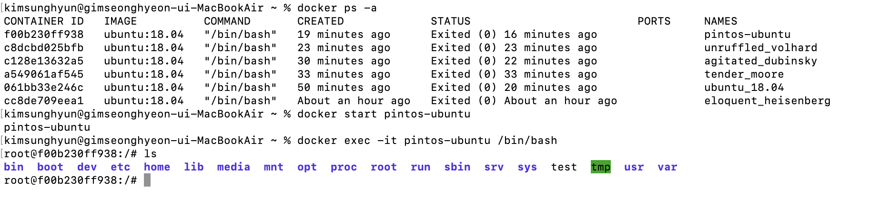

오랜 시간이 지나 핀토스로 돌아왔다. 면접을 준비하며 운영체제를 복습해야 하는데 그럴 겸, 내가 가장 열심히 했던 과제 중 하나인 핀토스를 다시 해 볼까 한다. #1 과 #2는 내가 환경 세팅을 하면서 공부한 흔적이다. 만약 잘 세팅된 환경이 준비되어 있어서 이걸 볼 필요가 없다면 #3 항목으로 바로 가면 된다.

# 0. 기록

원래는 Mac 로컬에서 핀토스를 실행하려고 했다. qemu를 설치하고 거기서 서강대학교 핀토스 파일을 돌려 보려고 했다. 그런데 i386-elf-gcc가 없었고, i686-elf-gcc나 x86_64-elf-gcc를 brew로 깔아서 대체하려 해 보았다. 그러나 ld(링커)의 경로를 도저히 찾을 수가 없었다.

그래서 이다음에는 도커 컨테이너에서 우분투 18.04를 돌리고, 거기서 qemu를 돌리고 그 qemu 위에서 핀토스를 돌리려고 했다. 하지만 이번에는 i386-elf-gcc를 깔 방법이 딱히 없었다. gcc 크로스 컴파일러를 압축파일 형식으로 제공하는 사이트가 있긴 했지만 경로 설정이 나로서는 거의 불가능해 보였다. 

그래서 i386/ubuntu 도커 이미지를 받기도 해보았지만 Mac OS와 아키텍처가 달라서 제대로 돌아가지 않았다. Rosetta로 그 인식을 바꿀 수 있다는 말도 들었지만 시도는 해보지 않았다.

그래서 일단 좀 편한 환경에서 돌리는 것은 포기하고 다음과 같은 결정을 했다.

1. 우분투가 깔린 환경에서 돌리기(나는 안 쓰는 우분투 노트북이 있어서 이걸로 했다)
2. 서강대 핀토스 파일 대신 [카이스트에서 제공하는 핀토스](https://casys-kaist.github.io/pintos-kaist/)를 하기

그러나 그 삽질의 과정이 아까워서 #1 과 #2에 약간 정리해 놓았다.

# 1. 도커 설치

예전에 연구실에서 ROS 하겠다고 설치면서 도커를 깔던 기억이 난다. 그땐 내가 로보틱스 할 줄 알았는데...아무튼 해보자. 그땐 도커 가지고 일주일은 삽질하고도 실패했는데 이제는 하루에 해서 다행이라고 해야 하나..

[갓대희 님의 블로그](https://goddaehee.tistory.com/312)를 참고하였다.

[도커 공식 홈페이지](https://www.docker.com/products/docker-desktop/)에서 애플 맥을 위한 도커를 내려받는다. 내려받은 파일을 설치하면 된다. `docker --version` 명령어로 버전을 확인하고 잘 설치되었는지 확인할 수 있다.

그리고 우분투 18.04 이미지를 내려받자. 원래는 실행하는 명령어지만 이미지가 없는 상태에서 이렇게 하면 이미지를 다운받게 된다.

```
docker run ubuntu:18.04
```

이제 도커를 실행해야 한다. 여기부터는 [이 글](https://velog.io/@peeeeeter_j/Docker%EC%97%90%EC%84%9C-Ubuntu-20.04-%EC%82%AC%EC%9A%A9%ED%95%98%EA%B8%B0)을 참고했다.

docker run명령을 통해 컨테이너를 생성할 수 있다. 이 명령어 형식은 다음과 같다.

```
docker run [OPTIONS] IMAGE[:TAG|@DIGEST] [COMMAND] [ARG...]
```

`[]`로 감싸인 것들은 선택적으로 사용된다. options에는 `-i`, `-t`, `--name name`등 옵션들이 올 수 있다. 그리고 IMAGE에는 우리가 실행할 이미지를 넣는다. 지금같은 경우 방금 받은 `ubuntu 18.04`가 될 것이다. 또한 command는 이 컨테이너로 실행할 명령어인데 우리는 우분투 터미널을 실행할 것이므로 `/bin/bash`를 넣어준다. 따라서 우리가 쓸 명령어는 다음과 같다. 

앞서 설명한 것 같은 도커 명령어에 대한 설명은 [여기](https://www.daleseo.com/docker-run/)로.

```
docker run -it --name pintos-ubuntu ubuntu:18.04 /bin/bash
```

`-i`는 표준 입력을 컨테이너에 연결하며 `-t`는 가상 터미널을 제공한다. `--name`은 다음에 오는 단어로 컨테이너의 이름을 지정한다. 이제 이 명령어를 실행하면 우분투 터미널이 실행된다. 

그 우분투 터미널에 있는 상태로 `exit`를 입력하면 빠져나올 수 있는데 그 상태에서 `docker ps`로 컨테이너들의 상태를 확인할 수 있다. 만약 나오지 않는다면 `docker ps -a`에서 종료된 컨테이너들까지 확인하자.

## 1.1. 컨테이너 사용하기

이제 컨테이너가 생겼다. 도커를 쓸 때는 컨테이너 생성 -> 컨테이너 실행 -> 컨테이너에서 명령어 실행의 순서를 따른다. 생성은 방금 `docker run`에서 했다. 실행은 `docker start`를 통해 할 수 있다. `docker ps`명령어를 통해 컨테이너 상태를 확인할 수 있으면 컨테이너가 실행중인 것이다.

명령어 실행은 `docker exec` 명령을 사용한다. 나머지 형식은 `docker run`과 같다.

```bash
docker exec -it pintos-ubuntu /bin/bash
```

그러면 우분투 환경이 잘 실행되는 것을 터미널에서 확인할 수 있다.



이 상태에서 exit를 하면 다시 나갈 수 있다. 그런데 `docker ps`를 해보면 아직 컨테이너가 살아 있다. 이 컨테이너를 멈추려면 `docker stop`을 사용하자.

```bash
docker stop pintos-ubuntu
```

이렇게 하고 나면 `docker ps`의 결과에 해당 컨테이너가 없는 것을 확인 가능하다. 물론 데이터는 보존되어서, 후에 `docker start`로 다시 컨테이너를 실행시키면 다시 쓸 수 있다.

## 1.2. pintos 설치

여기부터는 [카이스트 핀토스 페이지](https://oslab.kaist.ac.kr/pintosslides/)의 설치 슬라이드와 [카이스트의 핀토스 가이드](https://casys-kaist.github.io/pintos-kaist/introduction/getting_started.html), [어떤 서강대생 블로그](https://eomtaegyung.tistory.com/4), [스탠포드 공식 가이드](https://www.scs.stanford.edu/23wi-cs212/pintos/pintos_1.html)등을 참고했다.

우분투 컨테이너에 접속했다면 이제 패키지 업데이트를 진행한다. 그리고 필수 유틸리티 설치.

```bash
apt-get update
apt-get install g++ xorg-dev ncurses-dev vim
```

그리고 vim과 pintos를 돌릴 QEMU를 설치하자. qemu는 설치에 시간이 좀 걸린다.

```
apt-get install vim
apt-get install qemu
```

그리고 심볼릭 링크 생성

```
ln -s /usr/bin/qemu-system-i386 /usr/bin/qemu
```

gcc 설치

```
apt-get install libc6-dev g++ gcc
```

그리고 pintos 폴더를 생성 후 거기에 코드를 클론해 온다.

이제 pintos/src/threads로 들어가서 make. 그러면 make not found가 뜬다. 바로 `apt-get install build-essential`

이번에는 i386-elf-gcc를 찾지 못했다고 한다. $PATH에 i386-elf-ld 경로를 추가해주자. 어..그런데 죽어도 i386-elf-ld가 없다.

이틀의 삽질을 했다. 그리고 그냥 우분투 pc를 준비하는 게 낫겠다는 결론을 내렸다. cspro가 그립다.

예전에 쓰던, 우분투 18.04가 깔린 노트북을 다시 꺼냈다. 여기서 한번 카이스트 핀토스를 돌려 봤더니 잘 돌아간다. 고로 여기에 ssh로 원격 작업 환경을 만들자. (만약 이대로 하는 사람이 있다면, qemu를 설치해야 한다. `sudo apt-get install qemu`)

# 2. 원격 작업 환경 만들기

일단 우분투 노트북에 ssh 서버를 설치하고 실행하자. [여기](https://wooono.tistory.com/312)를 참고하였다.

```
# 우분투 노트북에서
sudo apt-get install openssh-server
sudo systemctl enable ssh
sudo systemctl start ssh
sudo systemctl status ssh
```

그리고 sshd_config를 수정하자. 

```bash
sudo vim /etc/ssh/sshd_config
```

그리고 `#Port 22`의 주석을 제거한 뒤 접속할 포트번호로 바꾼다. `Port 2222`와 같이 말이다. 또한 `#PermitRootLogin prohibit-password`부분을 yes로 바꾼다. `PermitRootLogin yes`가 되는 것이다.

ssh 재시작

```bash
sudo systemctl restart ssh
```

그리고 나는 원래 쓰던 노트북에서 ssh로 접속하고 싶기 때문에, 노트북의 ip를 알아야 한다. `ifconfig`를 입력하면 나오는 inet 주소가 그것이다. 이 주소는 ssh 원격 접속을 할 때 쓰인다.

```bash
ssh -p 포트번호 사용자명@ip주소
ssh -p 2222 witch@142.168.192.44
```

위의 포트번호와 IP는 예시를 위해 아무거나 입력한 것이다. 이제 위처럼 원격으로 우분투에 접속이 잘 된다. 만약 계정을 추가하고 싶다면 [여기](https://m.blog.naver.com/PostView.naver?isHttpsRedirect=true&blogId=s&logNo=60178892000)를 참고.

노트북을 닫으면 서버가 닫히는 문제가 발생하였는데 이는 [여기](https://iamzombie.tistory.com/41)를 참고하여 노트북이 닫혀도 시스템이 종료되지 않도록 변경하였다.

## 2.1. 핀토스 구성

[이곳](https://casys-kaist.github.io/pintos-kaist/introduction/getting_started.html)에 아주 친절한, 하지만 영어로 된 안내가 있다.

먼저 내가 핀토스를 실행하고 싶은 폴더로 가서 카이스트 핀토스 파일을 받자. git이 없다면 apt-get으로 설치하면 된다.

```bash
git clone https://github.com/casys-kaist/pintos-kaist
```

그러면 pintos-kaist 폴더가 생성된다. 하지만 폴더 이름이 길면 cd로 이동하기 귀찮으니까 그냥 pintos로 바꿔주자.

```bash
mv pintos-kaist pintos
```

그리고 환경 세팅

```bash
cd pintos
source ./activate
```

`source 핀토스 폴더 경로/activate`를 `.bashrc`에 추가해 놓는 것도 좋다. 그렇지 않으면 매번 저걸 실행함으로써 환경 세팅을 해줘야 한다.

그리고 나는 vim보다는 vscode를 쓰고 싶기 때문에 vscode에 연결하여 진행하였다. remote-ssh 익스텐션을 사용하면 된다. ssh 원격 접속 상태에서 vscode로 코드를 짜고 싶은 사람은 쓰자.

# 3. 핀토스 시작

서강대학교 기준으로, 첫번째 프로젝트는 정말 별게 없다. `alarm-multiple` 명령을 한번 실행하기만 하면 되었었다. 물론 카이스트에서는 방식이 다르지만, 너무 기본적인 부분이라 하라는 대로만 하면 된다. 이걸 한번 해보고 다음 글부터는 진짜 코드를 짜보자.

먼저 threads 폴더로 이동해서 make.

```bash
cd pintos/threads
make
```

그러면 `pintos/threads/build` 폴더가 새로 만들어진다. 거기로 이동해서 다음 명령을 한번 실행해보자. 이때 `--`뒤의 `-q`는 핀토스에 전달하는 명령으로 출력이 끝나면 핀토스를 종료하라는 옵션이다.

```
cd build
pintos -- -q run alarm-multiple
```

잘 실행된다. 테스트를 하려면 역시 build 폴더에서 `make check`을 하면 된다. 만약 테스트 중 하나만 돌리고 싶다면 다음과 같이 build 폴더에 `원하는테스트.result`파일을 생성 후 다음과 같이 한다.

```bash
# make 하고 싶은 테스트의 result파일
make tests/threads/alarm-multiple.result
```

자. 대강 세팅은 된 것 같다. 이제 다음부턴 정말로 코딩을 해보자.

# 참고

https://oslab.kaist.ac.kr/pintosslides/ 의 installing pintos 슬라이드

ubuntu 설치 https://tistory.joonhyung.xyz/2

https://www.cs.jhu.edu/~huang/cs318/fall21/project/setup.html

https://velog.io/@peeeeeter_j/Docker%EC%97%90%EC%84%9C-Ubuntu-20.04-%EC%82%AC%EC%9A%A9%ED%95%98%EA%B8%B0

https://subicura.com/2017/01/19/docker-guide-for-beginners-2.html