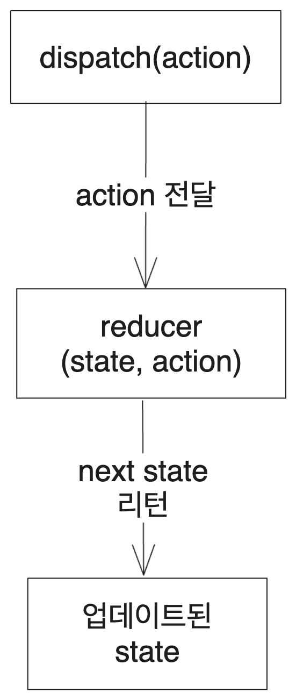

(2023-11-13 업데이트)

# 1. 시작

리액트를 가르치는 많은 문서에서 useReducer라는 상태 관리 기법을 소개하고 있다. 하지만 어렴풋이 이런 게 있다는 것만 알 뿐 딱히 사용해본 적은 없었다. 그래서 이번에 useReducer의 기능, 장점과 사용처를 알아보겠다. 마침 새로 업데이트된 리액트 공식 문서에도 이 부분이 있었다.

# 2. useReducer의 기본형태

React에서는 useState라는 상태 관리 기법을 제공한다. 그리고 리액트를 쓰는 사람이라면 useState정도는 분명 써보았을 것이다. 이 함수는 상태와 그 상태를 특정한 상태로 업데이트시킬 수 있는 `setState` 함수를 제공한다.

그러면 useReducer는 이와 무엇이 다른가? useReducer는 어떤 상태와 그 상태를 특정한 다른 상태로 변경하는 action을 보낼 수 있는 dispatch 함수를 제공한다. 이 action은 상태를 직접 설정하는 대신 '무엇을 할지'에 대한 정보를 리듀서에 전달하는 역할을 한다.

예시를 들어 보자. 다음과 같은 useState를 사용한 코드가 있다고 하자.

```jsx
const [number, setNumber] = useState(0);
```

여기서 useState는 상태를 저장하는 변수 number와 그 number를 특정한 다른 숫자로 바꿔주는 함수 setNumber를 제공한다. 따라서 카운터를 만든다면 다음과 같이 증가와 감소를 구현할 수 있다.

```jsx
const onIncrease = () => {
  setNumber(number + 1);
};

const onDecrease = () => {
  setNumber(number - 1);
};
```

반면 useReducer는 상태를 저장하는 변수와 그 상태를 특정 함수(reducer)를 통과한 상태로 만들어주는 함수(dispatch)를 제공한다.

기본형은 이렇다. useReducer 훅은 상태의 업데이트를 담당하는 Reducer 함수와 초기 상태를 인자로 받는다.

```jsx
const [state, dispatch] = useReducer(reducer, initialState);
```

useReducer의 3번째 인자로 lazy initialization에 해당하는 함수를 넣어줄 수도 있지만 이는 잘 쓰이지 않으므로 사실상 위의 형태가 기본형이다. 즉 위의 number와 setNumber를 대체하는, useReducer의 형태는 다음과 같다.

```jsx
const [number, dispatch] = useReducer(reducer, 0);
```

앞서 보았던 증가와 감소 함수는 이런 식으로 구현된다. dispatch 함수에 action 객체를 전달해 주는 식이다. 이렇게 하면 `useReducer`가 리턴했던 `number` state가 업데이트된다.

```jsx
const onIncrease = () => {
  dispatch({ type: "INCREMENT" });
};

const onDecrease = () => {
  dispatch({ type: "DECREMENT" });
};
```

이때 사실 action 객체는 어떤 형태든 상관없지만 일반적으로 `type` 속성을 이용해 어떤 업데이트를 할지 명시한다. type속성은 사용자가 어떤 동작을 취했는지 즉 무슨 일이 일어났는지를 나타내기 때문에 `added`나 `changed`같이 쓰는 것을 리액트 공식 문서에서는 권장하고 있다.

업데이트에 필요한 데이터는 각 속성으로 전달하거나 `payload`라는 이름의 속성 객체로 전달하기도 한다. 위의 경우 특별히 업데이트에 필요한 상태가 없으므로 `type`속성만 전달하였다.

number는 `useState`를 썼을 때와 똑같이 상태를 저장하고 있고, dispatch는 action 객체를 리듀서에 전달해서 상태를 업데이트한다. 그럼 리듀서는 무엇인가?

# 3. reducer 함수에 대하여

리듀서는 `setState`와 비슷하게 state의 업데이트를 담당하는 함수이다. 현재 상태와 action 객체를 받아서 새로운 상태를 리턴한다.

```tsx
// state: 현재 상태
// action: 업데이트에 필요한 정보를 가진 객체
function reducer(state, action){
  // 다음 state를 리턴한다
}
```

이때 action은 useReducer를 사용하는 측에서 dispatch 함수를 통해 전달되는 객체이다. 앞서 말했듯 action은 상태 업데이트 종류를 나타내는 type과 필요한 정보로 이루어지는 게 일반적이다. 그렇기 때문에 일반적으로 `action.type`에 대한 switch문을 작성한다.

```tsx
function reducer(state, action) {
  switch (action.type) {
    case "ADDED":
      return state + 1;
    case "SUBTRACTED":
      return state - 1;
  }
}
```

만약 state가 객체 형태라면 여기서도 `setState`를 사용할 때와 같이 불변성을 지켜 주어야 한다. 여기서는 업데이트에 필요한 정보를 action.payload로 전달했는데 리덕스에서 사용하는 이름을 그대로 따른 것이다.

```tsx
function reducer(state, action) {
  switch (action.type) {
    case 'APPENDED':
      return [...state, action.payload];
    case 'CHANGED':
      return state.map((item) => {
        if (item.id === action.payload.id) {
          return action.payload;
        }
        return item;
      });
    case 'DELETED':
      return state.filter((item) => item.id !== action.payload.id);
  }
}
```

이 리듀서는 useState의 업데이트 로직과 같은 작업 큐에 들어가서 실행된다. 따라서 불변성과 순수성을 지켜 주어야 한다. 네트워크 요청이나 사이드 이펙트를 가지고 있으면 안된다.

또한 하나의 action은 하나의 사용자 상호작용을 나타내야 한다. 그것이 여러 데이터를 한번에 변경하더라도 말이다. form을 초기화하는 action이 있다면 5개의 데이터를 초기화하겠지만 이는 `reset_form`같은 하나의 action으로 표현되어야 한다.

## 3.1. reducer의 유래

이 reducer라는 이름은 어디서 온 걸까? 이는 배열의 `reduce`메서드에서 가져온 것이다. 배열의 reduce 메서드는 배열의 모든 원소를 모아서 만든 어떤 하나의 값을 리턴해준다. 그런데 이때 reduce가 받는 콜백을 바로 reducer라 한다. 이 콜백은 다음과 같은 형태를 가진다.

```tsx
function reducer(accumulator, currentValue, currentIndex, array) {
  // ...
}
// 그런데 일반적으론 2번째 인자까지만 쓰인다
function reducer(accumulator, currentValue) {
  // ...
}
```

이 콜백은 배열의 모든 원소를 순회하면서 호출되는데, accumulator는 이전 원소까지 순회하면서 나온 결과이고 currentValue는 현재 순회하고 있는 원소이다. 이 둘을 받아서 어떤 값을 리턴하면 그 값이 다음 순회에서 accumulator로 전달된다. 이런 식으로 모든 원소를 순회하면서 하나의 값으로 축약하는 것이다.

리액트의 reducer도 현재 상태와 action을 받아서 다음 상태를 리턴하는 함수이므로 이를 reducer라고 부른다. 상태를 지금까지의 모든 action이 reduce된 결과물이라고 생각하면 생각을 연결시켜 볼 수 있겠다.

# 4. dispatch 함수의 사용

앞서 본 useReducer의 기본형은 다음과 같다. reducer 함수와 초기상태를 useReducer에 전달하여 상태를 저장하는 변수 state와 action을 전달하여 상태를 업데이트하는 데 쓰이는 dispatch 함수를 받는다.

dispatch를 통해 action을 받아서 상태 변경에 대한 구체적인 로직을 실행하는 reducer는 컴포넌트 외부에, 혹은 다른 파일에 있어도 되기 때문에 상태 변경 로직을 분리할 수 있다는 게 useReducer의 장점이다.

```jsx
const [state, dispatch] = useReducer(reducer, initialState);
```

dispatch는 받은 인자를 reducer의 2번째 인자로 전달한다. 그리고 현재 상태와 dispatch에서 전달한 action을 통해 리턴된 값을 새로운 상태로 만든다. 만약 다음과 같은 dispatch 함수가 있다고 하자.

```jsx
dispatch({ type: "reset" });
```

그러면 reducer는 `reducer(현재 상태, {type:"reset"})`형태로 호출되고 여기서 리턴된 값이 새로운 state가 된다.

이런 동작을 그림으로 간단히 나타내볼 수 있다.



이때 이 dispatch 함수는 컴포넌트가 새로 렌더링된다고 새로 생성되지 않는다. 이는 useState의 setState도 마찬가지다.

참고로 `immer`라이브러리도 비슷한 기능을 제공한다. `useImmerReducer`를 사용하면 된다.

# 5. useReducer의 사용법 - Counter 예제

그럼 이제 useReducer를 사용하는 형태도 알았고 리듀서도 dispatch도 어떻게 쓰이는지 알았다. 그럼 어떻게 사용할까? 리액트를 처음 시작할 때 한번씩은 다들 만드는 카운터 예제를 만들어보자. 먼저 useState를 이용하는 형태로 만들어보자.

```jsx
function Counter() {
  const [number, setNumber] = useState(0);

  const onIncrease = () => {
    setNumber((prev) => prev + 1);
  };

  const onDecrease = () => {
    setNumber(number - 1);
  };

  return (
    <section>
      <h1>{number}</h1>
      <button onClick={onIncrease}>+1</button>
      <button onClick={onDecrease}>-1</button>
    </section>
  );
}
```

useReducer를 이용하면 다음과 같아진다.

```tsx
const initialState = { count: 0 };

function reducer(state: { count: number }, action: { type: string }) {
  switch (action.type) {
    case "increment":
      return { count: state.count + 1 };
    case "decrement":
      return { count: state.count - 1 };
    default:
      throw new Error();
  }
}

function Counter() {
  const [state, dispatch] = useReducer(reducer, initialState);

  const onIncrease = () => {
    dispatch({ type: "increment" });
  };

  const onDecrease = () => {
    dispatch({ type: "decrement" });
  };

  return (
    <section>
      <h1>{state.count}</h1>
      <button onClick={onIncrease}>+1</button>
      <button onClick={onDecrease}>-1</button>
    </section>
  );
}
```

그런데 어쩐지 코드는 더 길어진 것 같고 딱히 해결된 문제는 없는 것 같다.. 대체 useReducer는 왜 쓰는 걸까? 이는 다음 글에서 알아보도록 하자.

# 6. useReducer의 동작을 개념적으로 이해해 보기

이 문단은 참고문헌에 있는 [리액트 프로처럼 쓰기](https://devtrium.com/posts/how-to-use-react-usereducer-hook#usereducer-a-backend-mental-model)글의 `useReducer: A Backend Mental Model`문단과 [이창희](https://xo.dev/)님과의 대화를 참고하여 작성되었다.

useReducer를 사용해서 좋은 점에 대해서 알아보기 전에 먼저 useReducer가 어떤 식으로 작동하는지 직관적으로 이해해 보도록 하자. useReducer는 백엔드를 다루는 것과 비슷하게 생각할 수 있다.

state를 데이터베이스로 생각하고 dispatch는 DB의 api로 생각하는 것이다. 이 dispatch에 주는 인자인 action으로 우리는 마치 다양한 api로 데이터베이스를 관리하듯이 state를 관리할 수 있다. action.type으로 어떤 종류의 api인지를 선택할 수 있고, action.payload로 api에 전달할 데이터를 넣을 수 있다. POST 메서드 같은 경우 request body에 데이터를 함께 전달하는데 그것과 비슷하다.

그리고 reducer는 api의 내부 로직과 대응시켜 생각할 수 있다. 실제 백엔드 api의 경우 내부 로직과는 별개로 데이터베이스에 접근하는 방법을 제공한다. 예를 들어서 `AddUser` 라는 api가 있다면 이 api는 실제로는 어떤 DB 쿼리(혹은 ORM을 통한 DB 요청)를 날리는 것에 해당하는 동작을 할 것이다.

하지만 이 api를 사용하는 사람은 그렇게 내부에서 무슨 일이 일어나는지를 알 필요가 없다. 그냥 `AddUser`라는 api를 호출하면 된다. 이와 비슷하게 useReducer를 사용하는 사람은 reducer의 내부 로직을 알 필요가 없다. dispatch에 action을 넣어서 호출하면 된다. 그러면 reducer 함수에서 알아서 모든 걸 처리해 준다.

이런 상태 관리 로직의 분리는 실제로 useReducer의 장점이다. 그리고 이런 점이 useState와의 차별점을 만든다.

# 참고

벨로퍼트의 모던 리액트 useReducer 항목 [20. useReducer 를 사용하여 상태 업데이트 로직 분리하기 · GitBook](https://react.vlpt.us/basic/20-useReducer.html)

React 공식 문서의 useReducer https://ko.reactjs.org/docs/hooks-reference.html#usereducer

새로운 React 공식 문서의 useReducer 튜토리얼 https://react.dev/learn/extracting-state-logic-into-a-reducer

useReducer의 사용에 관한 구체적인 글 https://devtrium.com/posts/how-to-use-react-usereducer-hook

useReducer가 최적화에 도움이 될 때 https://stackoverflow.com/questions/54646553/usestate-vs-usereducer

useReducer를 언제 써야 하는지와 써야하는 이유에 관한 짧은 글 https://dev.to/spukas/3-reasons-to-usereducer-over-usestate-43ad#:%7E:text=useReducer()%20is%20an%20alternative,understand%20for%20you%20and%20colleagues
