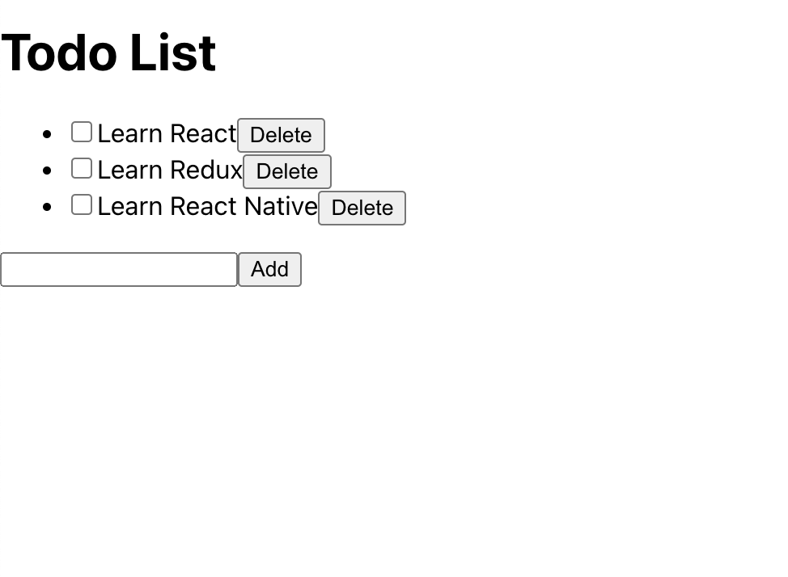

앞선 글에서 SWR를 간단하게 배워보았다. 이어서 SWR을 간단하게나마 실제로 써보았다.

# 1. 사전 작업

아주 간단한 todoList를 만들 것이다. CRA typescript로 어플리케이션을 만들었다. 이전 글에서 모두 해놓은 작업이다.

SWR 설치

```bash
npm i swr
```

다른 폴더에 json-server 설치

```bash
mkdir json-server-test && cd json-server-test
npm init -y
npm install json-server
```

프로젝트 루트에 db.json 파일을 생성하자. 내용은 다음과 같이 간단한 todo리스트 파일을 작성하였다.

```json
{
  "todos": [
    {
      "id": 1,
      "content": "Learn React",
      "done": false
    },
    {
      "id": 2,
      "content": "Learn Redux",
      "done": false
    },
    {
      "id": 3,
      "content": "Learn React Native",
      "done": false
    }
  ]
}
```

json-server를 설치한 폴더의 package.json의 스크립트에 다음과 같은 내용을 추가하자. json-server를 포트 5000으로 실행하도록 하는 것이다.

```json
"scripts": {
  "start": "json-server --watch db.json --port 5000",
  "test": "echo \"Error: no test specified\" && exit 1"
},
```

그리고 axios를 설치한다. 서버에 요청을 보내기 위한 것이다.

```bash
npm i axios
```

# 2. TodoList 구성하기

이제 TodoList를 작성할 것이다. 먼저 CRA의 기본 파일들을 지우고 다음과 같은 내용에서 시작하자. App.tsx를 다음처럼 바꾸면 될 것이다.

```tsx
function TodoListPage() {
  return <div>TodoList</div>;
}

export default TodoListPage;
```

그럼 todoList엔 뭐가 필요할까? 아무래도 기본적인 CRUD면 충분할 것 같다.

## 2.1. 기초 컴포넌트 구현하기

TodoListPage 컴포넌트를 최상단으로 하고, todo 항목들은 이 컴포넌트에서 관리하도록 하자. 그리고 이를 편집하는 기능들은 따로 각각의 item들로 내려보내는 형식으로 컴포넌트를 구성한다.

먼저 TodoListPage 컴포넌트를 다음과 같이 구성하자.

```tsx
function TodoListPage() {
  const [todos, setTodos] = useState<Todo[]>([
    {
      id: 1,
      content: "Learn React",
      done: false,
    },
    {
      id: 2,
      content: "Learn Redux",
      done: false,
    },
    {
      id: 3,
      content: "Learn React Native",
      done: false,
    },
  ]);

  return (
    <main>
      <h1>Todo List</h1>
      <TodoList todos={todos} setTodos={setTodos} />
      <TodoListForm addTodo={(todo) => setTodos([...todos, todo])} />
    </main>
  );
}
```

그리고 todo 항목들을 보여주는 TodoList 컴포넌트를 다음과 같이 구현한다. 간단한 unordered list로 구성하였다.

```tsx
function TodoList({
  todos,
  setTodos,
}: {
  todos: Todo[];
  setTodos: (todos: Todo[]) => void;
}) {
  return (
    <ul>
      {todos.map((todo) => (
        <TodoListItem
          key={todo.id}
          todo={todo}
          setTodo={(newTodo) => {
            setTodos(todos.map((td) => (td.id === newTodo.id ? newTodo : td)));
          }}
        />
      ))}
    </ul>
  );
}
```

이제 각각의 TodoListItem 컴포넌트를 구성한다. 이 컴포넌트는 todo 항목을 보여주고, done을 편집할 수 있도록 한다. list item 태그로 구성하였다.

```tsx
function TodoListItem({
  todo,
  setTodo,
}: {
  todo: Todo;
  setTodo: (todo: Todo) => void;
}) {
  return (
    <li>
      <input
        type="checkbox"
        checked={todo.done}
        onChange={() => {
          setTodo({
            ...todo,
            done: !todo.done,
          });
        }}
      />
      {todo.content}
    </li>
  );
}
```

그리고 TodoListForm 컴포넌트를 구성한다. 이 컴포넌트는 todo 항목을 추가할 수 있도록 한다. form 태그로 구성하였다.

```tsx
function TodoListForm({ addTodo }: { addTodo: (todo: Todo) => void }) {
  const [newTodo, setNewTodo] = useState<Todo>({
    id: 4,
    content: "",
    done: false,
  });

  const handleSubmit = (e: React.FormEvent<HTMLFormElement>) => {
    e.preventDefault();
    addTodo(newTodo);
    setNewTodo({
      id: newTodo.id + 1,
      content: "",
      done: false,
    });
  };

  return (
    <form onSubmit={handleSubmit}>
      <input
        type="text"
        value={newTodo.content}
        onChange={(e) => {
          setNewTodo({ ...newTodo, content: e.target.value });
        }}
      />
      <button type="submit">Add</button>
    </form>
  );
}
```

편집 중인 내역은 이 컴포넌트에서만 가지고 있으면 된다고 생각하여, 새로 추가할 요소의 내용을 담은 newTodo는 이 컴포넌트에서만 가지고 있도록 하였다. 그리고 이를 추가하는 addTodo 함수를 props로 내려받아서 사용하였다.

이제 create, read 기능을 구현하였다. 이렇게 하고 나면 다음과 같이 별로 예쁘진 않지만 todoList스러운 무언가가 완성되었다. 


이제 update, delete 기능을 구현해보자.

## 2.2. update, delete 기능 구현하기

delete 기능은 TodoListItem 컴포넌트 단위에서 구현할 수 있다. 이때 TodoListItem이 받는 props를 먼저 바꾸자. 현재는 setTodo라는 이름으로 되어 있는데 이를 updateTodo로 바꾸고 deleteTodo props를 추가하자.

```tsx
function TodoListItem({
  todo,
  updateTodo,
  deleteTodo,
}: {
  todo: Todo;
  updateTodo: (todo: Todo) => void;
  deleteTodo: (todo: Todo) => void;
}) {
  return (
    <li>
      <input
        type="checkbox"
        checked={todo.done}
        onChange={() => {
          updateTodo({
            ...todo,
            done: !todo.done,
          });
        }}
      />
      {todo.content}
      <button onClick={() => deleteTodo(todo)}>Delete</button>
    </li>
  );
}
```

그리고 TodoList 컴포넌트에서는 deleteTodo를 적절히 만들어서 넘겨주도록 하자.

```tsx
function TodoList({
  todos,
  setTodos,
}: {
  todos: Todo[];
  setTodos: (todos: Todo[]) => void;
}) {
  return (
    <ul>
      {todos.map((todo) => (
        <TodoListItem
          key={todo.id}
          todo={todo}
          updateTodo={(newTodo) => {
            setTodos(todos.map((td) => (td.id === newTodo.id ? newTodo : td)));
          }}
          deleteTodo={(todo) => {
            setTodos(todos.filter((td) => td.id !== todo.id));
          }}
        />
      ))}
    </ul>
  );
}
```

이제 delete 기능을 구현하였다. 이렇게 하고 나면 다음과 같이 delete 버튼이 생겼다. 또한 잘 작동하는 것을 확인할 수 있다.



이제 update 기능은 쉽다. TodoListItem 컴포넌트가 이미 todo를 업데이트하는 함수를 가지고 있기 때문에 이 컴포넌트만 편집해 주면 된다. 수정 상태인지를 알려주는 state를 추가한 후 이를 이용하여 input 태그를 보여주거나, span 태그를 보여주도록 하자.

```tsx
function TodoListItem({
  todo,
  updateTodo,
  deleteTodo,
}: {
  todo: Todo;
  updateTodo: (todo: Todo) => void;
  deleteTodo: (todo: Todo) => void;
}) {
  const [isEditing, setIsEditing] = useState(false);

  return (
    <li>
      <input
        type="checkbox"
        checked={todo.done}
        onChange={() => {
          updateTodo({
            ...todo,
            done: !todo.done,
          });
        }}
      />
      {isEditing ? (
        <input
          type="text"
          value={todo.content}
          onChange={(e) => {
            updateTodo({
              ...todo,
              content: e.target.value,
            });
          }}
        />
      ) : (
        <span>{todo.content}</span>
      )}
      <button onClick={() => setIsEditing((prev) => !prev)}>
        {isEditing ? "Done" : "Edit"}
      </button>
      <button onClick={() => deleteTodo(todo)}>Delete</button>
    </li>
  );
}
```

이 코드에는 현재 문제가 있기는 하다. 보통 TodoList에서 항목 수정이 완료되는 시점은 수정 완료(여기서는 Done)버튼을 누르는 시점이어야 한다. 하지만 여기서는 수정 버튼을 누른 후 수정하는 그대로 todo항목의 내용이 바뀌어 버린다. 하지만 여기서는 수정하다가 이를 물릴 수 있는 방법이 없으므로 그냥 넘어가고, 이따 서버와 통신할 때 이를 따지기로 한다.

# 3. SWR과 사용하기

이제 서버와 통신을 해보자. 서버와 통신을 하기 위해서는 앞서 설치한 axios를 사용할 것이다.

json-server의 데이터는 앞에서 구축했다. npm start로 서버를 실행하면 http://localhost:5000/todos 에 서버가 실행된다. 이제 이 서버와 통신을 해보자.

## 3.1. 서버에서 데이터 받아오기

간단하다. axios로 fetcher를 만들고 useSWR 훅을 사용하면 된다.

axios로 정의한 fetcher 함수

```tsx
const fetcher = (url: string) => axios.get(url).then((res) => res.data);
```

useSWR 훅을 사용해서 서버에서 데이터를 받아오는 시험을 하는 TodoListPage 코드

```tsx
function TodoListPage() {
  const [todos, setTodos] = useState<Todo[]>([
    {
      id: 1,
      content: "Learn React",
      done: false,
    },
    {
      id: 2,
      content: "Learn Redux",
      done: false,
    },
    {
      id: 3,
      content: "Learn React Native",
      done: false,
    },
  ]);

  const { data } = useSWR("http://localhost:5000/todos", fetcher);

  useEffect(() => {
    console.log(data);
  }, [data]);

  return (
    <main>
      <h1>Todo List</h1>
      <TodoList todos={todos} setTodos={setTodos} />
      <TodoListForm addTodo={(todo) => setTodos([...todos, todo])} />
    </main>
  );
}
```

이렇게 하면 처음에는 undefined이던 data가 서버에서 받아온 데이터로 바뀌는 것을 콘솔 출력으로 확인할 수 있다.

## 3.2. 서버 데이터로 TodoList 보여주기

먼저 Todo를 좀 수정하자. json-server에서 auto increment id를 처리해 주기는 쉽지 않고 여기서는 그것을 다루는 게 목적이 아니기 때문에 todo 항목 생성 시 id를 랜덤으로 생성해 주도록 하자.

먼저 Todo 타입을 수정하고, Todo의 추가 시점에 id를 생성해서 넣어주도록 하자.

```tsx
interface Todo {
  id: string;
  content: string;
  done: boolean;
}
```

그리고 랜덤 id 생성을 위한 uuid 라이브러리 설치

```bash
npm i uuid
```

id를 랜덤으로 생성해 주게 되면 새로운 todo 항목을 추가할 때 필요한 건 content 뿐이다. TodoListForm 컴포넌트를 수정하자.

그리고 원래는 todo 항목의 편집 함수들을 최상위의 TodoListPage 컴포넌트에서 관리하였는데 지금은 서버에 요청을 보내 편집하면 되기 때문에 굳이 props drilling을 할 필요 없다. 따라서 서버 데이터를 받아오는 건 TodoListPage 컴포넌트에서 관리하되 편집 함수들은 각각의 담당 컴포넌트에서 하도록 하자.

따라서 TodoListPage 컴포넌트는 다음과 같이 간소해진다.


```tsx
function TodoListPage() {
  const { data, error, isLoading } = useSWR(
    "http://localhost:5000/todos",
    fetcher
  );

  if (isLoading) {
    return <div>Loading...</div>;
  }
  if (error) {
    return <div>Error</div>;
  }

  return (
    <main>
      <h1>Todo List</h1>
      <TodoList todos={data} />
      <TodoListForm />
    </main>
  );
}
```

그리고 Todo 항목을 추가하는 TodoListForm 컴포넌트를 다음과 같이 수정한다. 서버에 직접 요청을 보낼 수 있으므로 addTodo 함수를 props로 받을 필요가 없다. 대신 handleSubmit 함수를 만들어서 서버에 요청을 보낸 후 mutate를 통해 데이터를 갱신해 주도록 한다.

```tsx
function TodoListForm() {
  const [newTodo, setNewTodo] = useState<string>("");

  const handleSubmit = (e: React.FormEvent<HTMLFormElement>) => {
    e.preventDefault();
    axios
      .post("http://localhost:5000/todos", {
        id: uuidv4(),
        content: newTodo,
        done: false,
      })
      .then(() => {
        setNewTodo("");
        mutate("http://localhost:5000/todos");
      });
  };

  return (
    <form onSubmit={handleSubmit}>
      <input
        type="text"
        value={newTodo}
        onChange={(e) => {
          setNewTodo(e.target.value);
        }}
      />
      <button type="submit">Add</button>
    </form>
  );
}
```

그리고 TodoList 함수는 그저 todos를 받아서 TodoItem 컴포넌트를 렌더링해 주는 역할만 하도록 수정한다. setTodos가 props에서 사라진 것을 알 수 있다.

```tsx
function TodoList({ todos }: { todos: Todo[] }) {
  return (
    <ul>
      {todos.map((todo) => (
        <TodoListItem key={todo.id} todo={todo} />
      ))}
    </ul>
  );
}
```

가장 많이 수정된 TodoListItem 컴포넌트는 다음과 같다. 이 컴포넌트에서는 todo가 수정되거나 삭제됨에 따라 서버에 요청을 보내고 mutate를 통해 데이터를 갱신해 주도록 하였다.

```tsx
function TodoListItem({ todo }: { todo: Todo }) {
  const [isEditing, setIsEditing] = useState<boolean>(false);
  const [editTodoContent, setEditTodoContent] = useState<string>("");

  const completeTodo = () => {
    axios
      .patch(`http://localhost:5000/todos/${todo.id}`, {
        done: !todo.done,
      })
      .then(() => {
        mutate("http://localhost:5000/todos");
      });
  };

  const editTodo = () => {
    setIsEditing(true);
    setEditTodoContent(todo.content);
  };

  const saveTodo = () => {
    axios
      .patch(`http://localhost:5000/todos/${todo.id}`, {
        content: editTodoContent,
      })
      .then(() => {
        setIsEditing(false);
        setEditTodoContent("");
        mutate("http://localhost:5000/todos");
      });
  };

  const deleteTodo = () => {
    axios.delete(`http://localhost:5000/todos/${todo.id}`).then(() => {
      mutate("http://localhost:5000/todos");
    });
  };

  return (
    <li>
      <input type="checkbox" checked={todo.done} onChange={completeTodo} />
      {isEditing ? (
        <input
          type="text"
          value={editTodoContent}
          onChange={(e) => {
            setEditTodoContent(e.target.value);
          }}
        />
      ) : (
        <span>{todo.content}</span>
      )}
      <button onClick={isEditing ? saveTodo : editTodo}>
        {isEditing ? "Done" : "Edit"}
      </button>
      <button onClick={deleteTodo}>Delete</button>
    </li>
  );
}
```

이제 json-server를 실행하고 todoList를 업데이트해 보면 todoList의 모든 기능이 잘 작동하는 것을 확인할 수 있다. 그리고 새로고침을 해도 데이터가 유지되며 편집한 내용이 json-server에 저장되는 것을 확인할 수 있다.

# 참고

https://maliethy.github.io/posts/swr/

https://velog.io/@soryeongk/SWRBasic

json server 사용하기 https://redux-advanced.vlpt.us/3/01.html