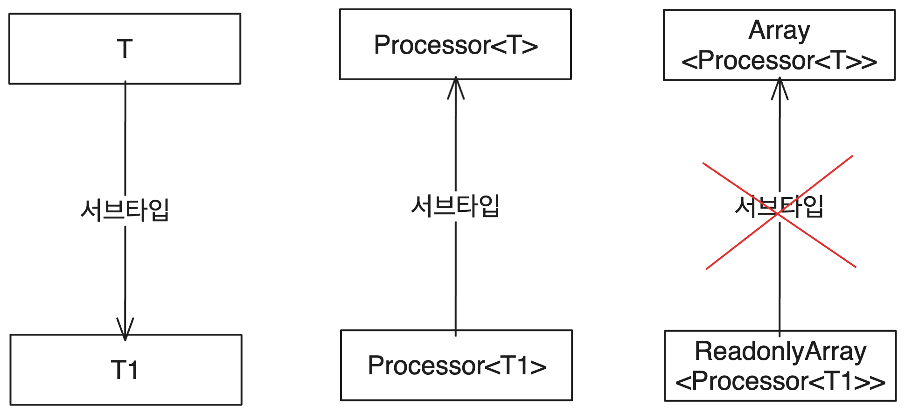

---

- 가변성에 대해 조사하다가 뻗어나온 토픽을 깊게 파다가 쓴 글이다. 이런 식으로 언어의 어떤 부분이 이렇게 된 이유와 역사에 대해 깊이 공부하는 건 매우 좋아하는 일이지만, 들이는 시간에 비해서 뭔가 실질적인 효율이 좋지는 않은 것 같아서 자제하고 있다. 그래도 이런 글을 쓰는 건 재밌다!

# 썸네일


# 1. Array.prototype.concat

TS의 기본 타입 파일 중 하나인 `lib.es5.d.ts`의 `Array<T>`를 살펴보고 있었다. 그런데 `concat`의 타입이 그냥 보기에 특이하게 정의되어 있었다.

그냥 `Array<T>`타입도 있고, 읽기 전용의 `ReadonlyArray<T>`타입도 있는데 `ConcatArray<T>`라는 새로운 타입을 정의해서 사용하고 있었다. 해당 타입은 다음과 같다.

```ts
interface Array<T> {
  concat(...items: ConcatArray<T>[]): T[];
  concat(...items: (T | ConcatArray<T>)[]): T[];
}
```

그래서 이 `Array.prototype.concat()`의 타입이 왜 이런 직관적이지 못한 형태가 되었는지 알아보았다. 그 과정에서 꽤 흥미로운 부분들이 있었기에 여기 적는다.

## 1.1. Array.prototype.concat이란?

JS에서 `Array.prototype`에는 `concat()`메서드가 정의되어 있다. 이 메서드는 기존 배열에 병합할 새 배열을 매개변수로 받아서 병합한 새 배열을 반환한다. 여러 개의 배열을 매개변수로 받아 병합하는 것도 가능하다. 다음은 MDN에서 가져온 `concat()`의 예제 구문이다.

```js
const array1 = ["a", "b", "c"];
const array2 = ["d", "e", "f"];
const array3 = array1.concat(array2);
// expected array3 : Array ["a", "b", "c", "d", "e", "f"]

concat();
concat(value0);
concat(value0, value1);
concat(value0, value1, /* …, */ valueN);
```

만약 매개변수가 하나도 없을 경우 `concat`은 기존 배열의 얕은 복사본을 반환한다.

## 1.2. concat 타입에 관한 생각

`concat`의 타입을 보면 `ConcatArray<T>`라는 새로운 타입을 정의해서 사용하고 있다. 그런데 그냥 `Array<T>`를 매개변수 타입으로 그대로 써도 되지 않을까?

`concat`은 배열 여러 개를 매개변수로 받을 수 있고 단일 원소도 매개변수로 받을 수 있다는 걸 감안하여 다음과 같은 형태는 어떨까? 이는 실제로 한때 TS에서 도입되었던 타입이다.

```ts
interface Array<T> {
  // ...
  concat(...items: (T | T[])[]): T[];
}
```

하지만 위의 타입은 당연히 문제가 있었다. 그리고 `ConcatArray<T>`라는 새로운 타입을 굳이 정의하기까지는 여러 이슈와 PR이 있었다. 당연히 바로 위에서 제시한 직관적인 `concat` 타입도 문제가 있어서 사라진 방식이다. 약간 스포일러를 하자면 `ReadonlyArray<T>`타입을 `concat`에 넘길 수 없다는 것이 문제였다.

아무튼 `concat`의 타입 정의가 현재 모습이 되기까지를 살펴보자.

# 2. union의 등장으로 인한 변경

## 2.1. 가장 초기의 concat 타입

가장 초기의 `concat`타입은 [2014년 9월의 이슈](https://github.com/microsoft/TypeScript/issues/738)에서 확인할 수 있다. 당시 `Array.concat`메서드의 타입은 이랬다.

```ts
interface Array<T> {
  concat<U extends T[]>(...items: U[]): T[];
  concat(...items: T[]): T[];
}
```

첫번째 오버로딩을 보면 `U`가 `T[]`를 상속하고 있으므로 `U[]`매개변수를 받는다는 건 개념상 `T[][]`를 받는다는 것과 같다. 따라서 병합할 여러 배열들을 매개변수로 받는다는 JS의 `concat`의 개념과 일치한다.

그리고 `concat`은 `[1, 2, 3].concat(4, 5, 6)`과 같이 배열이 아니라 개별 원소들도 매개변수로 받을 수 있기 때문에 두번째 오버로딩도 합당하다.

## 2.2. 개선

JS의 `concat`은 원래 개별 원소들과 배열을 혼합해서 매개변수로 받는 것이 가능하다.

```js
[1, 2, 3].concat(4, [5, 6], 7, [8]) // [1,2,3,4,5,6,7,8]
```

하지만 앞에서 본 `concat` 타입의 경우 위와 같은 동작을 모델링할 수 없다. 이는 [2016년 1월의 이슈](https://github.com/microsoft/TypeScript/issues/6594)에서 제시되었다. 그리고 [역시 2016년 1월의 PR](https://github.com/microsoft/TypeScript/pull/6629)을 통해 수정되었다.

해당 이슈의 코멘트를 보면, 앞서 본 concat의 타입 정의는 유니온 타입이 도입되기 전에 작성되었고 몇몇 역사적 이유 때문에 제네릭 제한 타입(`U extends T[]`)을 사용했다고 한다. 하지만 당시에는 유니온 타입이 도입되어 있었다. 그래서 다음과 같이 `concat`의 타입이 수정되었다.

```ts
interface Array<T> {
  // ...
  concat(...items: (T | T[])[]): T[];
}
```

사실 `concat`의 매개변수는 중첩된 배열도 가능하다. 하지만 그런 동작을 타입으로 모델링하려는 시도는 타입 추론에 안 좋은 영향을 미치게 되기 때문에 도입되지 못했다.

그래도 이제는 개별 원소와 배열을 매개변수로 받을 수 있게 되었으므로 원래보다는 좀 더 유연하고 직관적이기까지 한 타입이 되었다.

# 3. 오버로딩 추가로 타입 추론 로직 변경

## 3.1. 이슈

그리고 2016년 7월 [TS 이슈](https://github.com/microsoft/TypeScript/issues/9901)가 제기된다. `concat`에서 타입 추론이 제대로 이루어지지 않는다는 것이다. 문제의 코드는 이렇다.

```ts
// concat-bug.ts
var a: Array<[number, number]> = [[1, 2]];

// Typescript detects these first two tuples as arrays of numbers (`number[]`) instead of `[number, number]`
// error TS2345: Argument of type '[number[], number[], [number, number]]' is not assignable to parameter of type '[number, number] | [number, number][]'.
a.concat([
  [3, 4],
  [5, 6],
  [7, 8],
]);
```

에러 메시지를 읽어 보자. `concat`의 매개변수 타입은 `[number, number] | [number, number][]`이어야 하는데 `concat`에 넘어간 매개변수가 다른 타입이라는 에러이다.

## 3.2. 분석

요약하자면 매개변수 배열의 첫 두 원소가 튜플이 아니라 `number[]`로 추론되는 것이 문제였다. 그럼 왜 이런 문제가 발생했을까?

당시 `concat`의 타입은 위에서 정의된 그대로였다. 이는 `concat`이 `T[]` 혹은 `T` 둘 다 매개변수로 받을 수 있었다는 뜻이다. 그런데 이렇게 하면 `concat`의 매개변수 타입을 추론하는데 문제가 생긴다.

```ts
interface Array<T> {
  // ...
  concat(...items: (T | T[])[]): T[];
}
```

이때 만약 `#2`의 예시처럼 `array.concat(1, [2, 3], 4)`와 같이 중첩 레벨이 섞여서 들어온다면 `1`, `4`는 top-level argument 타입인 `T`, `[2, 3]`은 list-wrapped argument 타입 `T[]`로, 그리고 `T`는 `number`로 쉽게 추론될 수 있다.

하지만 위처럼 `[[3, 4], [5, 6], [7, 8]]`같은 것이 `concat`의 매개변수로 들어오면 컴파일러 입장에서는 어떻게 타입 추론을 해야 하는지 모호해진다.

먼저 `[[3, 4], [5, 6], [7, 8]]` 자체를 top-level argument 즉 단일 매개변수로 추론할 수 있다. `[[3, 4], [5, 6], [7, 8]]` 자체가 `T`타입이라고 보는 것이다. 그럴 경우 매개변수를 통해 추론된 `T` 타입은 `number[][]`이거나 `[number, number][]`이다.

아니면 컴파일러는 `[[3, 4], [5, 6], [7, 8]]`이 list-wrapped argument라고 생각할 수 있다. 이 경우 `[[3, 4], [5, 6], [7, 8]]`은 `T[]`타입이 되고 거기서 추론된 `T`타입은 `number[]` 혹은 `[number, number]`이다.

만약 후자로 추론된다면 위의 이슈는 없었겠지만 안타깝게도 TS는 전자로 추론했다. 그래서 `concat`에서 추론된 `T` 타입은 `number[][]`가 되었다. 이는 `a`의 타입인 `Array<[number, number]>`의 `T=[number, number]`와 호환되지 않았다. 그래서 에러가 뜬 것이다.

## 3.3. 해결

#2에서 사라졌던 오버로딩이 있을 때는 이런 문제가 없었다. 그 이유는 `concat`의 매개변수 타입이 `T[][]`로, 정확히는 `T[]`의 서브타입인 `U`에 대해서 `U[]`로 우선적으로 추론되었기 때문이다.

```ts
// 당시 사라졌던 concat의 오버로딩
concat<U extends T[]>(...items: U[]): T[];
```

해당 오버로딩을 없앨 당시에는 이런 문제가 없었지만 이슈가 제기되고 나서는 다시 도입되었다. 완전히 똑같은 형태는 아니고 `T[][]`를 받는 오버로딩이 우선적으로 적용되도록 추가함으로써 이를 해결했다. 

```ts
interface Array<T> {
  concat(...items: T[][]): T[];
  concat(...items: (T | T[])[]): T[];
}
```

이렇게 하면 매개변수 타입을 `T[][]`으로 추론하는 오버로딩이 우선적으로 적용되기 때문에 위의 추론 문제가 해결된다.

## 3.4. ReadonlyArray와의 싱크

`ReadonlyArray`는 읽기 전용 배열(`push`, `pop`등이 빠진)이므로 `Array`의 슈퍼타입이다. 그런데 [`Array.concat`의 오버로딩 변경사항이 `ReadonlyArray`에는 적용되지 않아서 `ReadonlyArray`에 `Array`를 할당할 수 없게 되어버린 이슈가 있었다.](https://github.com/microsoft/TypeScript/issues/10368)

따라서 [2016년 8월의 PR에서 `ReadonlyArray`에도 `Array.concat`의 오버로딩 변경사항이 동일하게 적용되도록 수정되었다.](https://github.com/microsoft/TypeScript/pull/10374)

```ts
interface ReadonlyArray<T> {
  concat(...items: T[][]): T[];
  concat(...items: (T | T[])[]): T[];
}
```

# 4. 매개변수를 ReadonlyArray로 변경

원리상 `ReadonlyArray`도 `concat`을 할 수 있어야 맞다. 읽기 전용의 배열이 `concat`에 쓰이지 못할 이유는 없기 때문이다.

[그런데 기존의 오버로딩에서는 매개변수를 `T[][]` 등 어쨌든 배열, 즉 `Array` 타입으로 추론했다. 때문에 `ReadonlyArray`끼리는 `concat`을 제대로 할 수 없다는 이슈가 있었다.](https://github.com/microsoft/TypeScript/issues/17076)

따라서 [2017년 8월 `concat`의 매개변수가 되는 배열을 기본적으로 `ReadonlyArray`로 추론하도록 수정되었다.](https://github.com/microsoft/TypeScript/pull/17806)

```ts
interface ReadonlyArray<T> {
  concat(...items: ReadonlyArray<T>[]): T[];
  concat(...items: (T | ReadonlyArray<T>)[]): T[];
}

interface Array<T> {
  concat(...items: ReadonlyArray<T>[]): T[];
  concat(...items: (T | ReadonlyArray<T>)[]): T[];
}
```

# 5. `ConcatArray` 도입 - 배경

`ConcatArray` 도입의 배경이 된 이슈에 대해 TS 리드 아키텍트인 [Anders Hejlsberg](https://github.com/ahejlsberg)가 남긴 [코멘트가 있다.](https://github.com/microsoft/TypeScript/issues/20268#issuecomment-362614906) 이를 해석하고 설명한 내용에 가깝다.

그리고 여기부터는 가변성(variance)이라는 개념이 깊이 연관되어 있다. 가변성에 대해서는 [이전 글인 TS 탐구생활 - 가변성(Variance)이란 무엇인가](https://witch.work/posts/typescript-covariance-theory)를 참고할 수 있다.

그리고 여기서는 홍재민 님의 `타입으로 견고하게 다형성으로 유연하게`의 번역어를 따라 공변(covariance)과 반변(contravariance), 불변(invariance), 양변(bivariance)으로 표기한다. 불변이 immutable이 아니라 invariance임에 주의한다.

## 5.1. 이슈 내용

[다음과 같은 이슈가 있었다. 인수에 대한 타입 검증이 안 된다는 것이었다.](https://github.com/microsoft/TypeScript/issues/20268)

```ts
// Error:(3, 28) TS2345:Argument of type 'Processor[]' is not assignable to parameter of type 'Processor | ReadonlyArray<Processor>'.
type Processor<T extends object> = <T1 extends T>(subj: T1) => T1;

function doStuff<T extends object, T1 extends T>(
  parentProcessors: Array<Processor<T>>,
  childProcessors: Array<Processor<T1>>
) {
  childProcessors.concat(parentProcessors);
}
```

일단 이 코드를 한 번 살펴보자. `Processor<T>` 제네릭은 `object` 즉 객체 타입을 상속하는 타입 `T`를 사용하는데, `T`를 상속한 `T1`타입을 매개변수로 받아 같은 타입을 반환하는 함수 타입이다.

그리고 `doStuff`는 `childProcessors`에 `parentProcessors`를 병합하는 동작이 들어 있는 함수이다. `parentProcessors`는 `Processor<T>`의 배열이고 `childProcessors`는 `Processor<T1>`의 배열이다. `T1`은 `T`의 서브타입이다.

당시 `concat`의 타입을 보면 `doStuff` 내부의 `concat`은 타입 에러를 일으키면 안 된다. `Array<Processor<T>>`는 `ReadonlyArray<Processor<T1>>`의 서브타입이기 때문이다.

```ts
interface Array<T> {
  concat(...items: ReadonlyArray<T>[]): T[];
  concat(...items: (T | ReadonlyArray<T>)[]): T[];
}
```

이유는 다음과 같다.

1. `Processor<T>`는 반변이다. `Processor<T>`타입은 `T`의 서브타입으로 제한된 `T1`을 타입 매개변수로 받아서 같은 타입을 리턴하는 함수이다. 그리고 함수 매개변수는 반변이다. 따라서 `Processor<T>`는 반변이다.
2. 따라서 `T1`이 `T`의 서브타입일 때 `Processor<T>`는 `Processor<T1>`의 서브타입이다.
3. `Array<T>`는 `ReadonlyArray<T>`의 서브타입이고 공변이므로 `T1`이 `T`의 서브타입일 때 `Array<Processor<T>>`는 `ReadonlyArray<Processor<T1>>`의 서브타입이다.

그런데 이 동작은 당시 시점에서 에러가 발생했다. 해당 이슈 코드의 맥락에서 `Array`가 `ReadonlyArray`의 서브타입이 될 수 없었기 때문이다.

왜 그런지는 상당히 복잡한 이유가 있었다. 먼저 배경이 되는 TS의 변경사항부터 살펴보아야 한다.

## 5.2. 이슈의 배경 - 콜백의 매개변수 제네릭

위와 같은 문제의 원인을 정확히 파악하려면 먼저 [콜백의 매개변수 타입으로 쓰인 제네릭을 공변으로 타입 체킹하도록 변경한 PR](https://github.com/microsoft/TypeScript/pull/15104)을 봐야 한다.

이 당시에는 함수 매개변수 타입을 반변으로 동작하도록 하는 `--strictFunctionTypes` 옵션이 없었다. 따라서 함수 매개변수의 타입은 언제나 양변이었다.

(TODO : 왜 TS에서 제네릭을 기본적으로 공변으로 하는 타협이 있었는지에 대한 내용이 포함된 글은 작성 중이다. 추후 링크 추가예정)

다음 글에서 더 자세히 다루겠지만 이는 `Array<T>`등의 제네릭을 공변으로 동작하도록 만들기 위한 타협이었다. 여담이지만 당연히 함수 매개변수는 반변으로 동작하는 것이 자연스럽고 이는 이후 [Strict function types PR](https://github.com/microsoft/TypeScript/pull/18654)를 통해 실현되게 된다.

그런데 이렇게 함수 매개변수가 늘 양변이던 시점에 콜백 함수의 매개변수 타입은 어땠을까? 콜백 함수도 함수이므로 역시 양변이었다. 그런데 [콜백 함수 매개변수 타입의 양변은 `Promise<T>`와 같은 기본 제네릭 타입들에서 타입 체크가 제대로 이루어지지 않는 문제를 일으켰다.](https://github.com/microsoft/TypeScript/issues/14770)

```ts
// a, b는 Promise의 T타입을 {foo: "bar"}로 제한했다.
// 하지만 실제 a, b에 제공된 T타입은 다른 타입이었다.
// 그런데 콜백 함수의 매개변수 타입이 양변이었기 때문에 에러가 나지 않았다.
const a: Promise<{ foo: "bar" }> = Promise.resolve({ foo: "typo" });
const b: Promise<{ foo: "bar" }> = Promise.resolve({});
```

이론적으로 생각해 보아도 콜백 함수의 매개변수 타입으로만 쓰이는 제네릭 타입은 공변인 게 자연스럽다. 콜백 함수의 사용을 생각해 보면 콜백 함수의 매개변수는 마치 리턴 타입과 같이 출력에 해당한다고 볼 수 있기 때문이다.

예시로 보면 더 이해가 쉽다. 이런 제네릭의 대표적인 예시로는 방금 본 `Promise<T>`가 있다. `T`는 `Promise<T>`에서 콜백 함수의 매개변수 타입으로밖에 쓰이지 않는다.

만약 TS에서 `Promise<T>` 타입이 어떤 식으로 정의되어 있는지 더 자세히 보고 싶다면 [TS 탐구생활 - TS의 Promise type 정의](https://witch.work/posts/typescript-promise-type) 글을 참고할 수 있다.

아무튼 `Promise`의 용법만 생각해 보아도 제네릭은 공변인 게 맞다. `Dog`이 `Animal`의 서브타입이라면 `Promise<Dog>`는 `Promise<Animal>`의 서브타입인 게 자연스럽다. [TS보다 더 강한 타입 시스템을 지향하는 flow에서도 promise의 제네릭 타입 인자는 공변이다.](https://github.com/microsoft/TypeScript/issues/14770#issuecomment-288666906)

따라서 당시 함수 매개변수는 양변이지만 콜백의 매개변수 타입은 공변으로 타입 검사하도록 변경한 것이 바로 이 PR이다. `Promise<T>`외의 예시는 다음과 같은 게 있겠다. [해당 PR의 댓글](https://github.com/microsoft/TypeScript/pull/15104#issuecomment-299425304)에서 가져왔다.

```ts
interface Box<T> {
  foo: (cb: (x: T) => void) => void;
}

declare const bA: Box<Animal>;
// 원래는 콜백의 매개변수 타입을 양변으로 검사하여 에러가 나지 않았다.
// 해당 PR로 인해 콜백의 매개변수 타입은 공변으로 검사되어 다음 문장은 이제 에러가 난다.
const bC: Box<Cat> = bA;
```

이는 메서드가 콜백 함수를 받을 때도 마찬가지로 적용되어 메서드의 콜백 함수의 매개변수도 공변이다. `Promise.then()`등의 메서드의 용법을 생각해 보면 합리적인 선택이다.

## 5.3. 이슈 심층 분석

그럼 다시 돌아가보자. 왜 [해당 이슈](https://github.com/microsoft/TypeScript/issues/20268)의 코드에서는 `Array`가 `ReadonlyArray`의 서브타입이 될 수 없었을까? 이 섹션에서는 그걸 알아본다. 이슈의 코드를 다시 보자.

```ts
// Error:(3, 28) TS2345: Argument of type 'Processor[]' is not assignable to parameter of type 'Processor | ReadonlyArray<Processor>'.
type Processor<T extends object> = <T1 extends T>(subj: T1) => T1

function doStuff<T extends object, T1 extends T>(parentProcessors: Array<Processor<T>>, childProcessors : Array<Processor<T1>>) {
    childProcessors.concat(parentProcessors);
}
```

그리고 아까 보았던 당시의 `Array.concat` 타입이다.

```ts
interface Array<T> {
  concat(...items: ReadonlyArray<T>[]): T[];
  concat(...items: (T | ReadonlyArray<T>)[]): T[];
}
```

앞서 언급했듯 `doStuff`의 `concat`에서 에러가 나지 않으려면 `parentProcessors`의 타입인 `Array<Processor<T>>`가 `ReadonlyArray<Processor<T1>>`의 서브타입이어야 하고 이론상으로 따져보면 그 서브타입 관계는 성립하는 게 맞아 보인다.

하지만 그럴 수 없었기에 에러가 발생했다. 그 이유는 구조적 타입 검사 과정에서 `indexOf` 메서드의 타입 검사에서 문제가 발생했기 때문이다.

`Array<T>`가 `ReadonlyArray<T>`의 서브타입이 되려면 `Array<T>`의 모든 멤버가 `ReadonlyArray<T>`의 멤버에 대입될 수 있어야 한다. 그런데 `Array<T>`의 `indexOf` 메서드 타입을 보자.

```ts
interface Array<T> {
  indexOf(searchElement: T, fromIndex?: number): number;
}
```

그럼 이슈 상황에서, `Processor<T>`가 `Processor<T1>`의 서브타입인데 이때 `ReadonlyArray<Processor<T1>>`의 `indexOf` 메서드에 `Processor<T>`의 `indexOf`를 대입할 수 있을까?

불가능하다. 그게 가능하기 위해서는 `Array`의 제네릭이 공변으로 동작해야 한다. 하지만 이 시점에는 함수의 매개변수 타입은 반변으로 타입 체크하도록 하는 [Strict function types PR](https://github.com/microsoft/TypeScript/pull/18654)이 도입되어 있었고 따라서 `indexOf`의 매개변수 `searchElement`의 타입 `T`는 반변이 된다.

그래서 이슈 상황에서는 `Array`의 제네릭이 공변으로 동작하지 않았고 `Array<T>`는 `ReadonlyArray<T>`의 서브타입이 되지 못했다.

생길 수 있는 의문 몇 가지는 다음 섹션에서 다룬다.

## 5.4. 가능한 의문

### 5.4.1. 메서드 매개변수가 양변으로 동작하지 않은 이유

[TS에서 이런 일은 이미 `push`등의 배열 메서드에 의해 예견되어 왔고 TS팀은 메서드 매개변수를 늘 양변으로 취급하는 타협을 통해서 이 문제를 회피해 왔다. 여기에 관해서는 이현섭 님의 '공변성이란 무엇인가'를 참고할 수 있다.](https://seob.dev/posts/%EA%B3%B5%EB%B3%80%EC%84%B1%EC%9D%B4%EB%9E%80-%EB%AC%B4%EC%97%87%EC%9D%B8%EA%B0%80)

따라서 왜 위의 경우에서 `indexOf`메서드가 양변으로 동작하지 않았는지에 대한 의문을 가질 수 있다. 나도 그랬다.

> That's usually masked by the fact that we always compare methods bivariantly, but in this scenario we don't because of #15104.

[이슈의 댓글](https://github.com/microsoft/TypeScript/issues/20268#issuecomment-362614906)에서 이 의문을 풀어주고 있다. 보통 메서드 매개변수는 양변으로 동작하지만 이 경우에는 제네릭이 콜백 함수의 매개변수 타입으로 취급되기 때문에 그렇지 않다는 것이다.

왜냐 하면 이슈 상황에서 구조적 타입 검사는 콜백 함수 매개변수에 대해서도 일어나기 때문이다.

```ts
childProcessors.concat(parentProcessors);
```

위 코드를 볼 때 `childProcessors.concat`의 입장에서는 다음과 같은 형태를 생각하고 `.indexOf`를 콜백 함수로, `searchElement`를 콜백함수 매개변수로 취급한다고 생각할 수 있다.(당연히 `concat`의 타입 정의상 실제로 동작하는 코드는 아니고 추론 과정상 그렇다는 것이다)

```ts
childProcessors.concat(parentProcessors.indexOf(searchElement, ...))
```

고로 [앞서 보았던 PR의 변경사항](https://github.com/microsoft/TypeScript/pull/15104)이 적용된다.

> where T is used only in callback parameter positions, will be co-variant (as opposed to bi-variant) with respect to T, ...

그래서 `Array`의 원소 타입 `T`(`indexOf`의 `searchElement`매개변수 타입)는 양변으로 타입 검사되지 않는다.

그런데 당연히 `Array<T>`에는 `T`를 입력으로 사용하는 `indexOf`와 같은 메서드뿐 아니라 출력으로 사용하는 메서드, 이를테면 `shift`같은 메서드도 있다. `reduce`같은 건 두 방향 모두 사용한다.

```ts
interface Array<T> {
  indexOf(searchElement: T, fromIndex?: number): number;
  shift(): T | undefined;
  // reduce의 여러 오버로딩은 여기서 중요한 건 아니라서 생략했다
  reduce(callbackfn: (previousValue: T, currentValue: T, currentIndex: number, array: T[]) => T): T;
}
```

그러니 `Array<T>`(비슷한 이유로 `ReadonlyArray<T>`도)는 불변으로 동작하게 된다. 

### 5.4.2. 콜백 매개변수에 대한 엄격한 타입 검사가 일어나지 않는 이유

해당 이슈의 해결 시점에는 [콜백 함수 매개변수를 반변으로 타입 체킹하는 PR](https://github.com/microsoft/TypeScript/pull/18976)이 머지되어 있었다. 그런데 왜 콜백 함수 매개변수에 대한 엄격한 타입 체크가 일어나지 않았을까?

메서드 매개변수에 대해서는 이 엄격한 타입 체크가 일어나지 않았기 때문이다. 메서드 매개변수의 타입은 여전히 양변인 구멍으로 남아 있었다. [PR의 댓글](https://github.com/microsoft/TypeScript/pull/18976#issuecomment-334623422)에도 콜백의 타입이 메서드가 아닐 때만 콜백 함수에 대한 엄격한 타입 체킹이 일어난다고 되어 있다.

> I suppose we could say that a callback parameter check occurs only if the callback type isn't declared as method.

[메서드의 콜백 함수 타입에 대해 엄격한 타입 체킹이 일어나지 않는 이유는 콜백 함수의 리턴타입에 의존하는 타입이 많았기 때문이다. 예를 들어 `reduce`같은 메서드가 있었다.](https://github.com/microsoft/TypeScript/issues/18963#issuecomment-334586832) 이를 엄격하게 체크할 경우 `Array<T>`는 불변이 되어버린다.(위의 이슈 상황에서 발생한 게 바로 그 상황이다)

```ts
// 만약 reduce의 콜백을 엄격하게 타입 체킹했을 경우
// T는 함수 매개변수 타입이기도 하므로 반변이고 콜백 매개변수이기도 하므로 공변이다.
// 따라서 이렇게 하면 Array<T>의 공변은 불가능해져 버린다
interface Array<T> {
  reduce(callbackfn: (previousValue: T, currentValue: T, currentIndex: number, array: T[]) => T, initialValue?: T): T;
}
```

하지만 메서드의 콜백 함수로 메서드가 쓰이게 된 경우 [앞서 보았던 PR의 변경사항](https://github.com/microsoft/TypeScript/pull/15104)은 적용되는 것으로 보인다. 메서드가 메서드의 콜백 함수로 쓰이게 된 경우 해당 콜백의 매개변수 타입이 공변으로 검사되는 것이다.

> where T is used only in callback parameter positions, will be co-variant (as opposed to bi-variant) with respect to T, ...

## 5.5. 정리



ReadonlyArray<T>, Array<T>가 불변이 되는 것에는 다음과 같은 이슈들이 관련되어 있었다.

- #15104(Covariant checking for callback parameters)
콜백 함수의 매개변수 타입을 공변으로 동작하도록 변경했다. 따라서 `Array.concat`의 인수로 들어간 `Array.indexOf`의 인수 타입이 공변으로 취급된다.

- #18654(Strict function types)
함수 매개변수 타입을 반변으로 동작하도록 변경했다. 메서드의 매개변수 타입은 여기서 예외가 되어 양변이 되었다. 하지만 이슈 상황에서는 `#15104`때문에 `Array.indexOf`의 인수 타입이 `concat`의 콜백의 매개변수 타입으로 취급되어 양변으로 검사되지 않았다. 따라서 `Array.indexOf`의 인수 타입은 콜백 매개변수이므로 공변이어야 하면서 함수 매개변수이므로 반변이어야 한다. 따라서 불변이 되고 만다.

- #18976(Strictly check callback parameters) 무력화됨
콜백 함수의 인수를 엄격하게 검사하도록 한 PR이다. 하지만 메서드 매개변수에 적용되지 않아서 위 이슈에서는 의미가 없어진다.

위와 같은 이유로 `Array<T>`는 불변이 되고 `ReadonlyArray<T>`도 마찬가지다. 즉 `Array<T>`는 `T`의 서브타입 관계나 구조적 타이핑에 상관없이 `ReadonlyArray<T>`의 서브타입이 될 수 없다.

따라서 이슈의 상황에서 `parentProcessors`의 타입은 `childProcessors`의 타입의 서브타입이 아니게 된다. 고로 에러가 발생한다.

이외에도 `--strictFunctionTypes` 하에서 `ReadonlyArray`와 `Array`를 구조적으로 비교하는 건 둘을 불변으로 만드는 문제가 있다는 건 [다른 이슈 댓글](https://github.com/microsoft/TypeScript/issues/20454#issuecomment-406453517)에서도 볼 수 있다.

참고로 이를 해결하기 위해 `indexOf`등을 공변으로 동작하게 하는 등의 해결책이 논의되었지만 많은 제한을 두거나 `any`타입을 사용하게 되는 문제가 있었다고 한다. 따라서 `concat`의 타입을 그대로 두면 이런 문제가 발생할 수밖에 없었다.

# 6. `ConcatArray` 도입

## 6.1. 앞선 이슈의 쉬운 해결책

결국 앞에서 본 이슈의 문제는 `Array<T>`가 `ReadonlyArray<T>`의 서브타입이 아니라는 데에서 발생했다.

이를 고치기 위해서는 아주 간단한 방법이 있는데, `concat`의 매개변수 타입을 `ReadonlyArray<T>`뿐 아니라 `Array<T>`도 포함된 유니언으로 바꾸면 된다. [그렇게 한 PR](https://github.com/microsoft/TypeScript/pull/20455)에서는 다음과 같은 오버로딩으로 `concat`의 타입을 수정하였다.

```ts
interface Array<T> {
  concat(...items: (T[] | ReadonlyArray<T>)[]): T[];
  concat(...items: (T | T[] | ReadonlyArray<T>)[]): T[];
}
```

[당시의 댓글에는 이런 제안도 있었다. 콜백 내에서 배열을 수정하는 건 당연히 좋은 일이 아니므로 `Array<T>`의 메서드 내의 모든 콜백 함수 타입이 `ReadonlyArray<T>`를 사용하게 하면 깔끔하게 해결된다는 것이다. 하지만 이는 당연히 breaking change가 된다. 따라서 다음 섹션에서 살펴볼 해결책이 등장하였다.](https://github.com/microsoft/TypeScript/pull/20455#issuecomment-362371634)

## 6.2. 구조적 타이핑 기반의 해결책

[2018년이 되어서 현재와 같은 타입의 PR이 나오게 되는데](https://github.com/microsoft/TypeScript/pull/21462)그 과정은 다음과 같다. 먼저 `Array.concat`의 기존 타입이 `T[]`와 `ReadonlyArray<T>`와의 유니언을 받는 것이 컴파일 속도를 느리게 만들었다. 따라서 다음과 같이 오버로딩이 수정되었다.

```ts
interface Array<T> {
  concat(...items: T[][]): T[];
  concat(...items: ReadonlyArray<T>[]): T[];
  concat(...items: (T | T[])[]): T[];
  concat(...items: (T | ReadonlyArray<T>)[]): T[];
}
```

하지만 오버로딩이 이렇게 많은 게 좋지 않다고 본 [Anders Hejlsberg](https://github.com/ahejlsberg)는 `concat`의 매개변수 역할을 할 새로운 타입을 도입하자는 제안을 한다.

`Array<T>` 혹은 `ReadonlyArray<T>` 타입이 매개변수로 들어왔을 때 구조적 타이핑 검사를 통과할 수 있고 또한 구조적 타입 검사에서 `Array<T>`나 `ReadonlyArray<T>`를 불변으로 취급되게 할 `indexOf`등의 메서드를 모두 제거한 `InputArray<T>`를 제안한 것이다.

```ts
interface InputArray<T> {
  readonly length: number;
  readonly [n: number]: T;
  join(separator?: string): string;
}
```

`join`은 `string` 혹은 배열과 비슷하게 보일 수 있는 다른 객체와 겹치는 상황을 피하기 위해 남겨둔 메서드였다. 그리고 `concat`을 이렇게 바꾸길 제안한다.

```ts
interface Array<T> {
  concat(...items: InputArray<T>[]): T[];
  concat(...items: (T | InputArray<T>)[]): T[];
}
```

이는 `ReadonlyArray<T>`를 사용하는 것에 비해 약간 덜 타입 안전하다고 할 수 있다. `InputArray<T>` 조건을 만족하는 배열이 아닌 객체가 `concat`의 매개변수로 들어올 수 있기 때문이다. 하지만 그렇게까지 위험해지는 건 아니고, 오버로딩도 줄어들고, `Array<T>`와 `ReadonlyArray<T>`를 구조적으로 비교할 때 불변으로 취급되는 문제도 해결되며 컴파일 속도도 10% 빨라졌다고 한다(이 컴파일 속도 향상에 대해서는 이견이 있는 듯 하지만 어쨌든 느려지지는 않았다고 한다).

그러나 위의 `InputArray<T>`정의는 `length`프로퍼티와 `join(string): string`메서드만 있으면 되기에 너무 쉽게 겹칠 수 있다는 이야기가 나왔다. 따라서 `slice`메서드를 추가하고 이름을 `ConcatArray`로 바꾼 다음 타입이 등장했다.

```ts
interface ConcatArray<T> {
  readonly length: number;
  readonly [n: number]: T;
  join(separator?: string): string;
  slice(start?: number, end?: number): T[];
}
```

그리고 `concat`의 오버로딩은 다음과 같이 바뀌었다. 이게 현재의 `concat`의 타입이다.

```ts
interface Array<T> {
  concat(...items: ConcatArray<T>[]): T[];
  concat(...items: (T | ConcatArray<T>)[]): T[];
}
```

# 7. 앞으로

지금은 2023년 12월이고, `concat`에 관한 마지막 PR이 머지된 지 5년이 지났다. 그 사이에 많은 이슈 보고가 있었다. [예를 들어서 빈 배열은 `concat`의 target이 될 수 없는 문제 등이 있다.](https://github.com/microsoft/TypeScript/issues/26976)

```ts
// No overload matches this call.
let a1 = [].concat(["a"]);
```

[이를 수정하기 위한 PR](https://github.com/microsoft/TypeScript/pull/33645)도 있었지만 [배열 타입에 어떤 변화를 만들기 힘든 상황이기 때문에 긴 시간 반영되지 못하고 있다.](https://github.com/microsoft/TypeScript/pull/33645#issuecomment-1058376819)

새롭게 제시된 `concat`의 타입도 있다. `ConcatArray<T>` 타입은 아까와 같다.

```ts
interface Array<T> {
  concat(...items: ConcatArray<T>[]): T[];
  concat<U extends any[]>(...items: U): (T | Flatten<U[number]>)[];
}

type Flatten<T> = T extends undefined ? T : T extends ConcatArray<infer U> ? U : T;
```

이 오버로딩은 빈 배열도 `concat`의 target이 될 수 있게 하고 서로 다른 타입 간에도 `concat`이 가능하게 하는 등 여러 이슈를 해결한다.

따라서 해당 PR을 잘 반영해서 배열 타입을 수정해 보기 위해 [TS팀은 배열 메서드가 기대하는 대로 동작하지 않는 예시들을 모으는 PR을 현재 열어 놓은 상태이다.](https://github.com/microsoft/TypeScript/issues/36554) 언젠가 위의 개선안이 받아들여져서 `concat` 타입의 발전이 있었으면 좋겠다.

# 참고

[Anders Hejlsberg](https://github.com/ahejlsberg)의 얼굴을 이슈에서 너무 많이 보아서 이제 내적 친밀감이 생겨 버렸다. 깃헙 이슈와 PR의 코멘트로나마 많은 도움을 받았다.

홍재민, 타입으로 견고하게 다형성으로 유연하게 https://product.kyobobook.co.kr/detail/S000210397750

MDN의 `Array.prototype.concat()` 문서 https://developer.mozilla.org/ko/docs/Web/JavaScript/Reference/Global_Objects/Array/concat

weird Array.concat declaration and associated LanguageService/typeChecker issues https://github.com/microsoft/TypeScript/issues/738

Union types and array.concat problem https://github.com/microsoft/TypeScript/issues/4216

Confusing type error message in concat https://github.com/microsoft/TypeScript/issues/6594

Update Array.concat type signature to fix #6594 https://github.com/microsoft/TypeScript/pull/6629

Tuple types get incorrect contextual type https://github.com/microsoft/TypeScript/issues/9901

Re-add strict concat signature https://github.com/microsoft/TypeScript/pull/9997

Array not assignable to ReadonlyArray with subclass items https://github.com/microsoft/TypeScript/issues/10368

Improve `ReadonlyArray<T>.concat` to match `Array<T>` https://github.com/microsoft/TypeScript/pull/10374

Can't concat ReadonlyArray https://github.com/microsoft/TypeScript/issues/17076

Array arguments to concat should be ReadonlyArrays https://github.com/microsoft/TypeScript/pull/17806

polymorphic arguments validation error https://github.com/microsoft/TypeScript/issues/20268

Generic parameters not fully type-checked (e.g., Promise) https://github.com/microsoft/TypeScript/issues/14770

Covariant checking for callback parameters https://github.com/microsoft/TypeScript/pull/15104

Array of generic functions not assignable to ReadonlyArray #20454 의 댓글 https://github.com/microsoft/TypeScript/issues/20454#issuecomment-406453517

Hack to allow concat to work even when an Array isn't assignable to ReadonlyArray https://github.com/microsoft/TypeScript/pull/20455

strictFunctionTypes has different behavior with parameter types and return types #18963 https://github.com/microsoft/TypeScript/issues/18963

Strictly check callback parameters #18976 https://github.com/microsoft/TypeScript/pull/18976

Overloads in Array.concat now handle ReadonlyArray https://github.com/microsoft/TypeScript/pull/21462

Add additional overloads to Array.prototype.concat #26976 https://github.com/microsoft/TypeScript/issues/26976

Better typings for Array.concat(), etc. https://github.com/microsoft/TypeScript/pull/33645

Array method definition revamp: Use case collection https://github.com/microsoft/TypeScript/issues/36554

Strict function types #18654 https://github.com/microsoft/TypeScript/pull/18654

공변성이란 무엇인가 https://seob.dev/posts/%EA%B3%B5%EB%B3%80%EC%84%B1%EC%9D%B4%EB%9E%80-%EB%AC%B4%EC%97%87%EC%9D%B8%EA%B0%80

Typescript FAQ - Why are function parameters bivariant? https://github.com/Microsoft/TypeScript/wiki/FAQ#why-are-function-parameters-bivariant