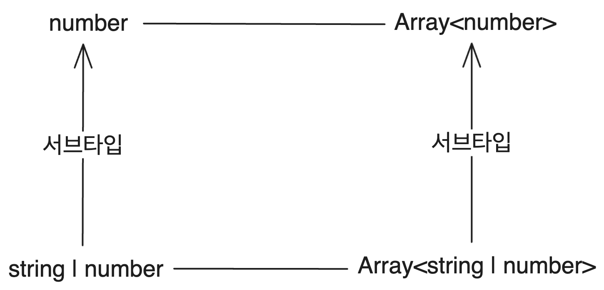
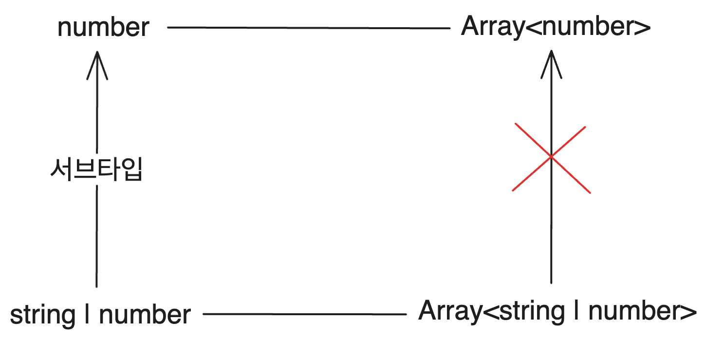
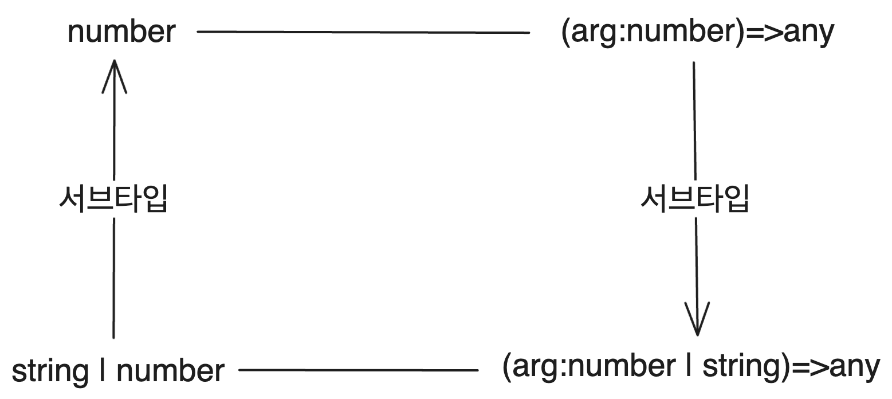

- 이 글은 읽는 사람이 슈퍼타입, 서브타입, 제네릭 등 기본적인 타입 시스템의 개념은 알고 있다는 가정하에 쓰여지는 글이다.

# 시작

TS를 더 잘 이해하기 위해 타입 시스템을 공부하다가 가변성(variance)이라는 개념을 만났다. 그래서 앞으로 2개의 글을 통해서 이 가변성이라는 게 무엇인지, 그리고 TS에서는 가변성을 어떻게 다루는지를 각각 알아볼 것이다.

이 글에서는 먼저 가변성이 우리에게 어떤 것을 전해줄 수 있는지를 알아보고 가변성의 종류를 알아볼 것이다. 그리고 가변성을 어떻게 정하는지 알아본다. TS와 좀 더 심화된 가변성에 대한 이야기는 다음 글에서 다루려고 한다.

이 글에서 쓰인 언어는 따로 언급이 없을 경우 TS 문법을 따른다. 하지만 이 글의 경우 TS의 타입 시스템보다는 일반적인 타입 이론의 관점에서 서술하려고 노력하였다. 다행히 TS 4.7부터 Variance Annotation을 지원하기 시작했기 때문에 이 글의 내용이 대부분 TS에서도 적용될 수 있었다.

# 1. 가변성의 배경

가변성은 제네릭 타입 간의 서브타입 관계를 정의하는 방식이다. 이 섹션에서는 이 가변성이라는 개념이 왜 필요한지를 설명한다.

TS에서 `number`가 `string | number`의 서브타입인 것은 당연하다. `string | number`가 `number`의 모든 원소를 포함하기 때문이다. 그리고 `Array<T>`는 `T`타입의 원소들을 가지는 제네릭 타입이다.

그러면 `Array<number>`는 `Array<string | number>`의 서브타입이 될까? 이는 당연한 것처럼 보인다. `number`타입 원소들이 들어 있는 배열은 `string | number` 원소들이 들어 있는 배열이라고 할 수도 있지 않은가?

그러면 `Array<number>`가 `Array<string | number>`의 서브타입이므로 다음과 같은 할당이 가능해진다. 이렇게 하면 `numberArray`와 `stringNumberArray`는 같은 배열 객체를 참조하게 된다. 또한 `Array<string | number>`를 매개변수로 받는 함수에 `Array<number>`를 매개변수로 넘길 수도 있다.

```ts
const numberArray: Array<number> = [1, 2, 3];
// stringNumberArray은 numberArray와 같은 배열 객체를 참조하고 있다
const stringNumberArray: Array<string | number> = numberArray;
```

그런데 이건 사실 이상한 일이다. 왜냐 하면 JS에서 배열은 mutable이기 때문이다. 우리는 배열의 타입이 `Array<T>`라고 할 때 `T`타입의 원소들을 배열에 추가하는 메서드를 사용할 수 있다. 하지만 `Array<string | number>`타입은 `Array<number>`에 해당하는 배열 객체를 할당받고도 string 타입 원소를 추가할 수 있다! 다음과 같은 코드를 보자.

```ts
const numberArray: Array<number> = [1, 2, 3];

const stringNumberArray: Array<string | number> = numberArray;

stringNumberArray.push("foo");
// stringNumberArray는 이제 [1,2,3,"foo"]를 참조하고 있다
console.log(numberArray);
```

`stringNumberArray`와 `numberArray`는 이제 둘 다 `[1, 2, 3, "foo"]`를 가리키고 있다. `number` 타입 배열인 `numberArray`에 `string` 타입 원소가 들어간 것이다!

이때 들어간 `"foo"`는 `numberArray`의 원소이기도 하므로 해당 원소를 `numberArray`를 통해서 number 타입으로 사용해봐도 에러가 나지 않는다. 이는 이상한 일이다. `n`은 number 타입으로 되어 있지만 실제로는 string이기 때문에 `toFixed`같은 number 타입 메서드를 사용해보면 JS 에러가 발생한다.

```ts
const n: number = numberArray[3];
console.log(n); // "foo"
n.toFixed(); // n.toFixed is not a function 에러 발생
```

그럼 뭐가 문제일까? `Array<number>`가 `Array<string | number>`의 서브타입인 게 잘못되었나? 아예 `Array<T>`가 타입 인자들의 서브타입 관계를 무시하고 `Array<number>`와 `Array<string | number>` 간에는 서브타입 관계가 없다고 정의하는 게 맞는 걸까? 실제로 C#에서는 `List<T>`와 같은 제네릭 타입들이 이렇게 동작한다.

하지만 어쩐지 시원치 않다. '숫자 배열'이 '숫자 혹은 문자열이 들어간 배열'의 서브타입이라는 건 직관적으로 이상한 일이 아니다. 하지만 이를 허용했을 경우 문제가 생기는 것을 우리는 위에서 보았다.

이걸 어떻게 처리해야 맞는 걸까? 더 나아가서, 하나의 제네릭 타입에 들어간 두 가지 타입에 서브타입 관계가 존재할 때 그렇게 만들어진 두 가지 제네릭 타입의 서브타입 관계는 어떻게 되어야 할까? 이를 어떻게 처리할지 결정하는 데에 쓰이는 개념이 바로 가변성이다.

# 2. 가변성의 종류

가변성은 이렇게 제네릭 타입이 주어진 타입 인자들 간의 서브타입 관계를 어떻게 취급하는지에 대한 개념이다. 먼저 이 관계들을 어떤 종류로 구분할 수 있는지를 알아보자. 이런 관계는 총 4가지가 있다.

## 2.1. 공변

공변은 제네릭 타입이 타입 인자의 서브타입 관계를 보존하는 것이다. 즉 `T`가 `U`의 서브타입이면 `Array<T>`는 `Array<U>`의 서브타입이 되면 `Array<T>`는 공변이다. 제네릭 타입이 타입 인자와 함께 변한다는 뜻을 담아서 공변(covariance)이라고 한다.



TS에서는 함수 인수를 제외한 제네릭 타입들은 기본적으로 공변이다.

## 2.2. 불변

불변은 제네릭 타입이 타입 인자의 서브타입 관계를 무시하는 것이다. `T`가 `U`의 서브타입이라도 `Array<T>`는 `Array<U>`의 서브타입이 되지 않으면 `Array<T>`는 불변이다. 제네릭 타입이 타입 인자와 함께 변하지 '않는다'는 뜻을 담아서 불변(invariance)이라고 한다.



C#이나 코틀린 같은 언어에서는 제네릭 타입들이 기본적으로 불변이다. 

## 2.3. 반변

반변은 제네릭 타입이 타입 인자의 서브타입 관계를 역전시키는 것이다. `T`가 `U`의 서브타입이면 `Array<U>`가 `Array<T>`의 서브타입이 되면 `Array<T>`는 반변이다. 제네릭 타입이 타입 인자의 서브타입 관계와 '반대로 변한다'는 뜻을 담아서 반변(contravariance)이라고 한다.

우리가 지금까지 보았던 `Array` 같은 경우 공변인 게 당연하다. 그래서 방금 `Array`를 통해 설명한 반변은 매우 비직관적으로 보인다. 하지만 반변이 자연스러운 경우도 있다.

바로 함수의 매개변수 타입이 그렇다. `(arg:number | string)=>any` 타입은 숫자 혹은 문자열을 받아서 아무거나 리턴하는 함수 타입이다. 이는 해당 함수가 순수 함수라고 했을 때, 숫자를 받아서 아무거나 리턴하는 함수 타입인 `(arg:number)=>any`타입에 포함된다. `숫자를 받아서 처리`하는 함수에 비해서 `숫자 혹은 문자열을 받아서 처리`하는 함수는 더 구체적인 개념이기 때문이다.



TS에서 함수의 매개변수 타입이 반변이다. 코틀린의 `Comparator<T>`나 C#의 `Action<T>`같이 함수의 매개변수 타입을 제네릭 타입 인자로 결정하는 타입들도 마찬가지로 반변이다.

## 2.4. 양변

양변은 제네릭 타입이 타입 인자의 서브타입 관계를 양쪽으로 모두 사용하는 것이다. `T`가 `U`의 서브타입이면 `Array<T>`는 `Array<U>`의 서브타입이면서 슈퍼타입이면 `Array<T>`는 양변이다. 제네릭 타입이 타입 인자의 양쪽으로 변한다는 뜻을 담아서 양변(bivariance)이라고 한다.

타입 검사의 관점에서 크게 유용한 점은 없다. 하지만 이후 글에서 볼 TS의 메서드 타입이 `set(item: T): void;`와 같은 형식으로 선언될 경우 메서드의 매개변수 타입이 양변이 된다.

# 3. 타입 가변성 정의하기

가변성의 배경과 종류를 알아보았다. 이제 우리가 프로그래밍을 하면서 이 가변성이라는 개념을 어떻게 정의할 수 있고, 어떤 경우에 어떤 종류의 가변성을 지정할 수 있는지 알아보자.

`Generic<T>`라는 제네릭 타입이 있다고 하자. 그러면 어떤 경우에 해당 타입을 공변적으로, 어떤 경우에 불변적으로, 어떤 경우에 반변적으로 사용할 수 있을까? 요약하자면 `Generic`이 `T`를 출력에만 사용하면 공변, 입력에만 사용하면 반변, 입력과 출력에 모두 사용하면 불변이다.

그럼 입력에 사용한다, 출력에 사용한다는 말은 무슨 뜻일까?

## 3.1. 입력에 사용

`Generic<T>` 인터페이스에서 `T`를 입력에 사용한다는 것은 `T`타입의 인수를 받는 메서드를 가지고 있다는 것을 의미한다. 예를 들어 `T`타입의 인수를 받아서 `void`를 리턴하는 `set`메서드를 가지고 있다면 다음과 같다.

```ts
interface Generic<T> {
  set:(value: T) => void;
}
```

이렇게 `T`가 입력에만 사용될 경우 `Generic<T>`는 반변적으로 작동할 수 있다. `T`를 입력에만 사용한다는 말은 `T`타입을 리턴하는 메서드는 가지고 있지 않고 `T`타입의 인수를 받는 메서드만 가지고 있다는 것이다.

이런 경우 `in`키워드를 사용하여 나타낼 수 있는데 이럴 경우 `Generic<T>`는 반변이 되고 `T`를 메서드의 매개변수 타입에만 사용할 수 있고 리턴 타입으로는 사용할 수 없다.

```ts
// T를 메서드의 매개변수 타입으로만 사용할 수 있다
interface Generic<in T> {
  set: (value: T) => void;
}
```

## 3.2. 출력에 사용

`Generic<T>` 인터페이스에서 `T`를 출력에 사용한다는 것은 리턴 타입이 `T`인 메서드를 가지고 있다는 것을 의미한다. 특정 인덱스 원소를 가져오는 메서드를 예시로 들 수 있겠다.

```ts
// T를 메서드 리턴 타입으로만 사용할 수 있다
interface Generic<T> {
  get: (index: number) => T;
}
```

이렇게 `T`가 출력에만 사용될 경우 `Generic<T>`는 공변적으로 작동할 수 있다. `T`를 출력에만 사용한다는 말은 `T`타입의 인수를 받는 메서드를 가지고 있지 않고 `T`타입의 값을 리턴하는 메서드만 가지고 있다는 것이다.

이런 경우 `out`키워드를 사용하여 나타낼 수 있는데 이럴 경우 `Generic<T>`는 공변이 되고 `T`를 메서드의 리턴 타입에만 사용할 수 있고 인수 타입으로는 사용할 수 없다.

```ts
interface Generic<out T> {
  get: (index: number) => T;
}
```

단 예외가 있는데 만약 반변인 제네릭 타입이 메서드의 매개 변수로 있는 경우 `T`를 반변인 제네릭 타입의 타입 인자로 사용할 수 있다.

예시로 보는 게 이해가 쉽다. 다음 코드에서 `Action<P>`는 반변이고 메서드의 매개변수로 넘어갔다. 2번 반변되어서 공변이 되기 때문에 이런 동작이 허용된다.

```ts
type Action<P> = (param: P) => any;

interface Generic<out T> {
  method: (value: Action<T>) => void;
}
```

## 3.3. 입력과 출력에 모두 사용

`Generic<T>` 인터페이스에서 `T`를 입력과 출력에 모두 사용한다는 것은 `T`타입의 인수를 받는 메서드와 `T`타입의 값을 리턴하는 메서드를 모두 가지고 있다는 것을 의미한다.

특정 인덱스의 원소를 가져와 리턴하는 메서드와 원소를 추가하는 메서드를 모두 가지고 있다고 하자. 이런 경우 `T`를 입력과 출력에 모두 사용한다고 할 수 있다.

```ts
interface Generic<T> {
  get: (index: number) => T;
  append: (value: T) => void;
}
```

이런 경우 `Generic<T>`는 불변이어야 한다. C#이나 코틀린 등 많은 언어들이 대부분의 제네릭에 대해서 기본적으로 불변이다. TS같은 경우 제네릭이 기본적으로 공변이기 때문에 불변 제네릭을 정의하기 위해서는 `in out`키워드를 모두 사용해야 한다.

```ts
interface Generic<in out T> {
  get: (index: number) => T;
  append: (value: T) => void;
}
```

## 3.4. 입출력 또한 제네릭일 때

`Generic<T>` 제네릭 타입에서 `T`가 입력으로만 쓰이면 반변, 출력으로만 쓰이면 공변일 수 있고 둘 다라면 불변이어야 한다고 했다. 그리고 이는 `T`가 메서드의 매개변수 타입으로 있는지 리턴 타입으로 있는지에 따라서 결정된다고 했다. 그런데 다음과 같은 경우는 어떨까? 메서드의 리턴 타입이 또다른 제네릭 타입일 경우이다.

```ts
interface Foo<out T> {
  outMethod: () => Bar<T>;
}
```

이럴 경우에는 `Bar`에서 `T`가 어떻게 쓰이는지에 따라 가능 여부가 갈리게 된다. 먼저 `Bar`에서 `T`가 출력으로만 쓰인다고 하자.

```ts
interface Bar<out T> {
  outMethod: () => T;
}

interface Foo<out T> {
  outMethod: () => Bar<T>;
}
```

그러면 `T`는 출력에만 쓰이게 되고 `Foo`가 공변적으로 동작하는 데에 아무 문제도 없다. 서브타입 관계도 그냥 `Foo`, `Bar`모두 타입 인자의 서브타입 관계를 보존하면 된다.

그런데 만약 `T`가 `Bar`에서 입력으로 쓰인다면? 이런 경우를 보자. 다음 경우에 `Bar`는 반변이고 `Foo`는 공변이다.

```ts
interface Bar<in T> {
  inMethod: (t: T) => void;
}

interface Foo<out T> {
  outMethod: () => Bar<T>;
}
```

그러면 다음과 같은 문제 상황을 생각할 수 있다. `number`는 `string | number`의 서브타입이다. 따라서 `Foo<number>`는 `Foo<string | number>`의 서브타입이다. 그래서 다음과 같은 코드가 가능하다.

```ts
const fooN: Foo<number> = ...;
const fooSN: Foo<string | number> = fooN;
```

그 다음 이런 코드를 실행시킨다고 해보자. 이는 주석에 쓴 대로의 문제가 발생한다.

```ts
/*
fooSN은 fooN 객체를 가리키고 있다. 따라서 fooSN.outMethod()의 리턴 객체는 사실 Bar<number>와 같은 만큼의 기능을 가지고 있다.

그런데 fooSN.outMethod()에서 리턴된 객체는 타입 시스템에서 Bar<string | number> 타입으로 추론된다. 따라서 string을 fooSN.outMethod().inMethod에 넘기는 것이 가능하고 이는 문제가 된다.
*/
fooSN.outMethod().inMethod("foo");
```

물론 `inMethod`가 사실 `T`를 어떤 문제되는 동작도 없는 데에만 쓸 수도 있다. 예를 들어서 함수 인자로 받은 `t`를 그대로 출력만 할 수도 있다. 하지만 이런 함수의 내부 동작을 컴파일러가 컴파일 시점에 알고 판단하는 것은 불가능하다. 그래서 컴파일러는 혹시 모를 상황을 대비해 이런 상황에 에러를 발생시킨다.

제네릭이 연쇄적으로 나타나는 다른 경우들도 비슷하게 생각해서 추론할 수 있다. 타입 인자를 입력에만 계속 쓰는 경우, 출력에만 계속 쓰는 경우에만 이런 연쇄가 허용된다는 것을 알 수 있다.

# 4. 가변성을 정의하는 시점

TS에서는 제네릭 타입을 정의할 때만 가변성을 정의할 수 있다. 하지만 다른 몇몇 언어에서는 제네릭 타입의 가변성을 지정할 수 있는 방법이 또 하나 있다. 개발자가 제네릭 타입을 사용할 때 가변성을 지정할 수 있도록 한 언어들이 있다. 이런 2가지의 가변성 지정 시점에 대해 간단히나마 알아보자.

## 4.1. 제네릭 타입 정의와 함께 가변성 정의

제네릭 타입의 가변성을 정의하는 첫번째 방법은 제네릭 타입을 정의할 때 가변성을 정의하는 것이다. TS에서 이런 방식을 취하고 있다. 제네릭 타입 인자 앞에 `in`을 붙이면 해당 인자는 반변이 되고 `out`을 붙이면 해당 인자는 공변이 된다. 대신 `in`을 붙인 인자는 입력에만, `out`을 붙인 인자는 출력에만 사용할 수 있다.

```ts
interface ReadOnlyArray<out T> {
  get(index: number): T;
}

interface Map<in K, V> {
  get(key: K): V;
  set(key: K, value: V): void;
}
```

그런데 이렇게 하면 제네릭 타입 인자의 가변성이 일관적이고 이해하기 쉬운 대신 제네릭 타입 사용에 큰 제약이 생긴다는 단점이 있다. 예를 들어 위의 `ReadOnlyArray`타입은 오직 출력만 할 수 있다. 만약 원소를 추가하는 메서드를 가지고 싶다면 `set`메서드의 입력에 `T`타입을 사용해야 하므로 `ReadOnlyArray`를 불변으로 만들어야 한다. 

자연스러운 가변성을 부여하는 대신 입력 혹은 출력 둘 중 하나만 사용할 수 있는 타입을 만들거나, 불변으로 만들어야 한다.

물론 immutable(보통 불변으로 번역되는데, invariant의 번역인 불변과 헷갈리지 않기 위해 영어로 표기하였다)한 자료구조만 사용하는 함수형 프로그래밍에서는 이런 문제가 덜하다. 하지만 함수형에도 `concat`등 원소를 추가하는 메서드가 있는 자료구조가 있다. 이런 메서드를 만들기 위해서는 결국 T가 불변이 되어야 한다!

```ts
interface ReadOnlyArray<in out T> {
  get(index: number): T;
  concat(array: ReadOnlyArray<T>): ReadOnlyArray<T>;
}
```

물론 실제 TS에서는 `ConcatArray<T>`라는 자료구조를 사용해서 이런 제약을 우회한다. 이는 다음 글에서 살펴볼 것이다. 하지만 그렇게 해도 코드가 복잡해지고, 여전히 mutable한 자료구조에 대한 문제는 남는다. 그래서 코틀린 등 몇몇 언어에서는 가변성을 지정하는 시점을 타입을 사용하는 시점으로 미룬다.

## 4.2. 제네릭 타입 사용과 함께 가변성 정의

제네릭 타입의 가변성을 정의하는 두번째 방법은 제네릭 타입을 사용할 때 가변성을 정의하는 것이다. 이 방법은 제네릭 타입을 정의할 때보다는 덜 직관적이지만 제네릭 타입을 사용할 때 더 유연하게 가변성을 정의할 수 있다는 장점이 있다.

먼저 타입은 아무 제한 없이 사용할 수 있다. 다만 제네릭 타입을 사용할 때 `in`을 붙이면 해당 인자는 반변이 되고 `out`을 붙이면 해당 인자는 공변이 된다. 대신 `in`을 붙인 타입 인자는 입력에만, `out`을 붙인 타입 인자는 출력에만 사용할 수 있다.

이때 `Generic<T>`는 서브타입 정의상 `Genetic<in T>`와 `Generic<out T>`의 서브타입이 된다. `Generic<T>`가 둘 각각보다 더 구체적인 타입이기 때문이다.

코틀린에서 이런 방식을 사용할 수 있다. 정의할 때 가변성을 공변이나 반변으로 지정한 경우 사용할 때 바꿀 수 없지만 불변으로 정의한 제네릭 클래스의 경우 사용할 때 `in`이나 `out`키워드를 통해 가변성을 지정할 수 있다. 다음은 이를 사용하는 간단한 코틀린 코드이다.

```kotlin
class Generic<T> {
  fun get(index: Int): T
  fun set(value: T): Unit
}

// get 메서드만 사용가능
val generic1: Generic<out T> = ...
// set 메서드만 사용가능
val generic2: Generic<in T> = ...
```

이로써 가변성이 무엇이고 어떻게 정의할 수 있는지 알아보았다. 다음 글에서는 TS에서 가변성을 어떻게 다루는지 알아볼 것이다.

# 참고

홍재민, 타입으로 견고하게 다형성으로 유연하게

TypeScript에서의 변성(Variance): 도대체 왜 이렇게 된 거야?
https://driip.me/d230be64-df1d-4e9a-a8c2-cba6bbc0ae15

C# 공변성과 반공변성이란? https://sticky32.tistory.com/entry/C-%EA%B3%B5%EB%B3%80%EC%84%B1%EA%B3%BC-%EB%B0%98%EA%B3%B5%EB%B3%80%EC%84%B1%EC%9D%B4%EB%9E%80

Variant 제네릭 인터페이스 만들기(C#) https://learn.microsoft.com/ko-kr/dotnet/csharp/programming-guide/concepts/covariance-contravariance/creating-variant-generic-interfaces

공변성이란 무엇인가 https://seob.dev/posts/%EA%B3%B5%EB%B3%80%EC%84%B1%EC%9D%B4%EB%9E%80-%EB%AC%B4%EC%97%87%EC%9D%B8%EA%B0%80/