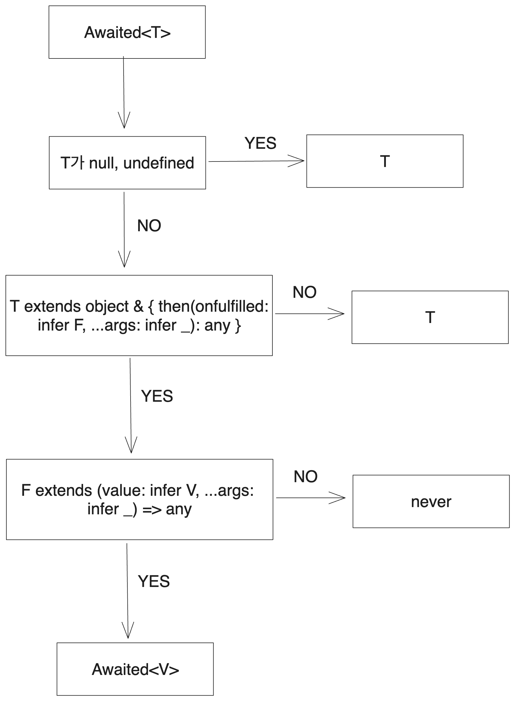

# 시작

JS의 Promise는 말할 것도 없이 매우 중요한 개념이고, 당연히 TS에서도 관련 타입들을 잘 정의해 두었다. 이를 한번 살펴보자. 완벽하게 정리된 글이라기보다는 탐구의 과정을 드러내고자 했다.

# 1. 탐구의 시작

Promise는 es2015에 처음 등장했다. 그러니 `node_modules`에서 typescript를 찾은 후 폴더 내를 찾아보면 `lib.es2015`로 시작하는 파일들을 찾아보자. 마침 `lib.es2015.promise.d.ts`라는 파일이 있다.

이 파일에 들어가면 `PromiseConstructor`타입이 정의되어 있다.

```ts
interface PromiseConstructor {
    /**
     * A reference to the prototype.
     */
    readonly prototype: Promise<any>;
    /* 내용은 일단 생략. 이후에 다룬다 */
}

declare var Promise: PromiseConstructor;
```

Promise는 원래 존재하는 객체이므로 타입만 붙이기 위해서 declare로 앰비언트 타입을 썼다. 그런데 잘 보면 여기 정의되어 있는 PromiseConstructor 는 우리가 잘 알고 있는 Promise 인스턴스의 타입이 아니다. 여기서의 Promise타입은 `Promise.all`등의 메서드를 가지고 있는, Promise 생성자 그 자체다.

그럼 우리가 아는 Promise 인스턴스의 타입은 어디에 정의되어 있을까? 이는 `lib.es5.d.ts`에서 찾을 수 있다. 여기서는 Promise에 얽힌 다른 타입들도 정의하고 있는데 이를 하나씩 살펴보자. 그리고 나서 이 Promise 생성자로 다시 돌아올 것이다.

# 2. lib.es5.d.ts의 Promise 관련 타입

가장 다른 타입에 대한 의존성이 없는 타입부터 하나하나 살펴보겠다. 다른 아무 타입에도 의존하지 않고 있는 `PromiseLike`부터 시작하자.

## 2.1. PromiseLike

`lib.es5.d.ts`의 PromiseLike은 다음과 같이 정의되어 있다. `then`메서드 하나가 정의되어 있는 인터페이스다.

```ts
interface PromiseLike<T> {
  /**
   * Attaches callbacks for the resolution and/or rejection of the Promise.
   * @param onfulfilled The callback to execute when the Promise is resolved.
   * @param onrejected The callback to execute when the Promise is rejected.
   * @returns A Promise for the completion of which ever callback is executed.
   */
  then<TResult1 = T, TResult2 = never>(
    onfulfilled?:
      | ((value: T) => TResult1 | PromiseLike<TResult1>)
      | undefined
      | null,
    onrejected?:
      | ((reason: any) => TResult2 | PromiseLike<TResult2>)
      | undefined
      | null
  ): PromiseLike<TResult1 | TResult2>;
}
```

[MDN의 `Promise.prototype.then()` 문서](https://developer.mozilla.org/en-US/docs/Web/JavaScript/Reference/Global_Objects/Promise/then)를 보면 이와 비슷한 형태로 해당 메서드가 정의된 것을 볼 수 있다.

```ts
then(onFulfilled)
then(onFulfilled, onRejected)
```

`onfulfilled`는 Promise가 resolve되었을 때 실행되는 메서드, `onrejected`는 reject되었을 때 실행되는 메서드다. 둘 다 생략 가능하다.

위의 PromiseLike 타입으로 돌아가서 제네릭을 해석해 보면, `onfulfilled`는 인자로 받은 객체와 같은 타입을 리턴하거나 아니면 또다른 `PromiseLike`을 리턴한다. `onrejected`는 Promise가 거절되었을 때 실행되는 콜백이므로 또다른 Promise 혹은 명시된 리턴 타입을 리턴한다.

Promise의 사용 예시를 보면 이런 식으로 then이 중첩되는 것을 쉽게 볼 수 있으므로 Promise와 비슷한 형식의 타입인 `PromiseLike`도 재귀적으로 정의되는 게 맞다.

```ts
fetch("https://jsonplaceholder.typicode.com/todos/1")
  .then((response) => response.json())
  .then((json) => console.log(json));
```

딸린 타입으로 `PromiseConstructorLike`도 있다. 말 그대로 Promise 생성자 비슷한 타입이다.

```ts
declare type PromiseConstructorLike = new <T>(
  executor: (
    resolve: (value: T | PromiseLike<T>) => void,
    reject: (reason?: any) => void
  ) => void
) => PromiseLike<T>;
```

`resolve`, `reject`를 인자로 받는 executor 함수를 받는다. 실제 Promise의 사용예를 생각해 보면 이런 타입이 Promise 생성자와 비슷하다는 게 눈에 보인다.

```ts
// 실제 Promise 생성자 사용 예시
new Promise((resolve, reject) => {
  resolve(1);
});
```

`resolve`가 인자로 받은 값의 타입을 `PromiseLike`으로 감싸서 리턴하는 것까지 비슷하다. 예를 들어 Promise에서 `resolve(1)`을 하면 Promise가 이행된 값이 1이므로 `PromiseLike<number>`를 리턴하는 게 당연할 것이다!

```ts
new Promise((resolve, reject) => {
  resolve(1);
});
```

## 2.2. Promise

그럼 이걸 기반으로 진짜 Promise 인스턴스의 타입을 한번 파보자.

```ts
// lib.es5.d.ts
/**
 * Represents the completion of an asynchronous operation
 */
interface Promise<T> {
  /**
   * Attaches callbacks for the resolution and/or rejection of the Promise.
   * @param onfulfilled The callback to execute when the Promise is resolved.
   * @param onrejected The callback to execute when the Promise is rejected.
   * @returns A Promise for the completion of which ever callback is executed.
   */
  then<TResult1 = T, TResult2 = never>(
    onfulfilled?:
      | ((value: T) => TResult1 | PromiseLike<TResult1>)
      | undefined
      | null,
    onrejected?:
      | ((reason: any) => TResult2 | PromiseLike<TResult2>)
      | undefined
      | null
  ): Promise<TResult1 | TResult2>;

  /**
   * Attaches a callback for only the rejection of the Promise.
   * @param onrejected The callback to execute when the Promise is rejected.
   * @returns A Promise for the completion of the callback.
   */
  catch<TResult = never>(
    onrejected?:
      | ((reason: any) => TResult | PromiseLike<TResult>)
      | undefined
      | null
  ): Promise<T | TResult>;
}
```

then의 경우는 PromiseLike에서와 비슷하다. 다만 리턴 타입이 PromiseLike에서 Promise로 바뀌었다.

catch 메서드가 추가되었는데 이는 Promise가 거절되었을 때 실행되는 콜백을 등록하는 메서드다. [이 또한 Promise를 리턴하는데 `Promise.prototype.catch()`가 다른 Promise 체이닝이 가능하도록 Promise를 리턴하는 걸 볼 때 맞는 리턴 타입이다.](https://developer.mozilla.org/en-US/docs/Web/JavaScript/Reference/Global_Objects/Promise/catch)

## 2.3. Awaited

그럼 이제 비동기 타입을 벗겨내는 `Awaited<T>`에 대해 알아보자. Promise가 아닐 경우 never가 될 것이고 Promise일 경우 Promise가 resolve된 값의 타입이 될 것이다. JS에서의 `await`동작을 생각해 보면 된다.

```ts
/**
 * Recursively unwraps the "awaited type" of a type. Non-promise "thenables" should resolve to `never`. This emulates the behavior of `await`.
 */
type Awaited<T> = T extends null | undefined
  ? T // special case for `null | undefined` when not in `--strictNullChecks` mode
  : T extends object & { then(onfulfilled: infer F, ...args: infer _): any } // `await` only unwraps object types with a callable `then`. Non-object types are not unwrapped
  ? F extends (value: infer V, ...args: infer _) => any // if the argument to `then` is callable, extracts the first argument
    ? Awaited<V> // recursively unwrap the value
    : never // the argument to `then` was not callable
  : T; // non-object or non-thenable
```

이 복잡한 삼항 연산자를 그림으로 나타내면 다음과 같다.



`T`가 `null`이나 `undefined`일 경우 `T`를 리턴하는 부분은 크게 볼 것이 없다. 중요한 것은 그 다음이다. 

다음 단계에선 `T`가 객체이며 then 메서드를 가지는지를 검사한다. 즉 thenable인지를 검사하는 것이다. 여기서 통과하지 못하면 그대로 T를 리턴한다. 따라서 `Awaited<T>`에서 T가 thenable이 아닐 경우 그대로 T가 된다.

```ts
type A=Awaited<string>; // string이 그대로 나옴
type B=Awaited<'hello' | number>; // 역시 'hello' | number 그대로 나옴
type O=Awaited<{A:1}> // {A:1} 그대로 나옴
```

이것까지 통과했다면 `T`가 thenable 타입인 건 보장된 상태다. 그러면 then 메서드의 첫번째 인자 타입을 F로 추론한 후 해당 인자가 callable한 함수 타입인지 검사한다. 만약 T의 then 메서드 첫번째 인자 타입 F가 callable이 아니라면 `never`를 리턴한다. 다음과 같이 then메서드의 첫 인자가 callable이 아닌 타입은 Awaited 적용시 never가 리턴되는 걸 볼 수 있다.

```ts
type FooThenable={
    then:(value:number)=>any;
}

type F=Awaited<FooThenable>; // never
```

T의 then메서드 첫번째 인자가 callable이기까지 하다면 해당 인자의 첫번째 인자 타입을 또 V로 추론한 후 재귀적으로 `Awaited`에 집어넣어 리턴한다. 이는 실제 Promise의 then 메서드 사용을 보면 왜 이런 식으로 추론하는지 알 수 있다.

```ts
// 여기서 Awaited<fetch(...)>의 타입은 then메서드 첫번째 인자인 함수의 첫번째 인자인 response의 타입이다.
fetch("https://jsonplaceholder.typicode.com/todos/1")
  .then((response) => response.json());
```

`fetch`는 Promise를 리턴하는데, 여기에 await을 적용했을 때 나와야 하는 값은 `response`값이다. 이는 then메서드가 첫번째 인자로 받은 콜백의 첫번째 인자다. 이는 위에서 Awaited 타입이 추론한 타입과 같다.

Promise 타입의 형태에서도 해당 타입이 Awaited에 들어가면 어떻게 될지 한번 생각해 보자. `Awaited<Promise<T>>`가 있다면 Awaited 타입은 Promise 타입의 then 메서드가 받는 첫번째 콜백, 즉 onfulfilled가 받는 첫번째 인자의 타입을 추론하는데 아래에서 Promise의 onfulfilled 함수 첫번째 인자 타입을 보면 이는 바로 T다.

```ts
interface Promise<T> {
  /**
   * Attaches callbacks for the resolution and/or rejection of the Promise.
   * @param onfulfilled The callback to execute when the Promise is resolved.
   * @param onrejected The callback to execute when the Promise is rejected.
   * @returns A Promise for the completion of which ever callback is executed.
   */
  then<TResult1 = T, TResult2 = never>(
    onfulfilled?:
      | ((value: T) => TResult1 | PromiseLike<TResult1>)
      | undefined
      | null,
    onrejected?:
      | ((reason: any) => TResult2 | PromiseLike<TResult2>)
      | undefined
      | null
  ): Promise<TResult1 | TResult2>;

  /* ... */
}
```

이렇게 추론된 첫번째 인자 콜백 함수의 첫번째 인자 타입은 그대로 Awaited에 재귀적으로 들어가므로 `Awaited<Promise<T>>`는 `Awaited<T>`가 된다.

이런 부분을 이용해서 chaining된 Promise의 타입을 추론하는 부분도 있는데 이는 [조현영 님의 타입스크립트 교과서(네이버 쇼핑 링크)](https://search.shopping.naver.com/book/catalog/41736307631?cat_id=50010881&frm=PBOKPRO&query=%ED%83%80%EC%9E%85%EC%8A%A4%ED%81%AC%EB%A6%BD%ED%8A%B8+%EA%B5%90%EA%B3%BC%EC%84%9C&NaPm=ct%3Dloiqkizs%7Cci%3Da227a8b9f5020f34f7fa025e7249ade5ad19b261%7Ctr%3Dboknx%7Csn%3D95694%7Chk%3D20f6e1c8ee1437ed56121f5ca6fb361bbe23d5c0)에 아주 친절하게 설명되어 있다.

### 2.3.1. 약간의 문제

이런 식으로의 추론은 무한 루프를 일으킬 수 있다. `thenable` 구조가 타입에서 무한히 이어질 경우다.

```ts
type RecursiveThenable = {
  then: (callback: (value: RecursiveThenable) => void) => void;
};

// Type instantiation is excessively deep and possibly infinite.
type Unwrapped = Awaited<RecursiveThenable>; 
```

# 3. PromiseConstructor

다시 `lib.es2015.promise.d.ts`로 돌아와서 PromiseConstructor를 살펴보자. 이는 Promise 생성자의 타입인데, `Promise.all`같은 몇몇 메서드가 여기에 정의되어 있기 때문에 한번 보는 게 좋겠다.

```ts
interface PromiseConstructor {
    /**
     * A reference to the prototype.
     */
    readonly prototype: Promise<any>;

    /**
     * Creates a new Promise.
     * @param executor A callback used to initialize the promise. This callback is passed two arguments:
     * a resolve callback used to resolve the promise with a value or the result of another promise,
     * and a reject callback used to reject the promise with a provided reason or error.
     */
    new <T>(executor: (resolve: (value: T | PromiseLike<T>) => void, reject: (reason?: any) => void) => void): Promise<T>;

    /**
     * Creates a Promise that is resolved with an array of results when all of the provided Promises
     * resolve, or rejected when any Promise is rejected.
     * @param values An array of Promises.
     * @returns A new Promise.
     */
    all<T extends readonly unknown[] | []>(values: T): Promise<{ -readonly [P in keyof T]: Awaited<T[P]> }>;

    // see: lib.es2015.iterable.d.ts
    // all<T>(values: Iterable<T | PromiseLike<T>>): Promise<Awaited<T>[]>;

    /**
     * Creates a Promise that is resolved or rejected when any of the provided Promises are resolved
     * or rejected.
     * @param values An array of Promises.
     * @returns A new Promise.
     */
    race<T extends readonly unknown[] | []>(values: T): Promise<Awaited<T[number]>>;

    // see: lib.es2015.iterable.d.ts
    // race<T>(values: Iterable<T | PromiseLike<T>>): Promise<Awaited<T>>;

    /**
     * Creates a new rejected promise for the provided reason.
     * @param reason The reason the promise was rejected.
     * @returns A new rejected Promise.
     */
    reject<T = never>(reason?: any): Promise<T>;

    /**
     * Creates a new resolved promise.
     * @returns A resolved promise.
     */
    resolve(): Promise<void>;
    /**
     * Creates a new resolved promise for the provided value.
     * @param value A promise.
     * @returns A promise whose internal state matches the provided promise.
     */
    resolve<T>(value: T): Promise<Awaited<T>>;
    /**
     * Creates a new resolved promise for the provided value.
     * @param value A promise.
     * @returns A promise whose internal state matches the provided promise.
     */
    resolve<T>(value: T | PromiseLike<T>): Promise<Awaited<T>>;
}

declare var Promise: PromiseConstructor;
```

## 3.1. Promise.all

```ts
/**
     * Creates a Promise that is resolved with an array of results when all of the provided Promises
     * resolve, or rejected when any Promise is rejected.
     * @param values An array of Promises.
     * @returns A new Promise.
     */
    all<T extends readonly unknown[] | []>(values: T): Promise<{ -readonly [P in keyof T]: Awaited<T[P]> }>;
```

`Promise.all`은 여러 개의 Promise가 담긴 배열을 받아서 모든 Promise가 resolve되면 resolve된 값들의 배열을 리턴하고, 하나라도 reject되면 reject된 이유를 리턴한다. 따라서 제네릭에서 `T`를 배열 타입으로 제한하고 있다.

그리고 리턴 타입은 `T`의 각 요소를 `Awaited`에 넣은 배열을 Promise로 감싼 타입이다. `Promise.all`이 배열에 담긴 Promise들을 모두 이행 후 그 결과를 배열로 리턴하는 것에 맞는 타입이라고 보인다.

## 3.2. Promise.race

```ts
    /**
     * Creates a Promise that is resolved or rejected when any of the provided Promises are resolved
     * or rejected.
     * @param values An array of Promises.
     * @returns A new Promise.
     */
    race<T extends readonly unknown[] | []>(values: T): Promise<Awaited<T[number]>>;
```

`Promise.race`는 Promise.all과 비슷하게 Promise들이 담긴 배열을 받는다. 그런데 모든 Promise의 결과를 담는 all과 달리 race의 경우 가장 먼저 처리되는 Promise의 결과를 이행이건 거부건 그대로 리턴한다.

따라서 해당 함수의 리턴 타입은 Promise 배열 타입인 `T`를 숫자 인덱스로 접근했을 때 나올 수 있는 타입 중 하나를 Awaited한 `Awaited<T[number]>`를 Promise로 감싼 형태가 된다.

## 3.3. resolve, reject, finally

위에는 resolve, reject 타입도 있는데 너무 그대로 보이는 타입이기 때문에 해석은 생략한다. 비슷하게 `lib.es2018.promise.d.ts`에는 Promise의 메서드인 `finally`가 정의되어 있는데 이 또한 너무 그대로 보이는 타입이다.

```ts
// lib.es2018.promise.d.ts
interface Promise<T> {
    /**
     * Attaches a callback that is invoked when the Promise is settled (fulfilled or rejected). The
     * resolved value cannot be modified from the callback.
     * @param onfinally The callback to execute when the Promise is settled (fulfilled or rejected).
     * @returns A Promise for the completion of the callback.
     */
    finally(onfinally?: (() => void) | undefined | null): Promise<T>
}
```

## 3.4. Promise 이터러블을 위한 타입

그런데 ES2015에서, 반복 가능한 새로운 형태인 이터러블이라는 것이 나왔다. 이에 대한 자세한 설명은 [심볼의 쓰임새를 다룬 글](https://witch.work/posts/javascript-symbol-usage#6.4.-Symbol.iterator)에서 볼 수 있다. 반복자의 끝에 다다를 때까지 `Symbol.iterator`를 호출하면서 반복하는 형태이다. 그리고 이 타입을 TS에서도 정의하고 있다. `lib.es2015.iterable.d.ts`를 보면 된다.

```ts
// lib.es2015.iterable.d.ts
interface Iterator<T, TReturn = any, TNext = undefined> {
    // NOTE: 'next' is defined using a tuple to ensure we report the correct assignability errors in all places.
    next(...args: [] | [TNext]): IteratorResult<T, TReturn>;
    return?(value?: TReturn): IteratorResult<T, TReturn>;
    throw?(e?: any): IteratorResult<T, TReturn>;
}

interface Iterable<T> {
    [Symbol.iterator](): Iterator<T>;
}
```

이 타입에 대한 해석은 반복자 프로토콜에 대한 이해도 필요하고 해서 긴 다른 글이 될 거라고 생각해서 생략한다. 중요한 것은 배열 외에도 반복 가능한 새로운 객체가 나왔다는 것이고 Promise.all과 같이 반복 가능한 객체에 담긴 Promise들을 다루는 메서드들은 이를 지원해야 했다는 것이다.

따라서 `lib.es2015.iterable.d.ts`에서는 기존의 `PromiseConstructor`와 병합될 인터페이스에 또다른 형태의 all, race 메서드를 정의하고 있다.

```ts
interface PromiseConstructor {
    /**
     * Creates a Promise that is resolved with an array of results when all of the provided Promises
     * resolve, or rejected when any Promise is rejected.
     * @param values An iterable of Promises.
     * @returns A new Promise.
     */
    all<T>(values: Iterable<T | PromiseLike<T>>): Promise<Awaited<T>[]>;

    /**
     * Creates a Promise that is resolved or rejected when any of the provided Promises are resolved
     * or rejected.
     * @param values An iterable of Promises.
     * @returns A new Promise.
     */
    race<T>(values: Iterable<T | PromiseLike<T>>): Promise<Awaited<T>>;
}
```

위에서는 `T`자체가 배열 타입이었는데 여기서는 인자로 받는 타입이 `T`의 이터러블이다. 따라서 `Promise.all`메서드의 리턴 타입이 `T`를 Awaited로 감싸서 나오는 타입의 배열로 바뀐 것을 볼 수 있다.

## 3.5. any

ES2020에서는 이미 이터러블이 도입되어 있었기 때문에 여기부터 나오는 Promise 관련 타입들은 처음부터 이터러블을 위한 타입도 같이 정의되어 있다. `lib.es2021.promise.d.ts`에는 받은 Promise 배열에서 가장 먼저 fulfilled된 Promise의 결과를 리턴하거나 모두 실패시 Promise 거절 이유들을 담아서 리턴하는 Promise.any가 정의되어 있다.

일정 시기 이후부터는 타입들에서 처음부터 이터러블을 고려한다는 것을 보여주는 예시로써 다룬 것이기도 하고 위에서 다뤘던 타입들과 거의 비슷하기 때문에 구체적인 설명은 생략한다.

```ts
// lib.es2021.promise.d.ts
interface PromiseConstructor {
    any<T extends readonly unknown[] | []>(values: T): Promise<Awaited<T[number]>>;

    any<T>(values: Iterable<T | PromiseLike<T>>): Promise<Awaited<T>>
}
```

## 3.6. allSettled

`lib.es2020.promise.d.ts`에는 `allSettled`라는 메서드가 정의되어 있다. Promise.all이 중간에 거절된 Promise가 있다면 종료되는 것과 달리 allSettled는 모든 Promise가 끝까지 이행될 때까지 기다린다. 더 자세한 설명은 [Promise.allSettled() - JavaScript | MDN](https://developer.mozilla.org/ko/docs/Web/JavaScript/Reference/Global_Objects/Promise/allSettled)를 참고하자.

아무튼 여기서는 새로 정의된 타입이 좀 있다. `status`와 `value`혹은 거절 이유인 `reason`을 담은 객체를 리턴해야 하기 때문이다.

```ts
// lib.es2020.promise.d.ts
interface PromiseFulfilledResult<T> {
    status: "fulfilled";
    value: T;
}

interface PromiseRejectedResult {
    status: "rejected";
    reason: any;
}

type PromiseSettledResult<T> = PromiseFulfilledResult<T> | PromiseRejectedResult;

interface PromiseConstructor {
    /**
     * Creates a Promise that is resolved with an array of results when all
     * of the provided Promises resolve or reject.
     * @param values An array of Promises.
     * @returns A new Promise.
     */
    allSettled<T extends readonly unknown[] | []>(values: T): Promise<{ -readonly [P in keyof T]: PromiseSettledResult<Awaited<T[P]>> }>;

    /**
     * Creates a Promise that is resolved with an array of results when all
     * of the provided Promises resolve or reject.
     * @param values An array of Promises.
     * @returns A new Promise.
     */
    allSettled<T>(values: Iterable<T | PromiseLike<T>>): Promise<PromiseSettledResult<Awaited<T>>[]>;
}
```

`PromiseSettledResult`타입의 해석은 Promise의 각 상태에 대해서 알고 있다면 쉽다. 그냥 Promise가 이행되었을 때와 거절되었을 때의 타입을 유니언으로 묶은 것이다.

`allSettled`는 역시 Promise가 들어 있는 배열 혹은 이터러블(물론 Promise가 아니라도 타입은 잘 작동하지만 일반적으로 그렇다는 것이다)을 받는다. 그리고 해당 배열이나 이터러블에 들어 있는 각 Promise에 대해서 `Awaited`를 가해서 해당 Promise가 이행되었을 때의 결과를 가져온다. 그리고 이를 `PromiseSettledResult`에 담아서 리턴하는데 이때 `PromiseFulfilledResult`의 value의 타입이 Promise fulfill시 타입으로 추론된다.

```
allSettled에서 인자로 받은 Promise 배열의 타입을 T 타입으로 추론 -> T의 이행 결과의 타입을 `Awaited`에 넣어서 추론 -> PromiseSettledResult의 value 타입이 Awaited<T>가 됨
```